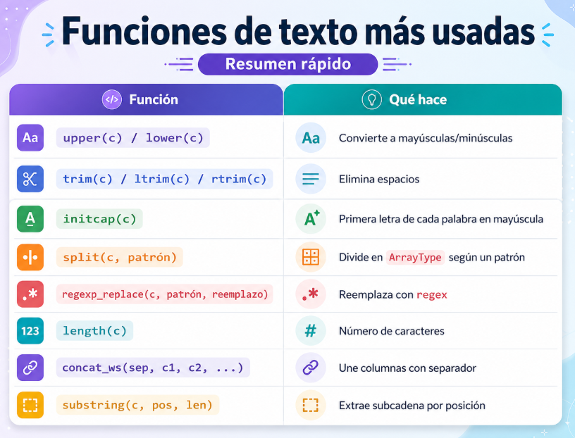

# 💻Clase 19 - Funciones Integradas en Spark y UDFs

---

# Agenda:

<aside>
💡

#### 9:00 - 9:50    →  Sesión 1  - Funciones Integradas en Spark y UDFs

#### 9:50 - 11:20   → Ejercicios y caso de uso

#### **11:20 - 11:40 → Descanso**

#### 11:40 - 12:40  → Sesión 2 - Practica de repaso para examen

#### 12:40 - 14:00  → Practica de repaso para examen

</aside>

# Sesión 1 : Funciones Integradas en Spark y UDFs

---

## 🧠 Teoría — Funciones Integradas en Spark y UDFs

### ¿Por qué usar funciones integradas?

<aside>

Cuando trabajamos con DataFrames en Spark, podemos transformar los datos de dos maneras:

1. **Funciones integradas (`org.apache.spark.sql.functions`):** Spark las conoce, las optimiza internamente con el **Catalyst Optimizer** y las ejecuta de forma distribuida y eficiente.
2. **UDFs (User Defined Functions):** Funciones Scala personalizadas que Spark envuelve y ejecuta fila a fila. Son más flexibles, pero Catalyst no puede mirar dentro de ellas.
</aside>

> 💡 **Regla práctica:** Usa siempre funciones integradas cuando existan. Recurre a las UDFs solo cuando no haya una función nativa que resuelva tu necesidad.
> 

---

### 1. Funciones de cadena de texto (`String`)

Estas funciones operan sobre columnas de tipo `StringType` y se importan desde `org.apache.spark.sql.functions`.

---

### Configuración inicial

```scala
import $ivy.`org.apache.spark::spark-sql:4.1.1`

import org.apache.spark.sql.SparkSession
import org.apache.spark.sql.functions._

val spark = SparkSession.builder()
  .appName("Dia16S2-Funciones-String")
  .master("local[*]")
  .config("spark.sql.shuffle.partitions", "4")
  .config("spark.ui.enabled", "false")
  .getOrCreate()

spark.sparkContext.setLogLevel("ERROR")
import spark.implicits._

println(s"✅ Spark ${spark.version} | Scala ${util.Properties.versionString}")
```

**Salida esperada:**

```
✅ Spark 4.1.1 | Scala version 2.13.18
```

---

### DataFrame de ejemplo

Usaremos este DataFrame a lo largo de todos los ejemplos de esta sección:

```scala
val personas = Seq(
  (1, "  ANA garcía torres  ", "ana.GARCIA@correo.es",   "612-345 678", "Madrid"),
  (2, "PEDRO   lópez",         "pedro.lopez@CORREO.COM", "699 876-543", "Barcelona"),
  (3, "maría RUIZ",            "maria.ruiz@correo.es",   "654321098",   "Valencia")
).toDF("id", "nombre", "email", "telefono", "ciudad")

personas.show(truncate = false)
```

**Salida esperada:**

```
+---+---------------------+------------------------+-----------+---------+
|id |nombre               |email                   |telefono   |ciudad   |
+---+---------------------+------------------------+-----------+---------+
|1  |  ANA garcía torres  |ana.GARCIA@correo.es    |612-345 678|Madrid   |
|2  |PEDRO   lópez        |pedro.lopez@CORREO.COM  |699 876-543|Barcelona|
|3  |maría RUIZ           |maria.ruiz@correo.es    |654321098  |Valencia |
+---+---------------------+------------------------+-----------+---------+
```

---

### `upper` / `lower` — convertir a mayúsculas o minúsculas

```scala
val nombreMayusMin = personas.select(
  col("nombre"),
  upper(col("nombre")).as("nombre_mayus"),
  lower(col("nombre")).as("nombre_minus")
)

nombreMayusMin.show(truncate = false)
```

**Salida esperada:**

```
+---------------------+---------------------+---------------------+
|nombre               |nombre_mayus         |nombre_minus         |
+---------------------+---------------------+---------------------+
|  ANA garcía torres  |  ANA GARCÍA TORRES  |  ana garcía torres  |
|PEDRO   lópez        |PEDRO   LÓPEZ        |pedro   lópez        |
|maría RUIZ           |MARÍA RUIZ           |maría ruiz           |
+---------------------+---------------------+---------------------+
```

> 💡 `upper` y `lower` solo cambian la capitalización. Los espacios extra del principio y del final permanecen intactos: eso es trabajo de `trim`.
> 

---

### `trim` — eliminar espacios al inicio y al final

```scala
val nombreSinEspacios = personas.select(
  col("nombre"),
  trim(col("nombre")).as("nombre_trim")
)

nombreSinEspacios.show(truncate = false)
```

**Salida esperada:**

```
+---------------------+--------------------+
|nombre               |nombre_trim         |
+---------------------+--------------------+
|  ANA garcía torres  |ANA garcía torres   |
|PEDRO   lópez        |PEDRO   lópez       |
|maría RUIZ           |maría RUIZ          |
+---------------------+--------------------+
```

> 💡 `trim` elimina espacios del **principio y del final**, no los espacios intermedios. La fila 2 (`PEDRO   lópez`) sigue teniendo tres espacios entre nombre y apellido después del trim porque están en medio.
> 

---

### `initcap` — primera letra de cada palabra en mayúscula

```scala
val nombreNormalizado = personas.select(
  col("nombre"),
  initcap(trim(col("nombre"))).as("nombre_normalizado")
)

nombreNormalizado.show(truncate = false)
```

**Salida esperada:**

```
+---------------------+--------------------+
|nombre               |nombre_normalizado  |
+---------------------+--------------------+
|  ANA garcía torres  |Ana García Torres   |
|PEDRO   lópez        |Pedro   López       |
|maría RUIZ           |María Ruiz          |
+---------------------+--------------------+
```

> 💡 El patrón habitual es `initcap(trim(col("nombre")))`: primero eliminas los espacios extremos y luego capitalizas. Si no hicieras el `trim` previo, los espacios del inicio harían que la primera letra real quedara en minúscula.
> 

---

### `split` — dividir una cadena y obtener un `ArrayType`

```scala
val emailDividido = personas.select(
  col("email"),
  split(col("email"), "@").as("partes_email"),
  split(col("email"), "@")(0).as("usuario"),
  split(col("email"), "@")(1).as("dominio")
)

emailDividido.show(truncate = false)
```

**Salida esperada:**

```
+------------------------+------------------------------+------------+----------+
|email                   |partes_email                  |usuario     |dominio   |
+------------------------+------------------------------+------------+----------+
|ana.GARCIA@correo.es    |[ana.GARCIA, correo.es]       |ana.GARCIA  |correo.es |
|pedro.lopez@CORREO.COM  |[pedro.lopez, CORREO.COM]     |pedro.lopez |CORREO.COM|
|maria.ruiz@correo.es    |[maria.ruiz, correo.es]       |maria.ruiz  |correo.es |
+------------------------+------------------------------+------------+----------+
```

> 💡 `split` devuelve un `ArrayType`. Puedes acceder a un elemento concreto con `(índice)` directamente sobre la expresión — el índice empieza en 0. Así `split(col("email"), "@")(0)` devuelve la parte antes del `@` y `(1)` la parte después.
> 

---

### `regexp_replace` — reemplazar texto usando expresión regular

```scala
val telefonoLimpio = personas.select(
  col("telefono"),
  regexp_replace(col("telefono"), "[^0-9]", "").as("telefono_limpio")
)

telefonoLimpio.show(truncate = false)
```

**Salida esperada:**

```
+-----------+---------------+
|telefono   |telefono_limpio|
+-----------+---------------+
|612-345 678|612345678      |
|699 876-543|699876543      |
|654321098  |654321098      |
+-----------+---------------+
```

> 💡 El patrón `[^0-9]` significa "cualquier carácter que **no** sea un dígito del 0 al 9". El segundo argumento `""` lo reemplaza por nada, eliminándolo. Es el patrón estándar para limpiar teléfonos, códigos postales o cualquier campo numérico con formato inconsistente.
> 

---

### `length` — longitud de la cadena en caracteres

```scala
val longitudNombre = personas.select(
  col("nombre"),
  length(col("nombre")).as("longitud_raw"),
  length(trim(col("nombre"))).as("longitud_limpia")
)

longitudNombre.show(truncate = false)
```

**Salida esperada:**

```
+---------------------+------------+---------------+
|nombre               |longitud_raw|longitud_limpia|
+---------------------+------------+---------------+
|  ANA garcía torres  |21          |17             |
|PEDRO   lópez        |13          |13             |
|maría RUIZ           |10          |10             |
+---------------------+------------+---------------+
```

> 💡 La primera fila tiene `longitud_raw = 21` porque incluye los 2 espacios del inicio y los 2 del final. Tras `trim`, `longitud_limpia = 17`. Esto ilustra por qué siempre conviene limpiar antes de medir o comparar cadenas.
> 

---

### `concat_ws` — unir varias columnas con un separador

```scala
val etiqueta = personas.select(
  col("nombre"),
  col("ciudad"),
  concat_ws(" — ", initcap(trim(col("nombre"))), col("ciudad")).as("etiqueta")
)

etiqueta.show(truncate = false)
```

**Salida esperada:**

```
+---------------------+---------+---------------------------+
|nombre               |ciudad   |etiqueta                   |
+---------------------+---------+---------------------------+
|  ANA garcía torres  |Madrid   |Ana García Torres — Madrid |
|PEDRO   lópez        |Barcelona|Pedro   López — Barcelona  |
|maría RUIZ           |Valencia |María Ruiz — Valencia      |
+---------------------+---------+---------------------------+
```

> 💡 `concat_ws(separador, col1, col2, ...)` ignora automáticamente los valores `null`: si una columna es `null` simplemente no la incluye en el resultado sin lanzar error. Esto la hace más robusta que `concat` para datos reales.
> 

---

### Pipeline completo: encadenando funciones con `withColumn`

En la práctica, todas estas funciones se combinan en una sola transformación encadenada:

```scala
val personasLimpias = personas
  .withColumn("nombre",   initcap(trim(col("nombre"))))
  .withColumn("email",    lower(trim(col("email"))))
  .withColumn("telefono", regexp_replace(col("telefono"), "[^0-9]", ""))

personasLimpias.show(truncate = false)
```

**Salida esperada:**

```
+---+--------------------+----------------------+---------+---------+
|id |nombre              |email                 |telefono |ciudad   |
+---+--------------------+----------------------+---------+---------+
|1  |Ana García Torres   |ana.garcia@correo.es  |612345678|Madrid   |
|2  |Pedro   López       |pedro.lopez@correo.com|699876543|Barcelona|
|3  |María Ruiz          |maria.ruiz@correo.es  |654321098|Valencia |
+---+--------------------+----------------------+---------+---------+
```

---

| Función | Qué hace | Ejemplo |
| --- | --- | --- |
| `upper(c)` | Todo en MAYÚSCULAS | `"madrid"` → `"MADRID"` |
| `lower(c)` | Todo en minúsculas | `"MADRID"` → `"madrid"` |
| `trim(c)` | Quita espacios extremos | `"  Ana  "` → `"Ana"` |
| `initcap(c)` | Primera letra de cada palabra en mayúscula | `"ana garcía"` → `"Ana García"` |
| `split(c, sep)` | Divide en `ArrayType` | `"a@b"` → `["a","b"]` |
| `regexp_replace(c, p, r)` | Reemplaza con regex | `"612-34"` → `"61234"` |
| `length(c)` | Longitud en caracteres | `"Ana"` → `3` |
| `concat_ws(sep, c1, c2)` | Une columnas con separador | `"Ana"`, `"Madrid"` → `"Ana — Madrid"` |
| `substring(c, pos, len)` | Extrae subcadena | `"Madrid"` (pos=1, len=3) → `"Mad"` |

> ⚠️ **Nota Spark 4.1.1 + Scala 2.13.18:** La sintaxis `$"columna"` sigue funcionando si tienes `import spark.implicits._` activo. En teoría usamos `col("columna")` que es más explícita. En la práctica usamos ambas.
> 



---

### 2. Funciones de fecha y hora

<aside>

Spark tiene tipos `DateType` y `TimestampType`. 

</aside>

---

### DataFrame de ejemplo

Usaremos este DataFrame a lo largo de todos los ejemplos de esta sección:

```scala
val eventos = Seq(
  (1, "Ana García",   "1985-07-14", "2019-03-01", "2024-11-15"),
  (2, "Pedro López",  "1972-11-22", "2021-06-15", "2024-12-20"),
  (3, "María Ruiz",   "1990-04-05", "2023-01-10", "2025-03-08")
).toDF("id", "nombre", "fecha_nacimiento_txt", "fecha_inicio_txt", "fecha_fin_txt")
  .withColumn("fecha_nacimiento", to_date(col("fecha_nacimiento_txt"), "yyyy-MM-dd"))
  .withColumn("fecha_inicio",     to_date(col("fecha_inicio_txt"),     "yyyy-MM-dd"))
  .withColumn("fecha_fin",        to_date(col("fecha_fin_txt"),        "yyyy-MM-dd"))
  .drop("fecha_nacimiento_txt", "fecha_inicio_txt", "fecha_fin_txt")

eventos.show(truncate = false)
eventos.printSchema()
```

**Salida esperada:**

```
+---+-----------+----------------+------------+----------+
|id |nombre     |fecha_nacimiento|fecha_inicio|fecha_fin |
+---+-----------+----------------+------------+----------+
|1  |Ana García |1985-07-14      |2019-03-01  |2024-11-15|
|2  |Pedro López|1972-11-22      |2021-06-15  |2024-12-20|
|3  |María Ruiz |1990-04-05      |2023-01-10  |2025-03-08|
+---+-----------+----------------+------------+----------+

root
 |-- id: integer (nullable = false)
 |-- nombre: string (nullable = true)
 |-- fecha_nacimiento: date (nullable = true)
 |-- fecha_inicio: date (nullable = true)
 |-- fecha_fin: date (nullable = true)
```

> 💡 Fíjate en el `printSchema()`: las tres columnas de fecha son `DateType`, no `StringType`. Trabajar con `DateType` real es lo que permite usar todas las funciones de esta sección. Si la columna fuera texto, las funciones de fecha no funcionarían.
> 

---

### `to_date` — convertir texto a `DateType`

Este es el primer paso en cualquier pipeline con fechas: convertir el texto en un tipo de fecha real.

```scala
val fechasConvertidas = Seq(
  (1, "14/07/1985"),
  (2, "22/11/1972"),
  (3, "05/04/1990")
).toDF("id", "fecha_texto")
  .withColumn("fecha_date", to_date(col("fecha_texto"), "dd/MM/yyyy"))

fechasConvertidas.show(truncate = false)
fechasConvertidas.printSchema()
```

**Salida esperada:**

```
+---+----------+----------+
|id |fecha_texto|fecha_date|
+---+----------+----------+
|1  |14/07/1985|1985-07-14|
|2  |22/11/1972|1972-11-22|
|3  |05/04/1990|1990-04-05|
+---+----------+----------+

root
 |-- id: integer (nullable = false)
 |-- fecha_texto: string (nullable = true)
 |-- fecha_date: date (nullable = true)
```

> 💡 El segundo argumento es el **formato de entrada** del texto que recibes. Si el texto tiene el formato `"dd/MM/yyyy"` pero pones `"yyyy-MM-dd"`, Spark devolverá `null` sin lanzar error. Verifica siempre el formato de tus datos antes de convertir.
> 

---

### `current_date` — fecha actual del sistema

```scala
val fechaHoy = eventos.select(
  col("nombre"),
  current_date().as("hoy")
)

fechaHoy.show(truncate = false)
```

**Salida esperada** *(el valor cambia según el día de ejecución)*:

```
+-----------+----------+
|nombre     |hoy       |
+-----------+----------+
|Ana García |2026-04-30|
|Pedro López|2026-04-30|
|María Ruiz |2026-04-30|
+-----------+----------+
```

> 💡 `current_date()` se evalúa en **tiempo de ejecución de Spark**, no cuando escribes el código. Esto significa que si el mismo notebook se ejecuta mañana, el valor será diferente.
> 

---

### `datediff` — diferencia en días entre dos fechas

```scala
val diasEntreEventos = eventos.select(
  col("nombre"),
  col("fecha_inicio"),
  col("fecha_fin"),
  datediff(col("fecha_fin"), col("fecha_inicio")).as("dias_duracion")
)

diasEntreEventos.show(truncate = false)
```

**Salida esperada:**

```
+-----------+------------+----------+-------------+
|nombre     |fecha_inicio|fecha_fin |dias_duracion|
+-----------+------------+----------+-------------+
|Ana García |2019-03-01  |2024-11-15|2086         |
|Pedro López|2021-06-15  |2024-12-20|1284         |
|María Ruiz |2023-01-10  |2025-03-08|787          |
+-----------+------------+----------+-------------+
```

> 💡 El orden importa: `datediff(fin, inicio)` devuelve un número positivo si `fin` es posterior a `inicio`, y negativo si es al revés. Es equivalente a restar fechas: `fin - inicio` en días.
> 

---

### `date_add` — sumar días a una fecha

```scala
val fechaConSuma = eventos.select(
  col("nombre"),
  col("fecha_inicio"),
  date_add(col("fecha_inicio"), 30).as("fecha_inicio_mas_30"),
  date_add(col("fecha_inicio"), 90).as("fecha_inicio_mas_90")
)

fechaConSuma.show(truncate = false)
```

**Salida esperada:**

```
+-----------+------------+-------------------+-------------------+
|nombre     |fecha_inicio|fecha_inicio_mas_30|fecha_inicio_mas_90|
+-----------+------------+-------------------+-------------------+
|Ana García |2019-03-01  |2019-03-31         |2019-05-30         |
|Pedro López|2021-06-15  |2021-07-15         |2021-09-13         |
|María Ruiz |2023-01-10  |2023-02-09         |2023-04-10         |
+-----------+------------+-------------------+-------------------+
```

> 💡 `date_add` maneja automáticamente los cambios de mes y año, incluidos los años bisiestos. Para restar días, usa un número negativo: `date_add(col("fecha"), -7)` resta 7 días.
> 

---

### `date_format` — formatear una fecha como texto

```scala
val fechaFormateada = eventos.select(
  col("nombre"),
  col("fecha_nacimiento"),
  date_format(col("fecha_nacimiento"), "dd/MM/yyyy").as("formato_es"),
  date_format(col("fecha_nacimiento"), "yyyy-MM-dd").as("formato_iso"),
  date_format(col("fecha_nacimiento"), "EEEE, d 'de' MMMM 'de' yyyy").as("formato_largo")
)

fechaFormateada.show(truncate = false)
```

**Salida esperada:**

```
+-----------+----------------+----------+-----------+------------------------------+
|nombre     |fecha_nacimiento|formato_es|formato_iso|formato_largo                 |
+-----------+----------------+----------+-----------+------------------------------+
|Ana García |1985-07-14      |14/07/1985|1985-07-14 |Sunday, 14 de July de 1985    |
|Pedro López|1972-11-22      |22/11/1972|1972-11-22 |Wednesday, 22 de November de 1972|
|María Ruiz |1990-04-05      |05/04/1990|1990-04-05 |Thursday, 5 de April de 1990  |
+-----------+----------------+----------+-----------+------------------------------+
```

> 💡 `date_format` devuelve un `StringType`, no un `DateType`. Es una función de **presentación final**, no de cálculo. Los nombres de día y mes (`EEEE`, `MMMM`) salen en inglés porque Spark usa el locale por defecto de la JVM. Úsala al final del pipeline, una vez hechos todos los cálculos.
> 

---

### `year` / `month` / `dayofmonth` — extraer componentes de la fecha

```scala
val componentesFecha = eventos.select(
  col("nombre"),
  col("fecha_nacimiento"),
  year(col("fecha_nacimiento")).as("anio"),
  month(col("fecha_nacimiento")).as("mes"),
  dayofmonth(col("fecha_nacimiento")).as("dia")
)

componentesFecha.show(truncate = false)
```

**Salida esperada:**

```
+-----------+----------------+----+---+---+
|nombre     |fecha_nacimiento|anio|mes|dia|
+-----------+----------------+----+---+---+
|Ana García |1985-07-14      |1985|7  |14 |
|Pedro López|1972-11-22      |1972|11 |22 |
|María Ruiz |1990-04-05      |1990|4  |5  |
+-----------+----------------+----+---+---+
```

> 💡 Los tres devuelven un `IntegerType`. Esto permite usarlos directamente en filtros y cálculos aritméticos, por ejemplo `year(col("fecha")) >= 1980` o calcular la década con `(year(col("fecha")) / 10 * 10).cast("int")`.
> 

---

### `months_between` — meses (decimales) entre dos fechas

```scala
val mesesYAnios = eventos.select(
  col("nombre"),
  col("fecha_nacimiento"),
  months_between(current_date(), col("fecha_nacimiento")).as("meses_vida"),
  (months_between(current_date(), col("fecha_nacimiento")) / 12).cast("int").as("edad_anios")
)

mesesYAnios.show(truncate = false)
```

**Salida esperada** *(varía según la fecha de ejecución)*:

```
+-----------+----------------+------------------+----------+
|nombre     |fecha_nacimiento|meses_vida        |edad_anios|
+-----------+----------------+------------------+----------+
|Ana García |1985-07-14      |489.52...         |40        |
|Pedro López|1972-11-22      |pilot...          |53        |
|María Ruiz |1990-04-05      |432.80...         |36        |
+-----------+----------------+------------------+----------+
```

> 💡 `months_between` devuelve un `DoubleType` con decimales. Para obtener años completos, divide entre 12 y aplica `.cast("int")` para truncar la parte decimal. Es la forma estándar de calcular edad en Spark.
> 

---

### Pipeline completo: enriquecer un DataFrame con columnas de fecha

En la práctica, estas funciones se encadenan en `withColumn` para enriquecer el DataFrame de una sola vez:

```scala
val eventosEnriquecidos = eventos
  .withColumn("dias_duracion",    datediff(col("fecha_fin"), col("fecha_inicio")))
  .withColumn("edad",             (months_between(current_date(), col("fecha_nacimiento")) / 12).cast("int"))
  .withColumn("anio_inicio",      year(col("fecha_inicio")))
  .withColumn("fecha_fin_es",     date_format(col("fecha_fin"), "dd/MM/yyyy"))
  .withColumn("recordatorio_30d", date_add(col("fecha_fin"), 30))

eventosEnriquecidos
  .select("nombre", "dias_duracion", "edad", "anio_inicio", "fecha_fin_es", "recordatorio_30d")
  .show(truncate = false)
```

**Salida esperada** *(edad varía según fecha de ejecución)*:

```
+-----------+-------------+----+-----------+------------+----------------+
|nombre     |dias_duracion|edad|anio_inicio|fecha_fin_es|recordatorio_30d|
+-----------+-------------+----+-----------+------------+----------------+
|Ana García |2086         |40  |2019       |15/11/2024  |2024-12-15      |
|Pedro López|1284         |53  |2021       |20/12/2024  |2025-01-19      |
|María Ruiz |787          |36  |2023       |08/03/2025  |2025-04-07      |
+-----------+-------------+----+-----------+------------+----------------+
```

---

### Tabla resumen

| Función | Qué hace | Devuelve |
| --- | --- | --- |
| `to_date(c, fmt)` | Texto → `DateType` | `DateType` |
| `current_date()` | Fecha del sistema | `DateType` |
| `datediff(fin, inicio)` | Días entre dos fechas | `IntegerType` |
| `date_add(c, n)` | Suma n días a una fecha | `DateType` |
| `date_format(c, fmt)` | Fecha → texto con formato | `StringType` |
| `year(c)` | Extrae el año | `IntegerType` |
| `month(c)` | Extrae el mes (1-12) | `IntegerType` |
| `dayofmonth(c)` | Extrae el día del mes | `IntegerType` |
| `months_between(fin, inicio)` | Meses decimales entre dos fechas | `DoubleType` |


---

### 3. Funciones de arrays y mapas

Cuando una columna es de tipo `ArrayType` (Lista de valores:  ["SQL", "Spark", "Scala”]) o   `MapType`(Pares clave-valor) Spark ofrece funciones específicas. Son especialmente útiles en pipelines ETL con datos provenientes de JSON o Parquet con columnas anidadas.

---

### DataFrame de ejemplo

Usaremos este DataFrame a lo largo de todos los ejemplos de esta sección:

```scala
val clientes = Seq(
  (1, "Ana García",   Seq("electrónica", "hogar", "electrónica", "ropa")),
  (2, "Pedro López",  Seq("alimentación", "hogar", "alimentación")),
  (3, "María Ruiz",   Seq("electrónica", "deportes")),
  (4, "Carlos Sanz",  Seq("ropa", "ropa", "hogar", "belleza")),
  (5, "Laura Vega",   Seq.empty[String])   // sin categorías → array vacío
).toDF("id", "nombre", "categorias")

clientes.show(truncate = false)
clientes.printSchema()
```

**Salida esperada:**

```
+---+-----------+----------------------------------------------+
|id |nombre     |categorias                                    |
+---+-----------+----------------------------------------------+
|1  |Ana García |[electrónica, hogar, electrónica, ropa]       |
|2  |Pedro López|[alimentación, hogar, alimentación]           |
|3  |María Ruiz |[electrónica, deportes]                       |
|4  |Carlos Sanz|[ropa, ropa, hogar, belleza]                  |
|5  |Laura Vega |[]                                            |
+---+-----------+----------------------------------------------+

root
 |-- id: integer (nullable = false)
 |-- nombre: string (nullable = true)
 |-- categorias: array (nullable = true)
 |    |-- element: string (containsNull = true)
```

> 💡 Fíjate en el schema: `categorias` es `array<string>`, no `StringType`. Esta es la diferencia clave respecto a almacenar los valores como texto separado por comas — Spark puede operar directamente sobre cada elemento del array.
> 

---

### `explode` — cada elemento del array se convierte en una fila nueva

```scala
val categoriasExplodidas = clientes.select(
  col("id"),
  col("nombre"),
  explode(col("categorias")).as("categoria")
)

categoriasExplodidas.show(truncate = false)
```

**Salida esperada:**

```
+---+-----------+------------+
|id |nombre     |categoria   |
+---+-----------+------------+
|1  |Ana García |electrónica |
|1  |Ana García |hogar       |
|1  |Ana García |electrónica |
|1  |Ana García |ropa        |
|2  |Pedro López|alimentación|
|2  |Pedro López|hogar       |
|2  |Pedro López|alimentación|
|3  |María Ruiz |electrónica |
|3  |María Ruiz |deportes    |
|4  |Carlos Sanz|ropa        |
|4  |Carlos Sanz|ropa        |
|4  |Carlos Sanz|hogar       |
|4  |Carlos Sanz|belleza     |
+---+-----------+------------+
```

> ⚠️ Laura Vega (id=5, array vacío) **ha desaparecido** de la salida. `explode` descarta silenciosamente las filas con array vacío o `null`. En un pipeline ETL esto puede arruinar conteos y joins si no se tiene en cuenta.
> 

---

### `explode_outer` — igual que `explode` pero conserva los nulls y arrays vacíos

```scala
val categoriasExplodidasOuter = clientes.select(
  col("id"),
  col("nombre"),
  explode_outer(col("categorias")).as("categoria")
)

categoriasExplodidasOuter.show(truncate = false)
```

**Salida esperada:**

```
+---+-----------+------------+
|id |nombre     |categoria   |
+---+-----------+------------+
|1  |Ana García |electrónica |
|1  |Ana García |hogar       |
|1  |Ana García |electrónica |
|1  |Ana García |ropa        |
|2  |Pedro López|alimentación|
|2  |Pedro López|hogar       |
|2  |Pedro López|alimentación|
|3  |María Ruiz |electrónica |
|3  |María Ruiz |deportes    |
|4  |Carlos Sanz|ropa        |
|4  |Carlos Sanz|ropa        |
|4  |Carlos Sanz|hogar       |
|4  |Carlos Sanz|belleza     |
|5  |Laura Vega |null        |
+---+-----------+------------+
```

> 💡 La única diferencia respecto a `explode` es la última fila: Laura Vega aparece con `categoria = null`. Usa `explode_outer` cuando necesites garantizar que todos los registros originales estén representados en la salida — por ejemplo, antes de hacer un `JOIN` o calcular métricas globales.
> 

---

### `array_contains` — comprobar si el array contiene un valor

```scala
val comproPorCategoria = clientes.select(
  col("id"),
  col("nombre"),
  col("categorias"),
  array_contains(col("categorias"), "electrónica").as("compro_electronica"),
  array_contains(col("categorias"), "hogar").as("compro_hogar")
)

comproPorCategoria.show(truncate = false)
```

**Salida esperada:**

```
+---+-----------+----------------------------------------------+------------------+------------+
|id |nombre     |categorias                                    |compro_electronica|compro_hogar|
+---+-----------+----------------------------------------------+------------------+------------+
|1  |Ana García |[electrónica, hogar, electrónica, ropa]       |true              |true        |
|2  |Pedro López|[alimentación, hogar, alimentación]           |false             |true        |
|3  |María Ruiz |[electrónica, deportes]                       |true              |false       |
|4  |Carlos Sanz|[ropa, ropa, hogar, belleza]                  |false             |true        |
|5  |Laura Vega |[]                                            |false             |false       |
+---+-----------+----------------------------------------------+------------------+------------+
```

> 💡 `array_contains` devuelve `BooleanType`. Puedes usarlo directamente dentro de un `filter` para quedarte solo con los clientes que compraron una categoría concreta: `clientes.filter(array_contains(col("categorias"), "electrónica"))`.
> 

---

### `array_distinct` — eliminar duplicados dentro del array

```scala
val categoriasUnicas = clientes.select(
  col("id"),
  col("nombre"),
  col("categorias"),
  array_distinct(col("categorias")).as("categorias_unicas")
)

categoriasUnicas.show(truncate = false)
```

**Salida esperada:**

```
+---+-----------+----------------------------------------------+-------------------------------+
|id |nombre     |categorias                                    |categorias_unicas              |
+---+-----------+----------------------------------------------+-------------------------------+
|1  |Ana García |[electrónica, hogar, electrónica, ropa]       |[electrónica, hogar, ropa]     |
|2  |Pedro López|[alimentación, hogar, alimentación]           |[alimentación, hogar]          |
|3  |María Ruiz |[electrónica, deportes]                       |[electrónica, deportes]        |
|4  |Carlos Sanz|[ropa, ropa, hogar, belleza]                  |[ropa, hogar, belleza]         |
|5  |Laura Vega |[]                                            |[]                             |
+---+-----------+----------------------------------------------+-------------------------------+
```

> 💡 Ana García había comprado `electrónica` dos veces y Pedro López `alimentación` dos veces. `array_distinct` los reduce a uno solo. El orden de los elementos restantes sigue siendo el de la primera aparición.
> 

---

### `size` — número de elementos del array

```scala
val tamanoArray = clientes.select(
  col("id"),
  col("nombre"),
  col("categorias"),
  size(col("categorias")).as("num_compras"),
  size(array_distinct(col("categorias"))).as("num_categorias_distintas")
)

tamanoArray.show(truncate = false)
```

**Salida esperada:**

```
+---+-----------+----------------------------------------------+-----------+------------------------+
|id |nombre     |categorias                                    |num_compras|num_categorias_distintas|
+---+-----------+----------------------------------------------+-----------+------------------------+
|1  |Ana García |[electrónica, hogar, electrónica, ropa]       |4          |3                       |
|2  |Pedro López|[alimentación, hogar, alimentación]           |3          |2                       |
|3  |María Ruiz |[electrónica, deportes]                       |2          |2                       |
|4  |Carlos Sanz|[ropa, ropa, hogar, belleza]                  |4          |3                       |
|5  |Laura Vega |[]                                            |0          |0                       |
+---+-----------+----------------------------------------------+-----------+------------------------+
```

> 💡 Combinando `size` con `array_distinct` obtienes dos métricas distintas sobre el mismo array: el total de compras (con repeticiones) y el número de categorías diferentes. Ana García compró 4 veces pero solo en 3 categorías distintas.
> 

---

### `collect_list` / `collect_set` — agrupar valores en un array

Estas dos funciones hacen el camino inverso a `explode`: en lugar de descomponer un array en filas, **agrupan filas en un array**. Se usan siempre dentro de una agregación (`groupBy` + `agg`).

```scala
// Primero necesitamos un DataFrame "plano" (sin arrays) para ver el efecto
val compras = Seq(
  (1, "Ana García",   "electrónica"),
  (1, "Ana García",   "hogar"),
  (1, "Ana García",   "electrónica"),
  (2, "Pedro López",  "alimentación"),
  (2, "Pedro López",  "hogar"),
  (2, "Pedro López",  "alimentación"),
  (3, "María Ruiz",   "electrónica"),
  (3, "María Ruiz",   "deportes")
).toDF("id", "nombre", "categoria")

val resumenPorCliente = compras.groupBy("id", "nombre").agg(
  collect_list(col("categoria")).as("historial_completo"),   // CON duplicados
  collect_set(col("categoria")).as("categorias_distintas")   // SIN duplicados
).orderBy("id")

resumenPorCliente.show(truncate = false)
```

**Salida esperada:**

```
+---+-----------+--------------------------------------+---------------------------+
|id |nombre     |historial_completo                    |categorias_distintas       |
+---+-----------+--------------------------------------+---------------------------+
|1  |Ana García |[electrónica, hogar, electrónica]     |[hogar, electrónica]       |
|2  |Pedro López|[alimentación, hogar, alimentación]   |[hogar, alimentación]      |
|3  |María Ruiz |[electrónica, deportes]               |[deportes, electrónica]    |
+---+-----------+--------------------------------------+---------------------------+
```

> 💡 Observa dos diferencias importantes entre `collect_list` y `collect_set`:
> 
> - `collect_list` mantiene los duplicados y el orden de llegada de las filas.
> - `collect_set` elimina duplicados pero el orden dentro del array **no está garantizado** (puede variar entre ejecuciones).
> 
> Usa `collect_list` cuando el orden o la frecuencia importen; `collect_set` cuando solo te interese saber qué valores distintos existen.
> 

---

### Pipeline completo: explotar, contar y reagrupar

El patrón más habitual con arrays es: **explotar → operar fila a fila → reagrupar**:

```scala
// Paso 1: explotar el array original
val explodido = clientes
  .filter(size(col("categorias")) > 0)   // excluir arrays vacíos
  .select(col("id"), col("nombre"), explode(col("categorias")).as("categoria"))

// Paso 2: ranking global de categorías más compradas
val rankingCategorias = explodido
  .groupBy("categoria")
  .count()
  .orderBy(col("count").desc)

println("🏆 Ranking de categorías:")
rankingCategorias.show(truncate = false)

// Paso 3: resumen por cliente con categorías únicas y total de compras
val resumenClientes = explodido
  .groupBy("id", "nombre")
  .agg(
    count("categoria").as("total_compras"),
    collect_set("categoria").as("especialidades")
  )
  .withColumn("num_especialidades", size(col("especialidades")))
  .orderBy("id")

println("📋 Resumen por cliente:")
resumenClientes.show(truncate = false)
```

**Salida esperada:**

```
🏆 Ranking de categorías:
+------------+-----+
|categoria   |count|
+------------+-----+
|electrónica |3    |
|hogar       |3    |
|ropa        |3    |
|alimentación|2    |
|deportes    |1    |
|belleza     |1    |
+------------+-----+

📋 Resumen por cliente:
+---+-----------+-------------+---------------------------+------------------+
|id |nombre     |total_compras|especialidades             |num_especialidades|
+---+-----------+-------------+---------------------------+------------------+
|1  |Ana García |4            |[electrónica, hogar, ropa] |3                 |
|2  |Pedro López|3            |[hogar, alimentación]      |2                 |
|3  |María Ruiz |2            |[electrónica, deportes]    |2                 |
|4  |Carlos Sanz|4            |[ropa, hogar, belleza]     |3                 |
+---+-----------+-------------+---------------------------+------------------+
```

---

### Tabla resumen

| Función | Qué hace | Devuelve | Nota clave |
| --- | --- | --- | --- |
| `explode(c)` | Array → filas | Tipo del elemento | Pierde filas con array vacío o `null` |
| `explode_outer(c)` | Array → filas | Tipo del elemento | Conserva filas con array vacío o `null` como `null` |
| `array_contains(c, v)` | ¿El array contiene el valor? | `BooleanType` | Seguro con `null` |
| `array_distinct(c)` | Elimina duplicados del array | `ArrayType` | Conserva el orden de la primera aparición |
| `size(c)` | Número de elementos | `IntegerType` | Devuelve 0 para array vacío |
| `collect_list(c)` | Filas → array con duplicados | `ArrayType` | Solo en `agg()` |
| `collect_set(c)` | Filas → array sin duplicados | `ArrayType` | Solo en `agg()` — orden no garantizado |

---

### 4. UDFs — User Defined Functions

<aside>

Una **UDF** es una función Scala que Spark envuelve para aplicarla columna a columna sobre un DataFrame.

</aside>

---

### DataFrame de ejemplo

Usaremos este DataFrame a lo largo de todos los ejemplos de esta sección:

```scala
val clientes = Seq(
  (1, "Ana García",   1250.0),
  (2, "Pedro López",   320.5),
  (3, "María Ruiz",     85.0),
  (4, "Carlos Sanz",   780.0),
  (5, "Laura Vega",   2400.0),
  (6, "Jorge Martín",   null.asInstanceOf[java.lang.Double])  // valor null
).toDF("id", "nombre", "total_gasto")

clientes.show(truncate = false)
```

**Salida esperada:**

```
+---+------------+-----------+
|id |nombre      |total_gasto|
+---+------------+-----------+
|1  |Ana García  |1250.0     |
|2  |Pedro López |320.5      |
|3  |María Ruiz  |85.0       |
|4  |Carlos Sanz |780.0      |
|5  |Laura Vega  |2400.0     |
|6  |Jorge Martín|null       |
+---+------------+-----------+
```

> 💡 Incluimos una fila con `null` en `total_gasto` de forma deliberada. Las UDFs deben gestionar `null` explícitamente, y veremos exactamente qué ocurre si no lo hacemos.
> 

---

### Definición y uso básico

```scala
import org.apache.spark.sql.functions.udf

// Paso 1: definir la función Scala con tipos explícitos
// java.lang.Double (no Double primitivo) para gestionar null sin NullPointerException
val clasificarGasto: java.lang.Double => String = (gasto) => {
  if      (gasto == null)   "Desconocido"
  else if (gasto >= 1000.0) "Premium"
  else if (gasto >= 300.0)  "Estándar"
  else                       "Básico"
}

// Paso 2: registrar como UDF
val clasificarGastoUDF = udf(clasificarGasto)

// Paso 3: aplicar sobre una columna del DataFrame
val clientesConSegmento = clientes
  .withColumn("segmento", clasificarGastoUDF(col("total_gasto")))

clientesConSegmento.show(truncate = false)
```

**Salida esperada:**

```
+---+------------+-----------+------------+
|id |nombre      |total_gasto|segmento    |
+---+------------+-----------+------------+
|1  |Ana García  |1250.0     |Premium     |
|2  |Pedro López |320.5      |Estándar    |
|3  |María Ruiz  |85.0       |Básico      |
|4  |Carlos Sanz |780.0      |Estándar    |
|5  |Laura Vega  |2400.0     |Premium     |
|6  |Jorge Martín|null       |Desconocido |
+---+------------+-----------+------------+
```

> ⚠️ **Por qué `java.lang.Double` y no `Double`:** `Double` es un tipo primitivo de la JVM que **no puede ser `null`**. Si la columna Spark tiene un `null` y la UDF espera `Double` primitivo, Spark lanza `NullPointerException` en tiempo de ejecución sin avisar en tiempo de compilación. `java.lang.Double` sí acepta `null`, lo que nos permite detectarlo con `gasto == null` y devolver un valor por defecto.
> 

---

### ¿Qué pasa si NO gestionamos el null? (ejemplo del error)

```scala
// UDF INCORRECTA: usa Double primitivo, no gestiona null
val clasificarGastoRoto: Double => String = (gasto) => {
  if      (gasto >= 1000.0) "Premium"
  else if (gasto >= 300.0)  "Estándar"
  else                       "Básico"
}

val clasificarGastoRotaUDF = udf(clasificarGastoRoto)

// Esto lanza NullPointerException al llegar a la fila con null
val clientesError = clientes
  .withColumn("segmento_roto", clasificarGastoRotaUDF(col("total_gasto")))

clientesError.show()   // ← falla aquí en tiempo de ejecución
```

**Salida esperada (error):**

```
SparkException: Failed to execute user defined function
  Caused by: NullPointerException
```

> 💡 Este es el error más frecuente al escribir UDFs en Scala 2.13 + Spark 4. La solución siempre es la misma: usa `java.lang.Double`, `java.lang.Integer`, `java.lang.Float`... en lugar de sus equivalentes primitivos `Double`, `Int`, `Float`...
> 

---

### Registrar una UDF para Spark SQL

Una vez definida la función Scala, puedes registrarla con un nombre SQL para usarla en consultas `spark.sql(...)`:

```scala
// Registrar la UDF con un nombre SQL
spark.udf.register("clasificar_gasto", clasificarGasto)

// Crear la vista temporal para poder referenciarla en SQL
clientes.createOrReplaceTempView("clientes")

// Usar la UDF dentro de una consulta SQL normal
val resultadoSQL = spark.sql("""
  SELECT
    id,
    nombre,
    total_gasto,
    clasificar_gasto(total_gasto) AS segmento
  FROM clientes
  ORDER BY total_gasto DESC
""")

resultadoSQL.show(truncate = false)
```

**Salida esperada:**

```
+---+------------+-----------+------------+
|id |nombre      |total_gasto|segmento    |
+---+------------+-----------+------------+
|5  |Laura Vega  |2400.0     |Premium     |
|1  |Ana García  |1250.0     |Premium     |
|4  |Carlos Sanz |780.0      |Estándar    |
|2  |Pedro López |320.5      |Estándar    |
|3  |María Ruiz  |85.0       |Básico      |
|6  |Jorge Martín|null       |Desconocido |
+---+------------+-----------+------------+
```

> 💡 Registrar la UDF con `spark.udf.register` y aplicarla con `clasificarGastoUDF(col(...))` en Scala son dos mecanismos independientes. Puedes usar uno, el otro, o ambos a la vez. El registro SQL es especialmente útil cuando quieres reutilizar la misma lógica desde consultas SQL dentro del mismo notebook.
> 

---

### La alternativa más importante: `when / otherwise`

Para lógica condicional, `when/otherwise` es **siempre preferible** a una UDF. Es el equivalente de `CASE WHEN ... THEN ... ELSE ... END` en SQL y Catalyst sí puede optimizarlo:

```scala
val clientesConSegmentoNativo = clientes
  .withColumn("segmento",
    when(col("total_gasto") >= 1000.0, "Premium")
    .when(col("total_gasto") >= 300.0,  "Estándar")
    .otherwise("Básico")
  )

clientesConSegmentoNativo.show(truncate = false)
```

**Salida esperada:**

```
+---+------------+-----------+--------+
|id |nombre      |total_gasto|segmento|
+---+------------+-----------+--------+
|1  |Ana García  |1250.0     |Premium |
|2  |Pedro López |320.5      |Estándar|
|3  |María Ruiz  |85.0       |Básico  |
|4  |Carlos Sanz |780.0      |Estándar|
|5  |Laura Vega  |2400.0     |Premium |
|6  |Jorge Martín|null       |Básico  |
+---+------------+-----------+--------+
```

> 💡 Observa que `when/otherwise` trata el `null` de forma diferente a nuestra UDF: al no cumplir ninguna condición `when`, el `null` cae en `otherwise("Básico")`. Si quieres el mismo comportamiento que la UDF (mostrar "Desconocido" para nulls), añade un `when` explícito al principio: `.when(col("total_gasto").isNull, "Desconocido")`.
> 

---

### Comparar los planes de ejecución: UDF vs `when/otherwise`

```scala
println("=" * 55)
println("PLAN — versión con UDF")
println("=" * 55)
clientesConSegmento.explain()

println("\n" + "=" * 55)
println("PLAN — versión con when/otherwise")
println("=" * 55)
clientesConSegmentoNativo.explain()
```

**Fragmento del plan con UDF:**

```
+- Project [id, nombre, total_gasto,
            UDF(total_gasto) AS segmento]
```

**Fragmento del plan con `when/otherwise`:**

```
+- Project [id, nombre, total_gasto,
            CASE WHEN (total_gasto >= 1000.0) THEN Premium
                 WHEN (total_gasto >= 300.0)  THEN Estándar
                 ELSE Básico END AS segmento]
```

> 💡 La diferencia es visible a simple vista en el plan: la UDF aparece como `UDF(total_gasto)` — una caja negra que Catalyst no puede abrir ni optimizar. `when/otherwise` aparece como un `CASE WHEN` completo que Catalyst puede analizar, combinar con filtros y pushear al origen de datos si es necesario.
> 

---

### Tabla resumen: UDF vs funciones nativas

| Aspecto | Funciones integradas / `when` | UDFs |
| --- | --- | --- |
| Optimización Catalyst | ✅ Sí | ❌ Caja negra |
| Velocidad | ✅ Alta | ⚠️ Más lenta |
| Expresividad | ⚠️ Limitada a lo nativo | ✅ Cualquier lógica Scala |
| Gestión de `null` | ✅ Automática | ⚠️ Manual con `java.lang.Double` |
| Uso en Spark SQL | ✅ Directo | ✅ Tras `spark.udf.register` |
| Cuándo usarla | Siempre que sea posible | Solo si no hay alternativa nativa |

## 💻 Práctica —

### Antes de empezar — comprueba el kernel

### ⚙️ Celda 0 — Cargar Spark 4.1.1 vía Ivy

Esta es **siempre la primera celda** de cualquier notebook que use Spark en este entorno.

```scala
import $ivy.`org.apache.spark::spark-sql:4.1.1`
```

---

### ⚙️ Celda 1 — Crear la SparkSession

```scala
import org.apache.spark.sql.SparkSession
import org.apache.spark.sql.functions._

val spark = SparkSession.builder()
  .appName("Funciones-UDF")
  .master("local[*]")
  .config("spark.sql.shuffle.partitions", "4")  // reduce overhead en local
  .config("spark.ui.enabled", "false")          // evita conflicto en puerto 4040
  .getOrCreate()

spark.sparkContext.setLogLevel("ERROR")   // silencia logs INFO/WARN

import spark.implicits._   // activa $"columna" y .toDF() sobre Seq

println(s"✅ Spark ${spark.version} | Scala ${util.Properties.versionString}")
```

**Salida esperada:**

```
✅ Spark 4.1.1 | Scala version 2.13.18
```

> 💡 `import spark.implicits._` debe ir **después** de crear la SparkSession, nunca antes. Sin esta línea, `.toDF()` sobre una `Seq` y la sintaxis `$"columna"` no compilan.
> 

---

### 🏋️ Ejercicio 1 — Limpieza de datos con funciones de texto y fecha

**Contexto:** **DataRetail S.L.** recibe un fichero de clientes con datos sucios: mayúsculas y minúsculas mezcladas, espacios sobrantes, teléfonos con guiones y espacios, y fechas almacenadas como texto plano.

### Celda 2 — Crear el DataFrame con datos sucios

```scala
val clientesRaw = Seq(
  (1, "  JUAN García  ",  "  juan.garcia@correo.com  ",  "612-345 678", "2023-03-15", 1250.0),
  (2, "maría López",      "maria.lopez@correo.COM",      "699 876-543", "2022-11-02",  320.5),
  (3, "PEDRO   martín",   "pedro.martin@correo.es",      "654321098",   "2024-01-20",   85.0),
  (4, "  Ana Ruiz  ",     "ANA.RUIZ@correo.es",          "600-111 222", "2023-07-08",  780.0),
  (5, "carlos sanz",      "carlos.sanz@CORREO.com",      "677 999-000", "2021-05-30", 2400.0)
).toDF("id", "nombre", "email", "telefono", "fecha_registro", "total_gasto")

clientesRaw.show(truncate = false)
clientesRaw.printSchema()
```

**Salida esperada:**

```
+---+----------------+--------------------------+-----------+---------------+-----------+
|id |nombre          |email                     |telefono   |fecha_registro |total_gasto|
+---+----------------+--------------------------+-----------+---------------+-----------+
|1  |  JUAN García   |  juan.garcia@correo.com  |612-345 678|2023-03-15     |1250.0     |
|2  |maría López     |maria.lopez@correo.COM    |699 876-543|2022-11-02     |320.5      |
|3  |PEDRO   martín  |pedro.martin@correo.es    |654321098  |2024-01-20     |85.0       |
|4  |  Ana Ruiz      |ANA.RUIZ@correo.es        |600-111 222|2023-07-08     |780.0      |
|5  |carlos sanz     |carlos.sanz@CORREO.com    |677 999-000|2021-05-30     |2400.0     |
+---+----------------+--------------------------+-----------+---------------+-----------+
```

### Celda 3 — Limpiar con funciones nativas

```scala
val clientesLimpios = clientesRaw
  // nombre: quitar espacios extremos y capitalizar cada palabra
  .withColumn("nombre",         initcap(trim($"nombre")))
  // email: quitar espacios y pasar todo a minúsculas
  .withColumn("email",          lower(trim($"email")))
  // telefono: eliminar todo lo que no sea dígito
  .withColumn("telefono",       regexp_replace($"telefono", "[^0-9]", ""))
  // fecha_registro: convertir el texto "yyyy-MM-dd" a DateType real
  .withColumn("fecha_registro", to_date($"fecha_registro", "yyyy-MM-dd"))

clientesLimpios.show(truncate = false)
clientesLimpios.printSchema()
```

**Salida esperada:**

```
+---+-------------+-------------------------+---------+--------------+-----------+
|id |nombre       |email                    |telefono |fecha_registro|total_gasto|
+---+-------------+-------------------------+---------+--------------+-----------+
|1  |Juan García  |juan.garcia@correo.com   |612345678|2023-03-15    |1250.0     |
|2  |María López  |maria.lopez@correo.com   |699876543|2022-11-02    |320.5      |
|3  |Pedro Martín |pedro.martin@correo.es   |654321098|2024-01-20    |85.0       |
|4  |Ana Ruiz     |ana.ruiz@correo.es       |600111222|2023-07-08    |780.0      |
|5  |Carlos Sanz  |carlos.sanz@correo.com   |677999000|2021-05-30    |2400.0     |
+---+-------------+-------------------------+---------+--------------+-----------+
```

Observa en el `printSchema()` que `fecha_registro` ha pasado de `string` a `date`.

### Celda 4 — Columnas derivadas de la fecha

```scala
val clientesConFecha = clientesLimpios
  .withColumn("dias_cliente",     datediff(current_date(), $"fecha_registro"))
  .withColumn("anio_registro",    year($"fecha_registro"))
  .withColumn("mes_registro",     month($"fecha_registro"))
  .withColumn("fecha_es",         date_format($"fecha_registro", "dd/MM/yyyy"))

clientesConFecha
  .select("id", "nombre", "fecha_registro", "dias_cliente", "anio_registro", "mes_registro", "fecha_es")
  .show(truncate = false)
```

> 💡 `datediff(current_date(), $"fecha_registro")` calcula cuántos días lleva el cliente en la base de datos. El resultado cambia cada día porque `current_date()` se evalúa en tiempo de ejecución de Spark, no en tiempo de compilación.
> 

---

### 🏋️ Ejercicio 2 — UDF de clasificación vs. `when/otherwise`

**Objetivo:** Implementar la misma lógica de dos formas diferentes y entender la diferencia real observando el plan de ejecución.

### Celda 5 — Versión con UDF

```scala
import org.apache.spark.sql.functions.udf

// java.lang.Double (no Double primitivo) para gestionar null sin NullPointerException
val clasificarGasto: java.lang.Double => String = (gasto) => {
  if      (gasto == null)   "Desconocido"
  else if (gasto >= 1000.0) "Premium"
  else if (gasto >= 300.0)  "Estándar"
  else                       "Básico"
}

val clasificarGastoUDF = udf(clasificarGasto)

val clientesUDF = clientesLimpios
  .withColumn("segmento_udf", clasificarGastoUDF($"total_gasto"))

clientesUDF.select("id", "nombre", "total_gasto", "segmento_udf").show()
```

**Salida esperada:**

```
+---+-------------+-----------+------------+
|id |nombre       |total_gasto|segmento_udf|
+---+-------------+-----------+------------+
|1  |Juan García  |1250.0     |Premium     |
|2  |María López  |320.5      |Estándar    |
|3  |Pedro Martín |85.0       |Básico      |
|4  |Ana Ruiz     |780.0      |Estándar    |
|5  |Carlos Sanz  |2400.0     |Premium     |
+---+-------------+-----------+------------+
```

### Celda 6 — Versión con `when/otherwise` (forma recomendada)

```scala
val clientesNativo = clientesLimpios
  .withColumn("segmento_nativo",
    when($"total_gasto" >= 1000.0, "Premium")
    .when($"total_gasto" >= 300.0,  "Estándar")
    .otherwise("Básico")
  )

clientesNativo.select("id", "nombre", "total_gasto", "segmento_nativo").show()
```

### Celda 7 — Comparar planes de ejecución

```scala
println("=" * 55)
println("PLAN — versión con UDF")
println("=" * 55)
clientesUDF.explain()

println("\n" + "=" * 55)
println("PLAN — versión con when/otherwise")
println("=" * 55)
clientesNativo.explain()
```

**Qué observar:**

- El plan con **UDF** muestra un nodo `UDF(total_gasto)` opaco. Catalyst no sabe qué hay dentro y no puede optimizarlo.
- El plan con **when/otherwise** muestra el `CASE WHEN` completo desplegado. Catalyst puede analizarlo, combinarlo con filtros y pushear predicados si hay un origen de datos debajo.

### Celda 8 — Registrar la UDF para Spark SQL

```scala
spark.udf.register("clasificar_gasto", clasificarGasto)

clientesLimpios.createOrReplaceTempView("clientes")

spark.sql("""
  SELECT
    id,
    nombre,
    total_gasto,
    clasificar_gasto(total_gasto) AS segmento
  FROM clientes
  ORDER BY total_gasto DESC
""").show()
```

---

### 🏋️ Ejercicio 3 — Pipeline completo con funciones de array

**Contexto:** El sistema de **DataRetail S.L.** almacena las categorías compradas por cada cliente como un array en una columna. Queremos analizar popularidad de categorías y producir un resumen por cliente. Uno de los clientes aún no ha comprado nada — veremos cómo manejar ese caso.

### Celda 9 — Crear el DataFrame de historial de compras

```scala
val historial = Seq(
  (1, "Juan García",  Seq("electrónica", "hogar", "electrónica", "ropa")),
  (2, "María López",  Seq("alimentación", "hogar", "alimentación")),
  (3, "Pedro Martín", Seq("electrónica", "deportes")),
  (4, "Ana Ruiz",     Seq("ropa", "ropa", "hogar", "belleza")),
  (5, "Carlos Sanz",  Seq("electrónica", "electrónica", "deportes", "electrónica")),
  (6, "Laura Vega",   Seq.empty[String])   // sin compras → array vacío
).toDF("id", "nombre", "categorias")

historial.show(truncate = false)
historial.printSchema()
```

### Celda 10 — Analizar arrays con funciones nativas

```scala
val historialAnalizado = historial
  .withColumn("num_compras",        size($"categorias"))
  .withColumn("compro_electronica", array_contains($"categorias", "electrónica"))
  .withColumn("categorias_unicas",  array_distinct($"categorias"))

historialAnalizado
  .select("id", "nombre", "num_compras", "compro_electronica", "categorias_unicas")
  .show(truncate = false)
```

### Celda 11 — `explode` vs `explode_outer`: la diferencia que importa

```scala
println("--- explode: Laura Vega (array vacío) DESAPARECE ---")
historial
  .select($"id", $"nombre", explode($"categorias").as("categoria"))
  .show()

println("--- explode_outer: Laura Vega se CONSERVA con null ---")
historial
  .select($"id", $"nombre", explode_outer($"categorias").as("categoria"))
  .show()
```

> ⚠️ En un pipeline ETL real, perder registros silenciosamente con `explode` puede arruinar conteos, joins y métricas. Usa `explode_outer` cuando necesites garantizar que todos los registros originales están representados en la salida.
> 

### Celda 12 — Ranking de categorías más populares

```scala
// explode (sin outer): solo nos interesan compras reales aquí
val historialExplodido = historial
  .select($"id", $"nombre", explode($"categorias").as("categoria"))

val ranking = historialExplodido
  .groupBy("categoria")
  .count()
  .orderBy($"count".desc)

println("🏆 Ranking de categorías más compradas:")
ranking.show()
```

**Salida esperada:**

```
+------------+-----+
|categoria   |count|
+------------+-----+
|electrónica |6    |
|hogar       |3    |
|ropa        |3    |
|alimentación|2    |
|deportes    |2    |
|belleza     |1    |
+------------+-----+
```

### Celda 13 — Resumen por cliente con `collect_set`

```scala
val resumenCliente = historialExplodido
  .groupBy("id", "nombre")
  .agg(
    count("categoria").as("total_compras"),
    collect_set("categoria").as("categorias_distintas")
  )
  .orderBy("id")

println("📋 Resumen por cliente:")
resumenCliente.show(truncate = false)
```

> 💡 `collect_list` mantiene duplicados y el orden de inserción. `collect_set` devuelve solo valores únicos pero el orden dentro del array **no está garantizado**. Úsalo cuando te importe la existencia de un valor, no su posición.
> 

---

### ✅ Verificación de conocimientos

Responde mentalmente antes de mirar la solución:

1. ¿Qué diferencia hay entre `explode` y `explode_outer`?
2. ¿Por qué se recomienda `when/otherwise` en lugar de una UDF para lógica condicional?
3. ¿Por qué usamos `java.lang.Double` en lugar de `Double` en la UDF?
4. ¿Qué diferencia hay entre `collect_list` y `collect_set`?

## 📚 Referencia rápida de la sesión

---

```scala
import org.apache.spark.sql.functions._

// ── Cadenas ─────────────────────────────────────────────────────────
upper($"col")                              // MAYÚSCULAS
lower($"col")                              // minúsculas
trim($"col")                               // quitar espacios extremos
initcap($"col")                            // Primera Letra En Mayúscula
regexp_replace($"col", "[^0-9]", "")       // quitar no-dígitos
split($"col", "@")                         // dividir en ArrayType
length($"col")                             // longitud en caracteres
concat_ws("-", $"a", $"b")                 // unir columnas con separador

// ── Fechas ──────────────────────────────────────────────────────────
current_date()                             // fecha del sistema
datediff($"fin", $"inicio")                // diferencia en días
date_add($"fecha", 7)                      // sumar 7 días
date_format($"fecha", "dd/MM/yyyy")        // formatear como texto
year($"fecha") / month($"fecha") / dayofmonth($"fecha")
to_date($"texto", "yyyy-MM-dd")            // texto → DateType

// ── Arrays ──────────────────────────────────────────────────────────
explode($"arr")                            // array → filas (pierde nulls/vacíos)
explode_outer($"arr")                      // array → filas (conserva nulls/vacíos)
array_contains($"arr", "valor")            // ¿contiene el valor?
array_distinct($"arr")                     // eliminar duplicados del array
size($"arr")                               // número de elementos
collect_list($"col")                       // agrupar CON duplicados
collect_set($"col")                        // agrupar SIN duplicados

// ── UDFs ────────────────────────────────────────────────────────────
// ⚠️ Siempre java.lang.Double (no Double) para columnas nullable
val miUDF = udf((x: java.lang.Double) => if (x == null) "?" else "ok")
df.withColumn("nueva", miUDF($"col"))
spark.udf.register("nombre_sql", miUDF)    // disponible en Spark SQL

// ── Alternativa nativa recomendada ──────────────────────────────────
when($"col" >= 1000.0, "Premium")
  .when($"col" >= 300.0, "Estándar")
  .otherwise("Básico")
```

---

# 🏥 Caso de Estudio: SaludDirecta S.L. — Limpieza y análisis del registro de pacientes y tratamientos

---

## 🏢 Contexto de la empresa

**SaludDirecta S.L.** es una red de clínicas privadas con centros en varias ciudades españolas. Su departamento de datos ha acumulado durante años un fichero de registro de pacientes exportado desde tres sistemas distintos, lo que ha generado inconsistencias graves: nombres en mayúsculas o minúsculas sin criterio, teléfonos con formatos dispares, fechas como texto plano, y un historial de tratamientos almacenado como listas de texto separadas por comas.

El equipo de IT ha pedido a los analistas de datos que construyan un **pipeline de limpieza y análisis** usando Spark antes de migrar los datos al nuevo sistema centralizado.

Tu misión es construir ese pipeline en un notebook Jupyter.

---

## 📁 Datos de partida

### Celda 0 — Cargar dependencias

```scala
import $ivy.`org.apache.spark::spark-sql:4.1.1`
```

### Celda 1 — Inicializar SparkSession

```scala
import org.apache.spark.sql.SparkSession
import org.apache.spark.sql.functions._

val spark = SparkSession.builder()
  .appName("CasoEstudio-SaludDirecta")
  .master("local[*]")
  .config("spark.sql.shuffle.partitions", "4")
  .config("spark.ui.enabled", "false")
  .getOrCreate()

spark.sparkContext.setLogLevel("ERROR")
import spark.implicits._

println(s"✅ Spark ${spark.version} | Scala ${util.Properties.versionString}")
```

### Celda 2 — Datos de pacientes (registro con datos sucios)

```scala
val pacientesRaw = Seq(
  (1,  "  ANA  garcía torres  ", "ana.garcia@mail.ES",   "612-345 678", "1985-07-14", "2019-03-01", 2),
  (2,  "PEDRO López",            "pedro.lopez@MAIL.com", "699 876 543", "1972-11-22", "2021-06-15", 5),
  (3,  "maría RUIZ",             "maria.ruiz@mail.com",  "654321098",   "1990-04-05", "2023-01-10", 1),
  (4,  "  Carlos SANZ  ",        "CARLOS.SANZ@mail.es",  "600-111-222", "1968-09-30", "2020-08-22", 4),
  (5,  "laura vega",             "laura.vega@mail.com",  "677 999 000", "2001-02-18", "2022-12-01", 3),
  (6,  "JORGE martínez",         "jorge.martinez@MAIL.ES","655 432-109","1955-12-03", "2018-05-17", 7),
  (7,  "  Sofía RAMOS  ",        "sofia.ramos@mail.com", "610-222 333", "1995-08-25", "2024-02-28", 2),
  (8,  "ANTONIO Vidal",          "antonio.vidal@mail.ES","699-000 111", "1980-01-09", "2017-11-05", 9)
).toDF("id", "nombre", "email", "telefono", "fecha_nacimiento", "fecha_alta", "num_visitas")

pacientesRaw.show(truncate = false)
```

### Celda 3 — Historial de tratamientos (almacenado como texto con separadores)

```scala
// Los tratamientos están almacenados como texto separado por ";"
// Algunos pacientes no tienen tratamientos registrados aún
val tratamientosRaw = Seq(
  (1,  "fisioterapia;radiología;análisis"),
  (2,  "cardiología;endocrinología;fisioterapia;cardiología"),
  (3,  "análisis"),
  (4,  "traumatología;fisioterapia;traumatología;radiología"),
  (5,  "dermatología;análisis;dermatología"),
  (6,  "cardiología;radiología;neurología;cardiología;fisioterapia"),
  (7,  ""),     // sin tratamientos registrados
  (8,  "traumatología;neurología;cardiología;traumatología;neurología")
).toDF("id", "tratamientos_texto")

tratamientosRaw.show(truncate = false)
```

---

## 📋 Tareas

### 🔧 Tarea 1 — Limpiar el DataFrame de pacientes

Crea un nuevo DataFrame llamado `pacientesLimpios` aplicando todas las transformaciones siguientes en una sola cadena de `withColumn`:

- **`nombre`:** eliminar espacios al inicio y al final, y dejar cada palabra con la primera letra en mayúscula.
- **`email`:** eliminar espacios y convertir todo a minúsculas.
- **`telefono`:** eliminar todos los caracteres que no sean dígitos (guiones, espacios).
- **`fecha_nacimiento`:** convertir el texto `"yyyy-MM-dd"` a `DateType`.
- **`fecha_alta`:** convertir el texto `"yyyy-MM-dd"` a `DateType`.

Muestra el resultado con `show(truncate = false)` y verifica el schema con `printSchema()`.

**Resultado esperado (parcial):**

```
+---+--------------------+-------------------------+-----------+----------------+----------+-----------+
|id |nombre              |email                    |telefono   |fecha_nacimiento|fecha_alta|num_visitas|
+---+--------------------+-------------------------+-----------+----------------+----------+-----------+
|1  |Ana García Torres   |ana.garcia@mail.es       |612345678  |1985-07-14      |2019-03-01|2          |
|2  |Pedro López         |pedro.lopez@mail.com     |699876543  |1972-11-22      |2021-06-15|5          |
...
```

---

### 📅 Tarea 2 — Enriquecer con columnas derivadas de fecha

Sobre `pacientesLimpios`, añade las siguientes columnas y guarda el resultado en `pacientesEnriquecidos`:

- **`edad`:** años desde la fecha de nacimiento hasta hoy. Usa `months_between` dividido entre 12 y aplica `.cast("int")` para obtener un entero.
- **`anios_como_paciente`:** años desde la fecha de alta hasta hoy. Misma técnica.
- **`fecha_alta_formato_es`:** la fecha de alta formateada como `"dd/MM/yyyy"`.
- **`decada_nacimiento`:** la década en que nació el paciente (1950, 1960, 1970...). Puedes obtenerla con `year` dividido entre 10 y multiplicado por 10. Usa `.cast("int")`.

Muestra las columnas: `id`, `nombre`, `edad`, `anios_como_paciente`, `fecha_alta_formato_es`, `decada_nacimiento`.

> 💡 Para calcular la edad en años: `(months_between(current_date(), $"fecha_nacimiento") / 12).cast("int")`
> 

---

### 🔧 Tarea 3 — Clasificar pacientes por número de visitas con `when/otherwise`

Sobre `pacientesEnriquecidos`, añade una columna `perfil_visitas` con la siguiente lógica:

| Condición | Valor |
| --- | --- |
| `num_visitas >= 7` | `"Frecuente"` |
| `num_visitas >= 4` | `"Habitual"` |
| `num_visitas >= 2` | `"Ocasional"` |
| en cualquier otro caso | `"Nuevo"` |

Usa `when/otherwise`. **No uses una UDF para esta tarea.**

Muestra: `id`, `nombre`, `num_visitas`, `perfil_visitas`.

**Resultado esperado:**

```
+---+--------------------+-----------+---------------+
|id |nombre              |num_visitas|perfil_visitas |
+---+--------------------+-----------+---------------+
|1  |Ana García Torres   |2          |Ocasional      |
|2  |Pedro López         |5          |Habitual       |
|3  |María Ruiz          |1          |Nuevo          |
|4  |Carlos Sanz         |4          |Habitual       |
|5  |Laura Vega          |3          |Ocasional      |
|6  |Jorge Martínez      |7          |Frecuente      |
|7  |Sofía Ramos         |2          |Ocasional      |
|8  |Antonio Vidal       |9          |Frecuente      |
+---+--------------------+-----------+---------------+
```

---

### 🔧 Tarea 4 — Preparar el historial de tratamientos

El campo `tratamientos_texto` contiene los tratamientos separados por `";"`. Necesitas convertirlo en un `ArrayType` real de Spark y analizar su contenido.

**Paso 4a:** Sobre `tratamientosRaw`, crea una columna `tratamientos_array` usando `split($"tratamientos_texto", ";")`. Guarda el resultado en `tratamientosArray`.

**Paso 4b:** Elimina los elementos vacíos que genera el `split` cuando el texto original es vacío. Para ello filtra usando `array_contains`: mantén solo las filas donde `size($"tratamientos_array") > 0` **y** el primer elemento no sea una cadena vacía.

> 💡 Alternativamente, puedes usar `filter($"tratamientos_texto" =!= "")` antes del split para eliminar directamente los pacientes sin tratamientos registrados antes de convertir.
> 

**Paso 4c:** Sobre el DataFrame con el array ya limpio, añade:

- `num_tratamientos_totales`: número total de entradas en el array (con `size`).
- `tratamientos_unicos`: array sin duplicados (con `array_distinct`).
- `num_especialidades`: número de especialidades distintas (aplica `size` sobre `tratamientos_unicos`).

Muestra el resultado con `truncate = false`.

---

### 🔧 Tarea 5 — UDF para categorizar la complejidad del caso clínico

Crea una UDF llamada `categorizarCasoUDF` que reciba el número de **especialidades distintas** (`num_especialidades`) como `java.lang.Integer` y devuelva una categoría:

| Condición | Categoría |
| --- | --- |
| `null` | `"Sin datos"` |
| `>= 4` | `"Caso complejo"` |
| `>= 2` | `"Caso moderado"` |
| cualquier otro caso | `"Caso simple"` |

Aplica la UDF sobre la columna `num_especialidades` del DataFrame de la Tarea 4 y añade la columna `complejidad_caso`.

Registra también la UDF con `spark.udf.register("categorizar_caso", ...)` para poder usarla en Spark SQL en la tarea siguiente.

Muestra: `id`, `num_especialidades`, `complejidad_caso`.

**Resultado esperado:**

```
+---+------------------+----------------+
|id |num_especialidades|complejidad_caso|
+---+------------------+----------------+
|1  |3                 |Caso moderado   |
|2  |3                 |Caso moderado   |
|3  |1                 |Caso simple     |
|4  |3                 |Caso moderado   |
|5  |2                 |Caso moderado   |
|6  |4                 |Caso complejo   |
|8  |4                 |Caso complejo   |
+---+------------------+----------------+
```

*(El paciente 7 queda excluido por no tener tratamientos registrados)*

---

### 🔧 Tarea 6 — Ranking de especialidades más demandadas con `explode_outer`

Explota el array de tratamientos para obtener un ranking de las especialidades más solicitadas.

**Paso 6a:** Usa `explode_outer` (no `explode`) sobre `tratamientos_array` para conservar todos los pacientes, incluido el que no tiene tratamientos. Llama `especialidad` a la columna resultante. ¿Qué valor tiene la fila del paciente 7?

**Paso 6b:** Filtra las filas donde `especialidad` no sea `null` ni cadena vacía para trabajar solo con registros válidos.

**Paso 6c:** Agrupa por `especialidad`, cuenta las apariciones (incluyendo duplicados, porque una visita repetida cuenta) y ordena de mayor a menor.

Muestra el ranking completo.

**Resultado esperado:**

```
+---------------+-----+
|especialidad   |count|
+---------------+-----+
|traumatología  |4    |
|cardiología    |4    |
|fisioterapia   |4    |
|radiología     |3    |
|neurología     |3    |
|análisis       |3    |
|dermatología   |2    |
|endocrinología |1    |
+---------------+-----+
```

---

### 🔧 Tarea 7 — Informe final con Spark SQL (join de ambos DataFrames)

Registra como vistas temporales:

- El DataFrame de pacientes con `perfil_visitas` (resultado de la Tarea 3) → vista `pacientes`
- El DataFrame con `complejidad_caso` (resultado de la Tarea 5) → vista `tratamientos`

Ejecuta la siguiente consulta SQL para producir el informe final:

```sql
SELECT
  p.id,
  p.nombre,
  p.edad,
  p.perfil_visitas,
  t.num_especialidades,
  categorizar_caso(t.num_especialidades) AS complejidad_caso,
  p.fecha_alta_formato_es
FROM pacientes p
LEFT JOIN tratamientos t ON p.id = t.id
ORDER BY p.id
```

Muestra el resultado. El `LEFT JOIN` garantiza que todos los pacientes aparezcan aunque no tengan tratamientos registrados (como Sofía Ramos, id=7).

---