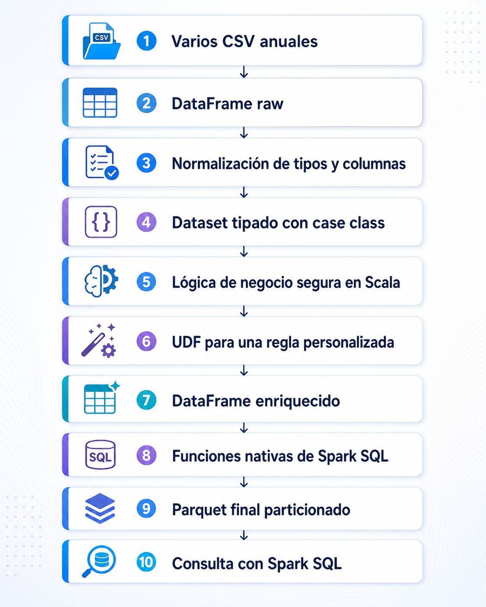

# 💻Clase 21 - Lectura y escritura de Ficheros

---

# Agenda:

<aside>
💡

#### 9:00 - 9:50    → Ficheros Parquet , AVRO y ORC

#### 9:50 - 11:20   →  Ejercicios

#### **11:20 - 11:40  →  Descanso**

#### 11:40 - 12:40  → Caso practico 2. Benchmark de Formatos: Airline Delay & Cancellation Data

#### 12:40 - 14:00  → Caso practico 3. Pipeline JSON → Parquet → BI

</aside>

---

# **Lectura y escritura de datos en Spark**

---

# **1. Celda inicial obligatoria**

Antes de ejecutar cualquier ejemplo de esta sesión, ejecuta esta celda al principio del notebook.

```scala
import $ivy.`org.apache.spark::spark-core:4.1.1`
import $ivy.`org.apache.spark::spark-sql:4.1.1`
import $ivy.`org.apache.spark::spark-avro:4.1.1`

import org.apache.spark.sql.SparkSession
import org.apache.spark.sql.types._
import org.apache.spark.sql.functions._

import java.nio.file.{Files, Paths}
import java.nio.charset.StandardCharsets
import java.io.File

val spark = SparkSession.builder()
  .appName("c21_Formatos_Spark")
  .master("local[*]")
  .config("spark.ui.showConsoleProgress", "false")
  .getOrCreate()

import spark.implicits._

spark.sparkContext.setLogLevel("ERROR")

println(s"✅ Spark${spark.version} listo para lectura y escritura de formatos")
```

**Salida esperada:**

```scala
✅ Spark 4.1.1 listo para lectura y escritura de formatos
```

> ⚠️ Para trabajar con **Avro** se añade la dependencia `spark-avro`. Parquet y ORC se pueden usar directamente desde `spark-sql`.
> 

---

# **2. Preparar carpeta y datos de entrada**

Para que todos los ejemplos funcionen en el notebook, primero crearemos un fichero CSV desde Scala. El CSV será solo el **punto de partida** del pipeline.

> ⚠️ Ajusta la ruta si tu carpeta de trabajo es diferente.
> 

```scala
val rutaBase = "C:/Curso-Scala/datos/c21"
Files.createDirectories(Paths.get(rutaBase))

println(s"Carpeta creada o existente:$rutaBase")
```

**Salida esperada:**

```scala
Carpeta creada o existente: C:/Curso-Scala/datos/dia17_s2
```

---

## **2.1 Crear un CSV de ventas**

```scala
val contenidoVentasCSV =
"""id_venta,fecha,anio,mes,cliente,ciudad,categoria,producto,cantidad,precio_unitario
1,2026-01-05,2026,1,Ana,Madrid,Informatica,Portatil,1,850.50
2,2026-01-07,2026,1,Luis,Valencia,Informatica,Raton,3,18.90
3,2026-02-11,2026,2,Marta,Sevilla,Oficina,Silla,2,120.00
4,2026-02-13,2026,2,Carlos,Madrid,Informatica,Monitor,1,199.99
5,2026-03-02,2026,3,Ana,Barcelona,Oficina,Mesa,1,250.00
6,2026-03-15,2026,3,Lucia,Zaragoza,Informatica,Webcam,4,39.90
7,2026-04-01,2026,4,Pedro,Madrid,Informatica,Teclado,2,45.00
8,2026-04-03,2026,4,Sofia,Valencia,Audio,Auriculares,2,59.99
9,2025-12-20,2025,12,Ana,Madrid,Informatica,Portatil,1,799.00
10,2025-12-22,2025,12,Luis,Sevilla,Oficina,Silla,4,110.00
"""

val rutaVentasCSV = s"$rutaBase/ventas.csv"

Files.write(
  Paths.get(rutaVentasCSV),
  contenidoVentasCSV.getBytes(StandardCharsets.UTF_8)
)

println(s"CSV creado en:$rutaVentasCSV")
```

**Salida esperada:**

```scala
CSV creado en: C:/Curso-Scala/datos/dia17_s2/ventas.csv
```

---

## **2.2 Cargar el CSV base con schema manual**

Como CSV ya se explicó en sesiones anteriores, aquí solo lo usamos como fuente inicial.

```scala
val schemaVentas = StructType(List(
  StructField("id_venta",        IntegerType, nullable = false),
  StructField("fecha",           DateType,    nullable = true),
  StructField("anio",            IntegerType, nullable = true),
  StructField("mes",             IntegerType, nullable = true),
  StructField("cliente",         StringType,  nullable = true),
  StructField("ciudad",          StringType,  nullable = true),
  StructField("categoria",       StringType,  nullable = true),
  StructField("producto",        StringType,  nullable = true),
  StructField("cantidad",        IntegerType, nullable = true),
  StructField("precio_unitario", DoubleType,  nullable = true)
))

val dfVentas = spark.read
  .option("header", "true")
  .schema(schemaVentas)
  .csv(rutaVentasCSV)

println("=== Ventas cargadas desde CSV base ===")
dfVentas.show(false)

dfVentas.printSchema()
```

**Salida esperada parcial:**

```scala
=== Ventas cargadas desde CSV base ===
+--------+----------+----+---+-------+---------+-----------+------------+--------+---------------+
|id_venta|fecha     |anio|mes|cliente|ciudad   |categoria  |producto    |cantidad|precio_unitario|
+--------+----------+----+---+-------+---------+-----------+------------+--------+---------------+
|1       |2026-01-05|2026|1  |Ana    |Madrid   |Informatica|Portatil    |1       |850.5          |
|2       |2026-01-07|2026|1  |Luis   |Valencia |Informatica|Raton       |3       |18.9           |
...
+--------+----------+----+---+-------+---------+-----------+------------+--------+---------------+
```

> ⚠️ En algunos lectores de CSV, Spark puede mostrar `nullable = true` aunque en el `StructField` hayamos escrito `nullable = false`. Esto se debe a que el CSV es texto externo y Spark no siempre puede garantizar esa restricción durante la lectura. El punto importante aquí es que el **tipo de dato** sí queda controlado.
> 

---

# **3. Formatos de datos soportados por Spark**

Spark permite leer y escribir muchos formatos. En Big Data, no todos cumplen la misma función.

| **Formato** | **Tipo** | **Lectura** | **Escritura** | **Uso habitual** |
| --- | --- | --- | --- | --- |
| CSV | Texto por filas | ✅ | ✅ | Intercambio simple, Excel, cargas manuales |
| JSON | Texto semiestructurado | ✅ | ✅ | APIs, logs, eventos simples |
| Parquet | Binario columnar | ✅ | ✅ | Data Lakes, analítica, consultas por columnas |
| ORC | Binario columnar | ✅ | ✅ | Hive, Hadoop, entornos analíticos optimizados |
| Avro | Binario por filas | ✅ | ✅ | Eventos, Kafka, serialización, intercambio con schema |
- **CSV y JSON** son formatos cómodos para intercambio, pero no suelen ser los más eficientes para analítica a gran escala.
- **Parquet y ORC** son formatos columnares. Suelen ser mejores para consultas analíticas porque permiten leer solo las columnas necesarias.
- **Avro** es binario por filas. Es muy usado cuando se necesita transportar registros completos con schema, por ejemplo en pipelines de eventos.

---

# **4. Preparar un DataFrame enriquecido para escribir**

Antes de guardar en distintos formatos, creamos una columna calculada `importe_total`.

```scala
val dfVentasPreparadas = dfVentas
  .withColumn("importe_total", col("cantidad") * col("precio_unitario"))

println("=== Ventas preparadas para escritura ===")
dfVentasPreparadas.show(false)
```

**Salida esperada parcial:**

```scala
=== Ventas preparadas para escritura ===
+--------+----------+----+---+-------+---------+-----------+------------+--------+---------------+-------------+
|id_venta|fecha     |anio|mes|cliente|ciudad   |categoria  |producto    |cantidad|precio_unitario|importe_total|
+--------+----------+----+---+-------+---------+-----------+------------+--------+---------------+-------------+
|1       |2026-01-05|2026|1  |Ana    |Madrid   |Informatica|Portatil    |1       |850.5          |850.5        |
|2       |2026-01-07|2026|1  |Luis   |Valencia |Informatica|Raton       |3       |18.9           |56.7         |
...
+--------+----------+----+---+-------+---------+-----------+------------+--------+---------------+-------------+
```

---

# **5. Parquet**

## **5.1 ¿Qué es Parquet?**

**Parquet** es un formato binario columnar. Es uno de los formatos más usados en Data Lakes y Lakehouses.  La idea clave es que Parquet guarda los datos **por columnas**, no solamente por filas.

<aside>

**Almacenamiento por filas (CSV, JSON):**
Los datos se guardan fila por fila, tal como los lees:

```scala
[1, Laptop, Tecnología, 1200, 2] [2, Teclado, Tecnología, 45, 5] [3, Silla, Oficina, 120, 4]
```

**Almacenamiento columnar (Parquet):** Los datos se guardan columna por columna:

```scala
ids:       [1, 2, 3]
productos: [Laptop, Teclado, Silla]
categorias:[Tecnología, Tecnología, Oficina]
precios:   [1200, 45, 120]        ← solo esto se lee para sum(precio)
cantidades:[2, 5, 4]
```

Para calcular la suma de precios, Spark **solo lee la columna `precio`**. El resto ni se toca.

### 3.2 Ventajas de Parquet

- **Lectura selectiva:** Solo se leen las columnas necesarias para la consulta.
- **Compresión superior:** Datos del mismo tipo se comprimen juntos (ej: enteros con enteros). Un CSV de 100 MB suele convertirse en un Parquet de 10–20 MB.
- **Schema embebido:** El fichero lleva su propio esquema de tipos. No hace falta `inferSchema` ni definirlo manualmente.
- **Estadísticas por bloque:** Parquet almacena mínimos y máximos por fragmento. Spark puede saltar bloques enteros que no cumplan un filtro (`WHERE precio > 500`).
- **Particionado físico:** Se puede escribir particionando los datos en carpetas (`partitionBy`), lo que acelera enormemente las consultas con filtros por esa columna.
</aside>

> Si una consulta solo necesita `ciudad` e `importe_total`, Spark puede evitar leer muchas columnas innecesarias.
> 

---

## **5.2 Escribir en Parquet**

```scala
val rutaParquet = s"$rutaBase/salida/ventas_parquet"

dfVentasPreparadas.write
  .mode("overwrite")
  .parquet(rutaParquet)

println(s"Datos escritos en Parquet:$rutaParquet")
```

**Salida esperada:**

```scala
Datos escritos en Parquet: C:/Curso-Scala/datos/dia17_s2/salida/ventas_parquet
```

---

## **5.3 Leer Parquet**

```scala
val dfVentasParquet = spark.read.parquet(rutaParquet)

println("=== Datos leídos desde Parquet ===")
dfVentasParquet.show(5, truncate = false)

dfVentasParquet.printSchema()
```

**Salida esperada parcial:**

```scala
=== Datos leídos desde Parquet ===
+--------+----------+----+---+-------+---------+-----------+--------+--------+---------------+-------------+
|id_venta|fecha     |anio|mes|cliente|ciudad   |categoria  |producto|cantidad|precio_unitario|importe_total|
+--------+----------+----+---+-------+---------+-----------+--------+--------+---------------+-------------+
|1       |2026-01-05|2026|1  |Ana    |Madrid   |Informatica|Portatil|1       |850.5          |850.5        |
...
+--------+----------+----+---+-------+---------+-----------+--------+--------+---------------+-------------+
```

> 💡 Parquet guarda el schema dentro del propio formato. Por eso, al leerlo, no necesitamos indicar `header`, `inferSchema` ni `schema`.
> 

---

# **6. ORC**

## **6.1 ¿Qué es ORC?**

**ORC** significa **Optimized Row Columnar**. Aunque su nombre contiene la palabra `Row`, en la práctica es un formato **columnar** optimizado para analítica. Es muy habitual en ecosistemas basados en **Hive**, **Hadoop** y almacenes analíticos que necesitan compresión y lectura eficiente.

| **Característica** | **ORC** |
| --- | --- |
| Tipo | Binario columnar |
| Guarda schema | Sí |
| Compresión | Sí |
| Uso típico | Hive, Hadoop, Data Warehouse sobre Data Lake |
| Bueno para | Consultas analíticas y lectura de columnas concretas |

<aside>

ORC es **columnar** igual que Parquet, pero con algunas diferencias internas.

**Almacenamiento ORC:** Los datos se guardan columna por columna, organizados en **stripes** (franjas horizontales):

```scala
STRIPE 1 (filas 1-3)
├── columna ids:        [1, 2, 3]
├── columna productos:  [Laptop, Teclado, Silla]
├── columna categorias: [Tecnología, Tecnología, Oficina]
├── columna precios:    [1200, 45, 120]     ← solo esto se lee para sum(precio)
└── columna cantidades: [2, 5, 4]

STRIPE 2 (filas 4-6)
├── columna ids:        [4, 5, 6]
├── columna productos:  [Mesa, Tablet, Ratón]
...

FILE FOOTER (al final del fichero)
├── estadísticas globales: min/max/suma por columna
├── estadísticas por stripe: min/max por columna por franja
└── schema completo
```

En la práctica, para Spark puro se usa casi siempre Parquet. ORC es la elección natural si el ecosistema principal es **Hive** o **Hadoop**, donde ORC nació y está más optimizado.

</aside>

---

## **6.2 Escribir en ORC**

```scala
val rutaORC = s"$rutaBase/salida/ventas_orc"

dfVentasPreparadas.write
  .mode("overwrite")
  .orc(rutaORC)

println(s"Datos escritos en ORC:$rutaORC")
```

**Salida esperada:**

```scala
Datos escritos en ORC: C:/Curso-Scala/datos/dia17_s2/salida/ventas_orc
```

---

## **6.3 Leer ORC**

```scala
val dfVentasORC = spark.read.orc(rutaORC)

println("=== Datos leídos desde ORC ===")
dfVentasORC.show(5, truncate = false)

dfVentasORC.printSchema()
```

**Salida esperada parcial:**

```scala
=== Datos leídos desde ORC ===
+--------+----------+----+---+-------+---------+-----------+--------+--------+---------------+-------------+
|id_venta|fecha     |anio|mes|cliente|ciudad   |categoria  |producto|cantidad|precio_unitario|importe_total|
+--------+----------+----+---+-------+---------+-----------+--------+--------+---------------+-------------+
|1       |2026-01-05|2026|1  |Ana    |Madrid   |Informatica|Portatil|1       |850.5          |850.5        |
...
+--------+----------+----+---+-------+---------+-----------+--------+--------+---------------+-------------+
```

---

# **7. Avro**

## **7.1 ¿Qué es Avro?**

**Avro** es un formato binario orientado a registros. A diferencia de Parquet y ORC, no está pensado principalmente para leer columnas sueltas, sino para transportar o almacenar registros completos con schema.

Es muy usado en pipelines de eventos, integración entre sistemas y ecosistemas como Kafka.

| **Característica** | **Avro** |
| --- | --- |
| Tipo | Binario por filas / registros |
| Guarda schema | Sí |
| Uso típico | Eventos, Kafka, integración de sistemas |
| Bueno para | Intercambiar registros completos |
| Menos ideal para | Consultas analíticas que leen pocas columnas |

<aside>

Avro es un formato de almacenamiento **por filas**, igual que CSV y JSON, no columnar como Parquet u ORC.

Usando la misma lógica de la imagen, un fichero Avro con esos mismos datos se almacenaría así:

```scala
fila 1: {id:1, producto:Laptop,  categoria:Tecnología, precio:1200, cantidad:2}
fila 2: {id:2, producto:Teclado, categoria:Tecnología, precio:45,   cantidad:5}
fila 3: {id:3, producto:Silla,   categoria:Oficina,    precio:120,  cantidad:4}
```

Cada fila se guarda completa y junta, igual que en CSV o JSON. La diferencia con estos dos es que Avro es **binario** (no legible por humanos) y lleva el **schema embebido** en el propio fichero en formato JSON.

La consecuencia práctica es la misma que en CSV: si quieres calcular `sum(precio)`, Spark tiene que leer los cinco campos de cada fila aunque solo necesite `precio`. Por eso Avro **no es eficiente para analítica**, pero sí es muy bueno para **streaming y mensajería** (Kafka, por ejemplo), donde los datos llegan registro a registro y lo que importa es procesar cada mensaje completo lo antes posible, no hacer agregaciones sobre millones de columnas.

</aside>

---

## **7.2 Escribir en Avro**

Con Spark se usa el formato `avro` mediante `.format("avro")`.

```scala
val rutaAvro = s"$rutaBase/salida/ventas_avro"

dfVentasPreparadas.write
  .mode("overwrite")
  .format("avro")
  .save(rutaAvro)

println(s"Datos escritos en Avro:$rutaAvro")
```

**Salida esperada:**

```scala
Datos escritos en Avro: C:/Curso-Scala/datos/dia17_s2/salida/ventas_avro
```

---

## **7.3 Leer Avro**

```scala
val dfVentasAvro = spark.read
  .format("avro")
  .load(rutaAvro)

println("=== Datos leídos desde Avro ===")
dfVentasAvro.show(5, truncate = false)

dfVentasAvro.printSchema()
```

**Salida esperada parcial:**

```scala
=== Datos leídos desde Avro ===
+--------+----------+----+---+-------+---------+-----------+--------+--------+---------------+-------------+
|id_venta|fecha     |anio|mes|cliente|ciudad   |categoria  |producto|cantidad|precio_unitario|importe_total|
+--------+----------+----+---+-------+---------+-----------+--------+--------+---------------+-------------+
|1       |2026-01-05|2026|1  |Ana    |Madrid   |Informatica|Portatil|1       |850.5          |850.5        |
...
+--------+----------+----+---+-------+---------+-----------+--------+--------+---------------+-------------+
```

> 💡 Recuerda: si esta celda falla con un error de formato Avro no encontrado, revisa que hayas ejecutado la celda inicial con `spark-avro`.
> 

---

# **8. Modos de escritura**

Cuando escribimos un DataFrame, Spark necesita saber qué hacer si la ruta de salida ya existe.

| **Modo** | **Qué hace** | **Cuándo usarlo** |
| --- | --- | --- |
| `overwrite` | Borra la salida anterior y escribe de nuevo | Reprocesos completos |
| `append` | Añade nuevos datos a la carpeta existente | Cargas incrementales |
| `ignore` | Si la ruta existe, no hace nada | Evitar errores en procesos repetidos |
| `errorIfExists` | Falla si la ruta ya existe | Evitar sobrescribir por accidente |

---

## **8.1 `overwrite`**

```scala
val rutaOverwrite = s"$rutaBase/salida/modo_overwrite"

dfVentasPreparadas.write
  .mode("overwrite")
  .parquet(rutaOverwrite)

println("Primera escritura con overwrite completada")

dfVentasPreparadas.write
  .mode("overwrite")
  .parquet(rutaOverwrite)

println("Segunda escritura con overwrite completada sin error")
```

**Salida esperada:**

```scala
Primera escritura con overwrite completada
Segunda escritura con overwrite completada sin error
```

---

## **8.2 `append`**

```scala
val rutaAppend = s"$rutaBase/salida/modo_append"

val ventas2026 = dfVentasPreparadas.filter(col("anio") === 2026)
val ventas2025 = dfVentasPreparadas.filter(col("anio") === 2025)

ventas2026.write
  .mode("overwrite")
  .parquet(rutaAppend)

ventas2025.write
  .mode("append")
  .parquet(rutaAppend)

val dfAppend = spark.read.parquet(rutaAppend)
println(s"Total después de append:${dfAppend.count()}")
```

**Salida esperada:**

```scala
Total después de append: 10
```

---

## **8.3 `ignore`**

```scala
val rutaIgnore = s"$rutaBase/salida/modo_ignore"

dfVentasPreparadas.write
  .mode("overwrite")
  .parquet(rutaIgnore)

val conteoAntes = spark.read.parquet(rutaIgnore).count()

// Como la ruta ya existe, ignore no escribirá de nuevo ni dará error
dfVentasPreparadas.limit(2).write
  .mode("ignore")
  .parquet(rutaIgnore)

val conteoDespues = spark.read.parquet(rutaIgnore).count()

println(s"Registros antes:$conteoAntes")
println(s"Registros después de ignore:$conteoDespues")
```

**Salida esperada:**

```scala
Registros antes: 10
Registros después de ignore: 10
```

---

## **8.4 `errorIfExists`**

Este modo es el comportamiento por defecto. Si la ruta ya existe, Spark lanza un error.

```scala
val rutaError = s"$rutaBase/salida/modo_error"

dfVentasPreparadas.write
  .mode("overwrite")
  .parquet(rutaError)

// Esta segunda escritura fallará porque la ruta ya existe
// dfVentasPreparadas.write
//   .mode("errorIfExists")
//   .parquet(rutaError)
```

**Salida esperada si se descomenta la segunda escritura:**

```scala
org.apache.spark.sql.AnalysisException: [PATH_ALREADY_EXISTS] Path file:/C:/Curso-Scala/datos/dia17_s2/salida/modo_error already exists.
```

> 💡 Para principiantes, conviene dejar esta parte comentada y explicarla en clase. Así evitamos detener el notebook con un error intencionado.
> 

# **9. Escritura particionada con `partitionBy`**

`partitionBy` permite guardar los datos organizados en carpetas según el valor de una o varias columnas.

Por ejemplo, si escribimos por `anio`, Spark crea una estructura parecida a esta:

```
ventas_por_anio/
  anio=2025/
    part-0000...
  anio=2026/
    part-0000...
```

Esto es útil cuando después queremos leer solo un año concreto.

---

## **9.1 Escribir Parquet particionado por año y mes**

```scala
val rutaParquetParticionado = s"$rutaBase/salida/ventas_parquet_particionado"

dfVentasPreparadas.write
  .mode("overwrite")
  .partitionBy("anio", "mes")
  .parquet(rutaParquetParticionado)

println(s"Parquet particionado creado en:$rutaParquetParticionado")
```

**Salida esperada:**

```scala
Parquet particionado creado en: C:/Curso-Scala/datos/dia17_s2/salida/ventas_parquet_particionado
```

---

## **9.2 Escribir ORC particionado por año y mes**

```scala
val rutaORCParticionado = s"$rutaBase/salida/ventas_orc_particionado"

dfVentasPreparadas.write
  .mode("overwrite")
  .partitionBy("anio", "mes")
  .orc(rutaORCParticionado)

println(s"ORC particionado creado en:$rutaORCParticionado")
```

**Salida esperada:**

```scala
ORC particionado creado en: C:/Curso-Scala/datos/dia17_s2/salida/ventas_orc_particionado
```

---

## **9.3 Escribir Avro particionado por año y mes**

```scala
val rutaAvroParticionado = s"$rutaBase/salida/ventas_avro_particionado"

dfVentasPreparadas.write
  .mode("overwrite")
  .partitionBy("anio", "mes")
  .format("avro")
  .save(rutaAvroParticionado)

println(s"Avro particionado creado en:$rutaAvroParticionado")
```

**Salida esperada:**

```scala
Avro particionado creado en: C:/Curso-Scala/datos/dia17_s2/salida/ventas_avro_particionado
```

---

## **9.4 Leer solo ventas de 2026 desde una salida particionada**

```scala
val dfSolo2026 = spark.read
  .parquet(rutaParquetParticionado)
  .filter(col("anio") === 2026)

println("=== Ventas del año 2026 ===")
dfSolo2026.show(false)

println(s"Total ventas 2026:${dfSolo2026.count()}")
```

**Salida esperada:**

```scala
Total ventas 2026: 8
```

> 💡 Cuando escribimos con `partitionBy("anio", "mes")`, esas columnas pueden aparecer al final al leer de nuevo. Esto es normal: se convierten en columnas de partición.
> 

---

# **10. Comparar tamaño de CSV, JSON, Parquet, ORC y Avro**

Para comparar tamaños de forma sencilla, creamos una función que calcule el tamaño total de una carpeta.

```scala
def tamanoCarpetaBytes(path: String): Long = {
  def total(file: File): Long = {
    if (file.isFile) file.length()
    else file.listFiles().map(total).sum
  }
  total(new File(path))
}
```

Primero exportamos también una salida CSV y una salida JSON para usarlas como comparación. No repetimos la teoría de estos formatos: aquí se usan solo como formatos base para medir peso y rendimiento.

```scala
val rutaCSVSalida = s"$rutaBase/salida/ventas_csv_exportado"
val rutaJSONSalida = s"$rutaBase/salida/ventas_json_exportado"

dfVentasPreparadas.write
  .mode("overwrite")
  .option("header", "true")
  .csv(rutaCSVSalida)

dfVentasPreparadas.write
  .mode("overwrite")
  .json(rutaJSONSalida)

println(s"CSV exportado en:$rutaCSVSalida")
println(s"JSON exportado en:$rutaJSONSalida")
```

Ahora medimos los tamaños.

```scala
val sizeCSV = tamanoCarpetaBytes(rutaCSVSalida)
val sizeJSON = tamanoCarpetaBytes(rutaJSONSalida)
val sizeParquet = tamanoCarpetaBytes(rutaParquet)
val sizeORC = tamanoCarpetaBytes(rutaORC)
val sizeAvro = tamanoCarpetaBytes(rutaAvro)

println(s"Tamaño CSV:$sizeCSV bytes")
println(s"Tamaño JSON:$sizeJSON bytes")
println(s"Tamaño Parquet:$sizeParquet bytes")
println(s"Tamaño ORC:$sizeORC bytes")
println(s"Tamaño Avro:$sizeAvro bytes")
```

**Salida esperada aproximada:**

```scala
Tamaño CSV:     2500 bytes
Tamaño JSON:    3200 bytes
Tamaño Parquet: 6000 bytes
Tamaño ORC:     5000 bytes
Tamaño Avro:    4500 bytes
```

> ⚠️ Con datasets muy pequeños, los formatos binarios pueden ocupar más que CSV o JSON porque guardan metadatos y schema. En datasets grandes, Parquet y ORC suelen ser más eficientes por compresión, lectura columnar y estadísticas internas. JSON normalmente ocupa más que CSV porque repite los nombres de campo en cada registro.
> 

---

# **11. Comparar tiempo de escritura y lectura entre formatos**

Con datos pequeños, la diferencia puede no ser estable. Aun así, este ejercicio enseña cómo medir de forma básica tanto la escritura como la lectura.

```scala
def medirTiempo[T](descripcion: String)(bloque: => T): (T, Double) = {
  val inicio = System.nanoTime()
  val resultado = bloque
  val fin = System.nanoTime()
  val ms = (fin - inicio) / 1000000.0
  println(f"$descripcion →$ms%.2f ms")
  (resultado, ms)
}
```

## **11.1 Medir escritura completa**

Para comparar escritura de forma limpia, escribimos en rutas nuevas de benchmark.

```scala
val rutaBenchCSV = s"$rutaBase/benchmark/ventas_csv"
val rutaBenchJSON = s"$rutaBase/benchmark/ventas_json"
val rutaBenchParquet = s"$rutaBase/benchmark/ventas_parquet"
val rutaBenchORC = s"$rutaBase/benchmark/ventas_orc"
val rutaBenchAvro = s"$rutaBase/benchmark/ventas_avro"

val (_, escrituraCSV) = medirTiempo("Escritura CSV") {
  dfVentasPreparadas.write
    .mode("overwrite")
    .option("header", "true")
    .csv(rutaBenchCSV)
}

val (_, escrituraJSON) = medirTiempo("Escritura JSON") {
  dfVentasPreparadas.write
    .mode("overwrite")
    .json(rutaBenchJSON)
}

val (_, escrituraParquet) = medirTiempo("Escritura Parquet") {
  dfVentasPreparadas.write
    .mode("overwrite")
    .parquet(rutaBenchParquet)
}

val (_, escrituraORC) = medirTiempo("Escritura ORC") {
  dfVentasPreparadas.write
    .mode("overwrite")
    .orc(rutaBenchORC)
}

val (_, escrituraAvro) = medirTiempo("Escritura Avro") {
  dfVentasPreparadas.write
    .mode("overwrite")
    .format("avro")
    .save(rutaBenchAvro)
}
```

**Salida esperada aproximada:**

```scala
Escritura CSV → 300.00 ms
Escritura JSON → 330.00 ms
Escritura Parquet → 180.00 ms
Escritura ORC → 190.00 ms
Escritura Avro → 220.00 ms
```

---

## **11.2 Medir lectura completa con `count()`**

```scala
val (_, lecturaCSV) = medirTiempo("Lectura CSV + count") {
  spark.read
    .option("header", "true")
    .option("inferSchema", "true")
    .csv(rutaBenchCSV)
    .count()
}

val (_, lecturaJSON) = medirTiempo("Lectura JSON + count") {
  spark.read
    .json(rutaBenchJSON)
    .count()
}

val (_, lecturaParquet) = medirTiempo("Lectura Parquet + count") {
  spark.read
    .parquet(rutaBenchParquet)
    .count()
}

val (_, lecturaORC) = medirTiempo("Lectura ORC + count") {
  spark.read
    .orc(rutaBenchORC)
    .count()
}

val (_, lecturaAvro) = medirTiempo("Lectura Avro + count") {
  spark.read
    .format("avro")
    .load(rutaBenchAvro)
    .count()
}
```

**Salida esperada aproximada:**

```scala
Lectura CSV + count → 250.00 ms
Lectura JSON + count → 280.00 ms
Lectura Parquet + count → 90.00 ms
Lectura ORC + count → 95.00 ms
Lectura Avro + count → 120.00 ms
```

---

## **11.3 Crear una tabla resumen de tiempos**

```scala
val comparativaTiempos = Seq(
  ("CSV", escrituraCSV, lecturaCSV),
  ("JSON", escrituraJSON, lecturaJSON),
  ("Parquet", escrituraParquet, lecturaParquet),
  ("ORC", escrituraORC, lecturaORC),
  ("Avro", escrituraAvro, lecturaAvro)
).toDF("formato", "tiempo_escritura_ms", "tiempo_lectura_ms")

comparativaTiempos.show(false)
```

**Salida esperada aproximada:**

```scala
+-------+-------------------+-----------------+
|formato|tiempo_escritura_ms|tiempo_lectura_ms|
+-------+-------------------+-----------------+
|CSV    |300.0              |250.0            |
|JSON   |330.0              |280.0            |
|Parquet|180.0              |90.0             |
|ORC    |190.0              |95.0             |
|Avro   |220.0              |120.0            |
+-------+-------------------+-----------------+
```

> 💡 Los tiempos pueden cambiar en cada ordenador. Lo importante es comparar el procedimiento, no memorizar los números.
> 

---

## **11.4 Medir lectura de pocas columnas**

Esta prueba ayuda a entender por qué Parquet y ORC son interesantes para analítica.

```scala
medirTiempo("CSV seleccionando 2 columnas") {
  spark.read
    .option("header", "true")
    .option("inferSchema", "true")
    .csv(rutaBenchCSV)
    .select("ciudad", "importe_total")
    .count()
}

medirTiempo("JSON seleccionando 2 columnas") {
  spark.read
    .json(rutaBenchJSON)
    .select("ciudad", "importe_total")
    .count()
}

medirTiempo("Parquet seleccionando 2 columnas") {
  spark.read
    .parquet(rutaBenchParquet)
    .select("ciudad", "importe_total")
    .count()
}

medirTiempo("ORC seleccionando 2 columnas") {
  spark.read
    .orc(rutaBenchORC)
    .select("ciudad", "importe_total")
    .count()
}

medirTiempo("Avro seleccionando 2 columnas") {
  spark.read
    .format("avro")
    .load(rutaBenchAvro)
    .select("ciudad", "importe_total")
    .count()
}
```

**Salida esperada aproximada:**

```scala
CSV seleccionando 2 columnas → 230.00 ms
JSON seleccionando 2 columnas → 260.00 ms
Parquet seleccionando 2 columnas → 70.00 ms
ORC seleccionando 2 columnas → 75.00 ms
Avro seleccionando 2 columnas → 115.00 ms
```

> 💡 En formatos columnares, seleccionar pocas columnas suele ser más eficiente porque Spark puede evitar leer columnas que no necesita.
> 

---

# **12. Resumen comparativo de formatos**

| **Formato** | **Tipo** | **Ventaja principal** | **Desventaja principal** | **Cuándo usarlo** |
| --- | --- | --- | --- | --- |
| CSV | Texto por filas | Muy simple y universal | Sin schema interno, pesado para analítica | Intercambio manual o entrada inicial |
| JSON | Texto semiestructurado | Flexible para datos con estructura variable | Puede ser pesado y lento | APIs, logs, documentos simples |
| Parquet | Binario columnar | Muy bueno para analítica y Data Lakes | No es cómodo de abrir manualmente | Capa silver/gold, consultas BI, lakehouse |
| ORC | Binario columnar | Muy optimizado en ecosistema Hive/Hadoop | Menos común fuera de ese ecosistema | Data Warehouse sobre Hadoop/Hive |
| Avro | Binario por registros | Bueno para eventos y transporte con schema | Menos eficiente para leer pocas columnas | Kafka, eventos, integración entre sistemas |

# **💻 Práctica guiada**

---

## **Ejercicio 1 — Crear DataFrame base y columna calculada**

### **Enunciado**

Usa el CSV `ventas.csv` creado al inicio de la sesión, cárgalo con schema manual y crea una columna `importe_total`.

### **Código solución**

```scala
val dfEj1 = spark.read
  .option("header", "true")
  .schema(schemaVentas)
  .csv(rutaVentasCSV)

val dfEj1Preparado = dfEj1
  .withColumn("importe_total", col("cantidad") * col("precio_unitario"))

println("=== DataFrame preparado ===")
dfEj1Preparado.show(false)
```

### **Salida esperada parcial**

```scala
+--------+----------+----+---+-------+---------+-----------+------------+--------+---------------+-------------+
|id_venta|fecha     |anio|mes|cliente|ciudad   |categoria  |producto    |cantidad|precio_unitario|importe_total|
+--------+----------+----+---+-------+---------+-----------+------------+--------+---------------+-------------+
|1       |2026-01-05|2026|1  |Ana    |Madrid   |Informatica|Portatil    |1       |850.5          |850.5        |
...
+--------+----------+----+---+-------+---------+-----------+------------+--------+---------------+-------------+
```

---

## **Ejercicio 2 — Escribir y leer Parquet**

### **Enunciado**

Guarda `dfEj1Preparado` en Parquet y vuelve a leerlo.

### **Código solución**

```scala
val rutaEj2Parquet = s"$rutaBase/practica/ventas_parquet_ej2"

dfEj1Preparado.write
  .mode("overwrite")
  .parquet(rutaEj2Parquet)

val dfEj2Parquet = spark.read.parquet(rutaEj2Parquet)

println("=== Parquet leído ===")
dfEj2Parquet.show(5, truncate = false)
dfEj2Parquet.printSchema()
```

### **Salida esperada parcial**

```scala
=== Parquet leído ===
+--------+----------+----+---+-------+---------+-----------+--------+--------+---------------+-------------+
|id_venta|fecha     |anio|mes|cliente|ciudad   |categoria  |producto|cantidad|precio_unitario|importe_total|
+--------+----------+----+---+-------+---------+-----------+--------+--------+---------------+-------------+
|1       |2026-01-05|2026|1  |Ana    |Madrid   |Informatica|Portatil|1       |850.5          |850.5        |
...
+--------+----------+----+---+-------+---------+-----------+--------+--------+---------------+-------------+
```

---

## **Ejercicio 3 — Escribir y leer ORC**

### **Enunciado**

Guarda `dfEj1Preparado` en ORC y vuelve a leerlo.

### **Código solución**

```scala
val rutaEj3ORC = s"$rutaBase/practica/ventas_orc_ej3"

dfEj1Preparado.write
  .mode("overwrite")
  .orc(rutaEj3ORC)

val dfEj3ORC = spark.read.orc(rutaEj3ORC)

println("=== ORC leído ===")
dfEj3ORC.show(5, truncate = false)
dfEj3ORC.printSchema()
```

### **Salida esperada parcial**

```scala
=== ORC leído ===
+--------+----------+----+---+-------+---------+-----------+--------+--------+---------------+-------------+
|id_venta|fecha     |anio|mes|cliente|ciudad   |categoria  |producto|cantidad|precio_unitario|importe_total|
+--------+----------+----+---+-------+---------+-----------+--------+--------+---------------+-------------+
|1       |2026-01-05|2026|1  |Ana    |Madrid   |Informatica|Portatil|1       |850.5          |850.5        |
...
+--------+----------+----+---+-------+---------+-----------+--------+--------+---------------+-------------+
```

---

## **Ejercicio 4 — Escribir y leer Avro**

### **Enunciado**

Guarda `dfEj1Preparado` en Avro y vuelve a leerlo.

### **Código solución**

```scala
val rutaEj4Avro = s"$rutaBase/practica/ventas_avro_ej4"

dfEj1Preparado.write
  .mode("overwrite")
  .format("avro")
  .save(rutaEj4Avro)

val dfEj4Avro = spark.read
  .format("avro")
  .load(rutaEj4Avro)

println("=== Avro leído ===")
dfEj4Avro.show(5, truncate = false)
dfEj4Avro.printSchema()
```

### **Salida esperada parcial**

```scala
=== Avro leído ===
+--------+----------+----+---+-------+---------+-----------+--------+--------+---------------+-------------+
|id_venta|fecha     |anio|mes|cliente|ciudad   |categoria  |producto|cantidad|precio_unitario|importe_total|
+--------+----------+----+---+-------+---------+-----------+--------+--------+---------------+-------------+
|1       |2026-01-05|2026|1  |Ana    |Madrid   |Informatica|Portatil|1       |850.5          |850.5        |
...
+--------+----------+----+---+-------+---------+-----------+--------+--------+---------------+-------------+
```

---

## **Ejercicio 5 — Comparar tamaños**

### **Enunciado**

Exporta el mismo DataFrame en CSV, JSON, Parquet, ORC y Avro. Después compara el peso de cada salida.

### **Código solución**

```scala
val rutaEj5CSV = s"$rutaBase/practica/comparacion_csv"
val rutaEj5JSON = s"$rutaBase/practica/comparacion_json"
val rutaEj5Parquet = s"$rutaBase/practica/comparacion_parquet"
val rutaEj5ORC = s"$rutaBase/practica/comparacion_orc"
val rutaEj5Avro = s"$rutaBase/practica/comparacion_avro"

dfEj1Preparado.write.mode("overwrite").option("header", "true").csv(rutaEj5CSV)
dfEj1Preparado.write.mode("overwrite").json(rutaEj5JSON)
dfEj1Preparado.write.mode("overwrite").parquet(rutaEj5Parquet)
dfEj1Preparado.write.mode("overwrite").orc(rutaEj5ORC)
dfEj1Preparado.write.mode("overwrite").format("avro").save(rutaEj5Avro)

println(s"CSV:${tamanoCarpetaBytes(rutaEj5CSV)} bytes")
println(s"JSON:${tamanoCarpetaBytes(rutaEj5JSON)} bytes")
println(s"Parquet:${tamanoCarpetaBytes(rutaEj5Parquet)} bytes")
println(s"ORC:${tamanoCarpetaBytes(rutaEj5ORC)} bytes")
println(s"Avro:${tamanoCarpetaBytes(rutaEj5Avro)} bytes")
```

### **Salida esperada aproximada**

```scala
CSV:     2500 bytes
JSON:    3200 bytes
Parquet: 6000 bytes
ORC:     5000 bytes
Avro:    4500 bytes
```

---

## **Ejercicio 6 — Comparar tiempos de lectura**

### **Enunciado**

Mide el tiempo de lectura y conteo de cada formato, incluyendo JSON como formato de texto semiestructurado.

### **Código solución**

```scala
medirTiempo("CSV + count") {
  spark.read
    .option("header", "true")
    .option("inferSchema", "true")
    .csv(rutaEj5CSV)
    .count()
}

medirTiempo("JSON + count") {
  spark.read.json(rutaEj5JSON).count()
}

medirTiempo("Parquet + count") {
  spark.read.parquet(rutaEj5Parquet).count()
}

medirTiempo("ORC + count") {
  spark.read.orc(rutaEj5ORC).count()
}

medirTiempo("Avro + count") {
  spark.read.format("avro").load(rutaEj5Avro).count()
}
```

### **Salida esperada aproximada**

```scala
CSV + count → 250.00 ms
JSON + count → 280.00 ms
Parquet + count → 90.00 ms
ORC + count → 95.00 ms
Avro + count → 120.00 ms
```

---

## **Ejercicio 7 — Escribir formatos particionados**

### **Enunciado**

Guarda el mismo DataFrame particionado por `anio` y `mes` en Parquet, ORC y Avro.

### **Código solución**

```scala
val rutaEj7ParquetPart = s"$rutaBase/practica/particionado_parquet"
val rutaEj7ORCPart = s"$rutaBase/practica/particionado_orc"
val rutaEj7AvroPart = s"$rutaBase/practica/particionado_avro"

dfEj1Preparado.write
  .mode("overwrite")
  .partitionBy("anio", "mes")
  .parquet(rutaEj7ParquetPart)

dfEj1Preparado.write
  .mode("overwrite")
  .partitionBy("anio", "mes")
  .orc(rutaEj7ORCPart)

dfEj1Preparado.write
  .mode("overwrite")
  .partitionBy("anio", "mes")
  .format("avro")
  .save(rutaEj7AvroPart)

println("Formatos particionados creados correctamente")
```

### **Salida esperada**

```scala
Formatos particionados creados correctamente
```

---

# **🏢 Caso de estudio propuesto: RetailLake Analytics**

---

## **Contexto empresarial**

**RetailLake Analytics** es una empresa de comercio electrónico que está construyendo su primer Data Lake. Hasta ahora, las ventas diarias se recibían en CSV y se procesaban manualmente. El equipo de Data Engineering quiere evaluar distintos formatos de almacenamiento para decidir cuál usar en las capas analíticas.

La empresa necesita comparar:

- CSV como formato de entrada original.
- JSON como formato semiestructurado de intercambio.
- Parquet como formato analítico general.
- ORC como alternativa columnar compatible con ecosistemas Hive/Hadoop.
- Avro como formato de intercambio de registros con schema.

Tu tarea será construir un pequeño pipeline que lea ventas, prepare datos, escriba en varios formatos, compare peso y tiempo de lectura, y genere una recomendación técnica.

Este caso usa únicamente conocimientos de esta sesión: lectura, escritura, formatos, modos de escritura, particionado, comparación de tamaño y medición básica de tiempo.

---

## **📦 Datos del caso**

Crea el fichero `retail_ventas.csv` en la carpeta `C:/Curso-Scala/datos/dia17_s2/caso/`.

```scala
val rutaCaso = s"$rutaBase/caso"
Files.createDirectories(Paths.get(rutaCaso))

val contenidoCasoCSV =
"""id_venta,fecha,anio,mes,canal,ciudad,categoria,producto,cantidad,precio_unitario
1001,2026-01-03,2026,1,Web,Madrid,Informatica,Portatil,2,820.00
1002,2026-01-04,2026,1,App,Valencia,Audio,Auriculares,3,55.00
1003,2026-01-10,2026,1,Web,Sevilla,Oficina,Silla,5,115.00
1004,2026-02-02,2026,2,App,Madrid,Informatica,Monitor,2,210.00
1005,2026-02-09,2026,2,Web,Barcelona,Oficina,Mesa,1,260.00
1006,2026-02-12,2026,2,Web,Zaragoza,Informatica,Webcam,6,42.00
1007,2026-03-01,2026,3,App,Madrid,Informatica,Teclado,4,48.00
1008,2026-03-04,2026,3,Web,Valencia,Audio,Auriculares,2,60.00
1009,2026-03-08,2026,3,App,Sevilla,Oficina,Silla,3,118.00
1010,2025-12-15,2025,12,Web,Madrid,Informatica,Portatil,1,790.00
1011,2025-12-16,2025,12,App,Barcelona,Audio,Auriculares,2,52.00
1012,2025-12-20,2025,12,Web,Valencia,Oficina,Mesa,1,240.00
"""

val rutaCasoCSV = s"$rutaCaso/retail_ventas.csv"

Files.write(
  Paths.get(rutaCasoCSV),
  contenidoCasoCSV.getBytes(StandardCharsets.UTF_8)
)

println(s"Fichero del caso creado en:$rutaCasoCSV")
```

**Salida esperada:**

```scala
Fichero del caso creado en: C:/Curso-Scala/datos/dia17_s2/caso/retail_ventas.csv
```

---

## **Tarea 1 — Cargar el CSV de entrada con schema manual**

### **Enunciado**

Carga el CSV de RetailLake con un schema manual para controlar los tipos.

### **Solución**

```scala
val schemaRetail = StructType(List(
  StructField("id_venta",        IntegerType, nullable = false),
  StructField("fecha",           DateType,    nullable = true),
  StructField("anio",            IntegerType, nullable = true),
  StructField("mes",             IntegerType, nullable = true),
  StructField("canal",           StringType,  nullable = true),
  StructField("ciudad",          StringType,  nullable = true),
  StructField("categoria",       StringType,  nullable = true),
  StructField("producto",        StringType,  nullable = true),
  StructField("cantidad",        IntegerType, nullable = true),
  StructField("precio_unitario", DoubleType,  nullable = true)
))

val dfRetail = spark.read
  .option("header", "true")
  .schema(schemaRetail)
  .csv(rutaCasoCSV)

println("=== Ventas RetailLake ===")
dfRetail.show(false)

dfRetail.printSchema()
println(s"Total registros:${dfRetail.count()}")
```

**Salida esperada:**

```scala
Total registros: 12
```

---

## **Tarea 2 — Preparar el DataFrame para escritura**

### **Enunciado**

Crea una columna `importe_total` multiplicando `cantidad` por `precio_unitario`. Guarda el resultado en la variable `dfRetailPreparado`.

### **Solución**

```scala
val dfRetailPreparado = dfRetail
  .withColumn("importe_total", col("cantidad") * col("precio_unitario"))

println("=== Dataset preparado ===")
dfRetailPreparado.show(false)
```

**Salida esperada parcial:**

```scala
+--------+----------+----+---+-----+---------+-----------+------------+--------+---------------+-------------+
|id_venta|fecha     |anio|mes|canal|ciudad   |categoria  |producto    |cantidad|precio_unitario|importe_total|
+--------+----------+----+---+-----+---------+-----------+------------+--------+---------------+-------------+
|1001    |2026-01-03|2026|1  |Web  |Madrid   |Informatica|Portatil    |2       |820.0          |1640.0       |
...
+--------+----------+----+---+-----+---------+-----------+------------+--------+---------------+-------------+
```

---

## **Tarea 3 — Guardar en JSON, Parquet, ORC y Avro**

### **Enunciado**

Guarda `dfRetailPreparado` en cuatro formatos diferentes usando `overwrite`:

- JSON
- Parquet
- ORC
- Avro

### **Solución**

```scala
val rutaRetailJSON = s"$rutaCaso/salida/retail_json"
val rutaRetailParquet = s"$rutaCaso/salida/retail_parquet"
val rutaRetailORC = s"$rutaCaso/salida/retail_orc"
val rutaRetailAvro = s"$rutaCaso/salida/retail_avro"

dfRetailPreparado.write
  .mode("overwrite")
  .json(rutaRetailJSON)

dfRetailPreparado.write
  .mode("overwrite")
  .parquet(rutaRetailParquet)

dfRetailPreparado.write
  .mode("overwrite")
  .orc(rutaRetailORC)

dfRetailPreparado.write
  .mode("overwrite")
  .format("avro")
  .save(rutaRetailAvro)

println("Formatos generados correctamente")
```

**Salida esperada:**

```scala
Formatos generados correctamente
```

---

## **Tarea 4 — Leer cada formato y validar conteos**

### **Enunciado**

Lee de nuevo las cuatro salidas y comprueba que todas conservan los 12 registros.

### **Solución**

```scala
val dfRetailJSON = spark.read.json(rutaRetailJSON)
val dfRetailParquet = spark.read.parquet(rutaRetailParquet)
val dfRetailORC = spark.read.orc(rutaRetailORC)
val dfRetailAvro = spark.read.format("avro").load(rutaRetailAvro)

println(s"Registros JSON:${dfRetailJSON.count()}")
println(s"Registros Parquet:${dfRetailParquet.count()}")
println(s"Registros ORC:${dfRetailORC.count()}")
println(s"Registros Avro:${dfRetailAvro.count()}")
```

**Salida esperada:**

```scala
Registros JSON:    12
Registros Parquet: 12
Registros ORC:     12
Registros Avro:    12
```

---

## **Tarea 5 — Guardar versiones particionadas por año y mes**

### **Enunciado**

Guarda el dataset preparado particionado por `anio` y `mes` en Parquet, ORC y Avro.

### **Solución**

```scala
val rutaRetailParquetPart = s"$rutaCaso/salida/retail_parquet_particionado"
val rutaRetailORCPart = s"$rutaCaso/salida/retail_orc_particionado"
val rutaRetailAvroPart = s"$rutaCaso/salida/retail_avro_particionado"

dfRetailPreparado.write
  .mode("overwrite")
  .partitionBy("anio", "mes")
  .parquet(rutaRetailParquetPart)

dfRetailPreparado.write
  .mode("overwrite")
  .partitionBy("anio", "mes")
  .orc(rutaRetailORCPart)

dfRetailPreparado.write
  .mode("overwrite")
  .partitionBy("anio", "mes")
  .format("avro")
  .save(rutaRetailAvroPart)

println("Versiones particionadas creadas correctamente")
```

**Salida esperada:**

```scala
Versiones particionadas creadas correctamente
```

---

## **Tarea 6 — Leer solo ventas del año 2026 desde Parquet particionado**

### **Enunciado**

Lee el Parquet particionado y filtra únicamente las ventas del año 2026.

### **Solución**

```scala
val dfRetail2026 = spark.read
  .parquet(rutaRetailParquetPart)
  .filter(col("anio") === 2026)

println("=== Ventas RetailLake 2026 ===")
dfRetail2026.show(false)

println(s"Total ventas 2026:${dfRetail2026.count()}")
```

**Salida esperada:**

```scala
Total ventas 2026: 9
```

---

## **Tarea 7 — Comparar peso en disco**

### **Enunciado**

Compara el tamaño del CSV original y de las salidas JSON, Parquet, ORC y Avro.

### **Solución**

```scala
val sizeRetailCSV = tamanoCarpetaBytes(rutaCasoCSV)
val sizeRetailJSON = tamanoCarpetaBytes(rutaRetailJSON)
val sizeRetailParquet = tamanoCarpetaBytes(rutaRetailParquet)
val sizeRetailORC = tamanoCarpetaBytes(rutaRetailORC)
val sizeRetailAvro = tamanoCarpetaBytes(rutaRetailAvro)

println(s"Tamaño CSV:$sizeRetailCSV bytes")
println(s"Tamaño JSON:$sizeRetailJSON bytes")
println(s"Tamaño Parquet:$sizeRetailParquet bytes")
println(s"Tamaño ORC:$sizeRetailORC bytes")
println(s"Tamaño Avro:$sizeRetailAvro bytes")
```

**Salida esperada aproximada:**

```scala
Tamaño CSV:     3000 bytes
Tamaño JSON:    3800 bytes
Tamaño Parquet: 7000 bytes
Tamaño ORC:     6000 bytes
Tamaño Avro:    5000 bytes
```

> 💡 El tamaño exacto puede cambiar según la versión de Spark, el sistema operativo, el número de particiones y la compresión aplicada.
> 

---

## **Tarea 8 — Comparar tiempo de lectura**

### **Enunciado**

Mide cuánto tarda Spark en leer y contar registros desde CSV, JSON, Parquet, ORC y Avro.

### **Solución**

```scala
medirTiempo("Retail CSV + count") {
  spark.read
    .option("header", "true")
    .schema(schemaRetail)
    .csv(rutaCasoCSV)
    .count()
}

medirTiempo("Retail JSON + count") {
  spark.read.json(rutaRetailJSON).count()
}

medirTiempo("Retail Parquet + count") {
  spark.read.parquet(rutaRetailParquet).count()
}

medirTiempo("Retail ORC + count") {
  spark.read.orc(rutaRetailORC).count()
}

medirTiempo("Retail Avro + count") {
  spark.read.format("avro").load(rutaRetailAvro).count()
}
```

**Salida esperada aproximada:**

```scala
Retail CSV + count → 250.00 ms
Retail JSON + count → 280.00 ms
Retail Parquet + count → 90.00 ms
Retail ORC + count → 95.00 ms
Retail Avro + count → 120.00 ms
```

---

## **Tarea 9 — Crear una recomendación técnica**

### **Enunciado**

Según los resultados obtenidos, escribe una recomendación para RetailLake.

Debe responder:

1. ¿Qué formato usarías para la capa analítica principal?
2. ¿Qué formato usarías si el sistema se integra con Kafka o eventos?
3. ¿Por qué no usarías CSV o JSON como formato principal del Data Lake analítico?

---

# Caso practico 1

## **1. Contexto empresarial**

### **🏢 Empresa ficticia: RetailNova**

**RetailNova** es una empresa de comercio electrónico que vende productos tecnológicos en España. Cada año exporta sus ventas en un fichero CSV independiente. El equipo de datos quiere construir una pequeña capa analítica optimizada para que los analistas puedan consultar los resultados con **Spark SQL**.

Actualmente la empresa dispone de varios CSV anuales:

```
ventas_2022.csv
ventas_2023.csv
ventas_2024.csv
```

Cada fichero contiene ventas con información de cliente, producto, canal, fecha, unidades, precio, descuento y país. El objetivo del caso práctico es construir este flujo:



---

---

# **3. Inicialización del entorno**

Ejecuta esta celda al principio del notebook.

```scala
import $ivy.`org.apache.spark::spark-sql:4.1.1`
import $ivy.`org.apache.spark::spark-avro:4.1.1`

import org.apache.spark.sql.SparkSession
import org.apache.spark.sql.functions._
import org.apache.spark.sql.types._
import java.nio.file.{Files, Paths}
import java.nio.charset.StandardCharsets

val spark = SparkSession.builder()
  .appName("RetailNova_Dataset_DataFrame_Parquet_SQL")
  .master("local[*]")
  .config("spark.ui.showConsoleProgress", "false")
  .getOrCreate()

spark.sparkContext.setLogLevel("ERROR")

import spark.implicits._

println(s"✅ Spark${spark.version} listo")
println(s"✅ Scala${scala.util.Properties.versionNumberString} listo")
```

**Salida esperada:**

```
✅ Spark 4.1.1 listo
✅ Scala 2.13.18 listo
```

---

# **4. Crear los CSV sintéticos de la empresa**

## **4.1 Crear carpeta de trabajo**

```scala
val rutaBase = "C:/Curso-Scala/datos/retailnova"
Files.createDirectories(Paths.get(rutaBase))

println(s"Carpeta creada o existente:$rutaBase")
```

---

## **4.2 Crear `ventas_2022.csv`**

```scala
val ventas2022 =
"""id_venta,fecha,id_cliente,cliente,pais,canal,categoria,producto,unidades,precio_unitario,descuento_pct
V2022-001,2022-01-15,C001,Ana García,España,web,Informática,Portátil Pro,1,950.00,5
V2022-002,2022-02-03,C002,Luis Martín,España,tienda,Periféricos,Teclado Mecánico,2,75.00,0
V2022-003,2022-03-18,C003,Marta López,España,web,Periféricos,Ratón Inalámbrico,3,29.90,10
V2022-004,2022-04-22,C004,Carlos Ruiz,Portugal,marketplace,Audio,Auriculares USB,2,59.99,5
V2022-005,2022-05-11,C005,Elena Vega,España,web,Monitores,Monitor 27,1,220.00,15
V2022-006,2022-06-30,C006,Jorge Díaz,Francia,tienda,Informática,Tablet 10,1,310.00,0
V2022-007,2022-08-09,C007,Laura Prieto,España,web,Almacenamiento,SSD 1TB,2,115.00,5
V2022-008,2022-09-25,C008,Pedro Santos,España,marketplace,Audio,Webcam HD,1,79.00,0
V2022-009,2022-10-14,C009,Sofía Ramos,Portugal,web,Informática,Portátil Air,1,780.00,8
V2022-010,2022-12-02,C010,Andrés Mora,España,tienda,Periféricos,Hub USB-C,4,35.00,0
"""

Files.write(
  Paths.get(s"$rutaBase/ventas_2022.csv"),
  ventas2022.getBytes(StandardCharsets.UTF_8)
)

println("✅ ventas_2022.csv creado")
```

---

## **4.3 Crear `ventas_2023.csv`**

```scala
val ventas2023 =
"""id_venta,fecha,id_cliente,cliente,pais,canal,categoria,producto,unidades,precio_unitario,descuento_pct
V2023-001,2023-01-09,C001,Ana García,España,web,Informática,Portátil Pro,1,970.00,4
V2023-002,2023-01-21,C011,Nuria Castro,España,marketplace,Audio,Auriculares Bluetooth,2,89.90,10
V2023-003,2023-02-15,C012,Raúl Gómez,Portugal,web,Monitores,Monitor 32,1,310.00,12
V2023-004,2023-03-05,C003,Marta López,España,tienda,Periféricos,Teclado Mecánico,1,79.00,0
V2023-005,2023-04-17,C013,Clara Soler,Francia,web,Informática,Tablet 10,2,299.00,5
V2023-006,2023-06-10,C014,David León,España,marketplace,Almacenamiento,Disco Externo 2TB,1,95.00,0
V2023-007,2023-07-19,C015,Lucía Torres,España,web,Audio,Micrófono USB,1,120.00,15
V2023-008,2023-09-01,C016,Iván Navarro,Portugal,tienda,Periféricos,Ratón Inalámbrico,2,31.00,5
V2023-009,2023-10-28,C017,Paula Marín,España,web,Informática,Portátil Air,1,810.00,7
V2023-010,2023-11-30,C018,Marcos Vidal,España,marketplace,Monitores,Monitor 27,2,215.00,10
"""

Files.write(
  Paths.get(s"$rutaBase/ventas_2023.csv"),
  ventas2023.getBytes(StandardCharsets.UTF_8)
)

println("✅ ventas_2023.csv creado")
```

---

## **4.4 Crear `ventas_2024.csv`**

```scala
val ventas2024 =
"""id_venta,fecha,id_cliente,cliente,pais,canal,categoria,producto,unidades,precio_unitario,descuento_pct
V2024-001,2024-01-12,C019,Isabel Romero,España,web,Informática,Portátil Pro,1,990.00,3
V2024-002,2024-02-08,C020,Hugo Molina,España,marketplace,Audio,Auriculares Bluetooth,1,94.90,5
V2024-003,2024-03-23,C021,Teresa Cano,Portugal,web,Almacenamiento,SSD 1TB,3,109.00,8
V2024-004,2024-04-04,C022,Álvaro Peña,España,tienda,Monitores,Monitor 32,1,330.00,10
V2024-005,2024-05-16,C023,Noelia Gil,Francia,web,Informática,Tablet 10,1,289.00,0
V2024-006,2024-06-27,C024,Rubén Flores,España,marketplace,Periféricos,Hub USB-C,2,39.00,0
V2024-007,2024-07-13,C025,Beatriz León,España,web,Audio,Micrófono USB,2,115.00,12
V2024-008,2024-08-29,C026,Sergio Vega,Portugal,tienda,Periféricos,Teclado Mecánico,1,82.00,0
V2024-009,2024-10-03,C027,Celia Robles,España,web,Informática,Portátil Air,1,835.00,6
V2024-010,2024-11-18,C028,Miguel Arias,España,marketplace,Monitores,Monitor 27,1,225.00,5
"""

Files.write(
  Paths.get(s"$rutaBase/ventas_2024.csv"),
  ventas2024.getBytes(StandardCharsets.UTF_8)
)

println("✅ ventas_2024.csv creado")
```

---

# **5. Parte 1 — Lectura de varios CSV como DataFrame**

## **5.1 Leer todos los CSV anuales**

```scala
val rutaCSV = s"$rutaBase/ventas_*.csv"

val dfRaw = spark.read
  .option("header", "true")
  .option("inferSchema", "true")
  .csv(rutaCSV)

println("=== Datos cargados desde varios CSV ===")
dfRaw.show(10, truncate = false)

println("=== Schema inferido ===")
dfRaw.printSchema()

println(s"Total de ventas cargadas:${dfRaw.count()}")
```

**Salida esperada aproximada:**

```
Total de ventas cargadas: 30
```

---

## **5.2 Preguntas:**

1. ¿Cuántos CSV se han leído realmente?
2. ¿Spark ha unido los tres ficheros en un único DataFrame?
3. ¿Qué tipos ha inferido Spark para `fecha`, `unidades`, `precio_unitario` y `descuento_pct`?
4. ¿Por qué no conviene depender siempre de `inferSchema` en producción?

---

# **6. Parte 2 — Normalización de tipos y columnas**

Antes de convertir a Dataset, conviene controlar los tipos.

```scala
val dfNormalizado = dfRaw
  .withColumn("fecha", to_date(col("fecha"), "yyyy-MM-dd"))
  .withColumn("unidades", col("unidades").cast(IntegerType))
  .withColumn("precio_unitario", col("precio_unitario").cast(DoubleType))
  .withColumn("descuento_pct", col("descuento_pct").cast(DoubleType))
  .withColumn("pais", trim(col("pais")))
  .withColumn("canal", lower(trim(col("canal"))))
  .withColumn("categoria", trim(col("categoria")))
  .withColumn("producto", trim(col("producto")))

println("=== DataFrame normalizado ===")
dfNormalizado.show(10, truncate = false)

dfNormalizado.printSchema()
```

**Concepto clave:**

```
Primero limpiamos y normalizamos con DataFrame porque las funciones nativas de Spark son eficientes y optimizables.
```

---

# **7. Parte 3 — Selección de columnas útiles para Dataset**

No siempre interesa convertir todas las columnas a Dataset. Normalmente seleccionamos las columnas relevantes para la lógica de negocio.

```scala
val dfVentasSeleccionadas = dfNormalizado.select(
  col("id_venta"),
  col("fecha"),
  col("id_cliente"),
  col("cliente"),
  col("pais"),
  col("canal"),
  col("categoria"),
  col("producto"),
  col("unidades"),
  col("precio_unitario"),
  col("descuento_pct")
)

println("=== Columnas seleccionadas ===")
dfVentasSeleccionadas.show(5, truncate = false)
```

---

# **8. Parte 4 — Convertir DataFrame a Dataset tipado**

## **8.1 Definir la case class de entrada**

```scala
import java.sql.Date

case class VentaRaw(
  id_venta: String,
  fecha: Date,
  id_cliente: String,
  cliente: String,
  pais: String,
  canal: String,
  categoria: String,
  producto: String,
  unidades: Int,
  precio_unitario: Double,
  descuento_pct: Double
)
```

---

## **8.2 Convertir a Dataset**

```scala

```

---

# **9. Parte 5 — Lógica de negocio segura con Scala**

## **9.1 Definir case class enriquecida**

Ahora crearemos una segunda case class con nuevas columnas de negocio.

```scala
case class VentaEnriquecida(
  id_venta: String,
  fecha: Date,
  id_cliente: String,
  cliente: String,
  pais: String,
  canal: String,
  categoria: String,
  producto: String,
  unidades: Int,
  precio_unitario: Double,
  descuento_pct: Double,
  importe_bruto: Double,
  importe_descuento: Double,
  importe_neto: Double,
  segmento_venta: String,
  requiere_revision: Boolean
)
```

---

## **9.2 Crear función Scala de negocio**

La empresa define estas reglas:

| **Regla** | **Resultado** |
| --- | --- |
| Importe neto >= 900 | Venta estratégica |
| Importe neto >= 300 | Venta media |
| Importe neto < 300 | Venta pequeña |
| Descuento > 12% y venta neta > 200 | Requiere revisión |

```scala

```

---

## **9.3 Aplicar lógica de negocio sobre Dataset**

```scala
val dsEnriquecido = dsVentas.map { v =>
  val importeBruto = v.unidades * v.precio_unitario
  val importeDescuento = importeBruto * (v.descuento_pct / 100.0)
  val importeNeto = importeBruto - importeDescuento

  VentaEnriquecida(
    id_venta = v.id_venta,
    fecha = v.fecha,
    id_cliente = v.id_cliente,
    cliente = v.cliente,
    pais = v.pais,
    canal = v.canal,
    categoria = v.categoria,
    producto = v.producto,
    unidades = v.unidades,
    precio_unitario = v.precio_unitario,
    descuento_pct = v.descuento_pct,
    importe_bruto = BigDecimal(importeBruto).setScale(2, BigDecimal.RoundingMode.HALF_UP).toDouble,
    importe_descuento = BigDecimal(importeDescuento).setScale(2, BigDecimal.RoundingMode.HALF_UP).toDouble,
    importe_neto = BigDecimal(importeNeto).setScale(2, BigDecimal.RoundingMode.HALF_UP).toDouble,
    segmento_venta = clasificarVenta(importeNeto),
    requiere_revision = necesitaRevision(v.descuento_pct, importeNeto)
  )
}

println("=== Dataset enriquecido con lógica Scala ===")
dsEnriquecido.show(10, truncate = false)
```

---

## **9.4 Preguntas:**

1. ¿Por qué esta parte se ha hecho con Dataset y no directamente con DataFrame?
2. ¿Qué ventaja aporta la `case class VentaRaw`?
3. ¿Qué pasaría si escribimos mal `v.precio_unitario` dentro del `map`?

---

# **10. Parte 6 — Convertir Dataset enriquecido a DataFrame**

Para guardar, particionar, consultar y usar Spark SQL, volvemos a DataFrame.

```scala
// Convierte el datset a dataframe
```

---

# **11. Parte 7 — UDF para lógica no expresada fácilmente con funciones nativas**

## **11.1 Caso de negocio**

RetailNova quiere crear un código interno de riesgo comercial. La regla no es simplemente un `when`: combina país, canal, categoría, descuento e importe neto con una lógica propia.

Reglas:

| **Condición** | **Código de riesgo** |
| --- | --- |
| Marketplace + descuento >= 10 + importe neto > 300 | `RIESGO_MARKETPLACE_DESCUENTO` |
| País diferente de España + importe neto > 500 | `RIESGO_INTERNACIONAL_ALTO` |
| Categoría Informática + importe neto > 800 | `VENTA_TECNOLOGICA_CLAVE` |
| Resto de casos | `NORMAL` |

---

## **11.2 Crear la UDF**

```scala

```

---

## **11.3 Aplicar la UDF**

```scala

```

---

## **11.4 Nota didáctica sobre UDFs**

```
Usamos UDF solo cuando la lógica de negocio no se expresa cómodamente con funciones nativas.
Si puede hacerse con when, col, concat, year, month, lower, regexp_replace, etc., es mejor usar funciones nativas de Spark.
```

---

# **12. Parte 8 — Añadir columnas con funciones nativas de Spark SQL**

Ahora añadimos columnas derivadas con funciones nativas. Esta parte sí conviene hacerla con DataFrame.

```scala
val dfFinal = dfConRiesgo
  .withColumn("anio", year(col("fecha")))
  .withColumn("mes", month(col("fecha")))
  .withColumn("trimestre", quarter(col("fecha")))
  .withColumn("importe_neto_redondeado", round(col("importe_neto"), 2))
  .withColumn(
    "tipo_cliente",
    when(col("importe_neto") >= 900, "premium")
      .when(col("importe_neto") >= 300, "estandar")
      .otherwise("ocasional")
  )
  .withColumn(
    "venta_internacional",
    when(col("pais") =!= "España", true).otherwise(false)
  )

println("=== DataFrame final con columnas nativas Spark SQL ===")
dfFinal.show(10, truncate = false)
```

---

# **13. Parte 9 — Crear DataFrame final con menos columnas**

En una capa final no siempre se guardan todas las columnas. Se seleccionan las necesarias para análisis.

```scala
val dfCapaAnalitica = dfFinal.select(
  col("id_venta"),
  col("fecha"),
  col("anio"),
  col("mes"),
  col("trimestre"),
  col("id_cliente"),
  col("pais"),
  col("canal"),
  col("categoria"),
  col("producto"),
  col("unidades"),
  col("importe_bruto"),
  col("importe_descuento"),
  col("importe_neto_redondeado").as("importe_neto"),
  col("segmento_venta"),
  col("tipo_cliente"),
  col("venta_internacional"),
  col("requiere_revision"),
  col("riesgo_comercial")
)

println("=== Capa analítica final ===")
dfCapaAnalitica.show(10, truncate = false)

dfCapaAnalitica.printSchema()
```

---

# **14. Parte 10 — Guardar en Parquet particionado**

La empresa quiere guardar la capa final particionada por:

```
anio
mes
```

Esto facilitará consultas por periodos.

```scala

```

La estructura generada será parecida a:

```
parquet_final_ventas/
  anio=2022/
    mes=1/
    mes=2/
    ...
  anio=2023/
    mes=1/
    mes=2/
    ...
  anio=2024/
    mes=1/
    mes=2/
    ...
```

---

# **15. Parte 11 — Leer el Parquet final**

```scala
val dfParquetFinal = spark.read.parquet(rutaParquetFinal)

println("=== Parquet final leído ===")
dfParquetFinal.show(10, truncate = false)

dfParquetFinal.printSchema()
```

---

# **16. Parte 12 — Consultar con Spark SQL**

## **16.1 Crear vista temporal**

```scala

```

---

## **16.2 Consulta 1 — Ventas por año y mes**

```scala
spark.sql("""
  SELECT
    anio,
    mes,
    COUNT(*) AS total_ventas,
    ROUND(SUM(importe_neto), 2) AS facturacion_neta
  FROM ventas_retailnova
  GROUP BY anio, mes
  ORDER BY anio, mes
""").show(100, truncate = false)
```

---

## **16.3 Consulta 2 — Facturación por país**

```scala
spark.sql("""
  SELECT
    pais,
    COUNT(*) AS total_ventas,
    ROUND(SUM(importe_neto), 2) AS facturacion_neta,
    ROUND(AVG(importe_neto), 2) AS ticket_medio
  FROM ventas_retailnova
  GROUP BY pais
  ORDER BY facturacion_neta DESC
""").show(false)
```

---

## **16.4 Consulta 3 — Ventas que requieren revisión**

```scala
spark.sql("""
  SELECT
    id_venta,
    fecha,
    pais,
    canal,
    categoria,
    producto,
    importe_neto,
    descuento_pct,
    requiere_revision,
    riesgo_comercial
  FROM ventas_retailnova
  WHERE requiere_revision = true
     OR riesgo_comercial <> 'NORMAL'
  ORDER BY importe_neto DESC
""").show(100, truncate = false)
```

---

## **16.5 Consulta 4 — Ranking de categorías**

```scala
spark.sql("""
  SELECT
    categoria,
    COUNT(*) AS total_ventas,
    ROUND(SUM(importe_neto), 2) AS facturacion_neta
  FROM ventas_retailnova
  GROUP BY categoria
  ORDER BY facturacion_neta DESC
""").show(false)
```

---

# **17.  Comparar tamaño y tiempos de escritura**

Esta parte permite conectar el caso con la sesión de formatos.

## **17.1 Función para medir tiempo**

```scala
def medirTiempo[T](bloque: => T): (T, Long) = {
  val inicio = System.nanoTime()
  val resultado = bloque
  val fin = System.nanoTime()
  val tiempoMs = (fin - inicio) / 1000000
  (resultado, tiempoMs)
}
```

---

## **17.2 Función para calcular tamaño de carpeta**

```scala
def calcularTamanoBytes(path: String): Long = {
  val p = Paths.get(path)
  if (!Files.exists(p)) 0L
  else {
    Files.walk(p)
      .filter(Files.isRegularFile(_))
      .mapToLong(Files.size(_))
      .sum()
  }
}
```

---

## **17.3 Escribir en distintos formatos: AVRO, ORC y Parquet**

```scala

```

---

## **17.4 Medir tiempos de lectura**

```scala

```

---

## **17.5 Crear tabla comparativa**

```scala

```

---

# **18. Preguntas finales**

## **Preguntas técnicas**

1. ¿Por qué se leen los CSV primero como DataFrame?
2. ¿Por qué normalizamos tipos antes de convertir a Dataset?
3. ¿Qué aporta `case class VentaRaw`?
4. ¿Qué aporta `case class VentaEnriquecida`?
5. ¿Por qué volvemos de Dataset a DataFrame?
6. ¿Por qué guardamos el resultado final en Parquet y no en CSV?
7. ¿Qué ventaja tiene particionar por `anio` y `mes`?
8. ¿Qué ocurre si una consulta Spark SQL filtra por `anio = 2024`?

## **Preguntas de negocio**

1. ¿Qué país genera más facturación?
2. ¿Qué categoría tiene mayor facturación neta?
3. ¿Qué ventas deberían ser revisadas por el equipo comercial?
4. ¿Qué canal genera más ventas estratégicas?
5. ¿Qué meses tienen mayor volumen de ventas?

---

# **19. Flujo completo**

```
1. CSV anuales
   - ventas_2022.csv
   - ventas_2023.csv
   - ventas_2024.csv

2. DataFrame raw
   - lectura conjunta
   - inspección inicial

3. DataFrame normalizado
   - casteo de tipos
   - limpieza de texto
   - fecha como DateType

4. Dataset[VentaRaw]
   - seguridad de tipos
   - acceso a campos como propiedades Scala

5. Dataset[VentaEnriquecida]
   - cálculo de importe bruto
   - cálculo de descuento
   - cálculo de importe neto
   - clasificación de venta
   - revisión comercial

6. DataFrame enriquecido
   - uso de UDF
   - uso de funciones nativas Spark SQL

7. DataFrame final reducido
   - solo columnas analíticas necesarias

8. Parquet particionado
   - optimizado para lectura analítica
   - particionado por año y mes

9. Spark SQL
   - consultas de negocio
   - agregaciones
   - filtros
```

---

# **20. Para recordar**

> En un flujo real no usamos Dataset porque sí. Usamos Dataset cuando necesitamos lógica de negocio tipada y segura con Scala. Después volvemos a DataFrame porque Spark SQL, las escrituras particionadas y las consultas analíticas trabajan de forma más natural sobre DataFrames y tablas.
> 

# Caso practico 2 - Benchmark de Formatos: Airline Delay & Cancellation Data

---

## 🌍 Contexto de negocio

La empresa **AeroMetrics Analytics** ha recibido un encargo del Ministerio de Transporte: analizar los datos históricos de retrasos y cancelaciones de vuelos en Estados Unidos entre 2009 y 2018.

Los datos llegan en formato CSV, uno por año. Tu equipo debe:

1. **Ingestar** los CSV anuales en Spark.
2. **Convertirlos** a cuatro formatos de almacenamiento: CSV consolidado, Parquet, ORC y Avro.
3. **Medir y comparar** el rendimiento de cada formato (tiempo de escritura, tiempo de lectura, tamaño en disco, tiempo de consulta selectiva).
4. **Construir un Data Lake mínimo** particionando los datos en Parquet por año.
5. **Redactar un informe comparativo** con los resultados obtenidos.

---

## 📥 Paso 0 — Descarga de los datos

### Fuente

Los datos están disponibles en Kaggle:

[Airline Delay and Cancellation Data, 2009 - 2018](https://www.kaggle.com/datasets/yuanyuwendymu/airline-delay-and-cancellation-data-2009-2018)

El dataset contiene **10 ficheros CSV**, uno por año, con datos de vuelos en EE. UU.:

| Fichero | Año | Tamaño aproximado |
| --- | --- | --- |
| `2009.csv` | 2009 | ~650 MB |
| `2010.csv` | 2010 | ~640 MB |
| `2011.csv` | 2011 | ~640 MB |
| `2012.csv` | 2012 | ~640 MB |
| `2013.csv` | 2013 | ~620 MB |
| `2014.csv` | 2014 | ~610 MB |
| `2015.csv` | 2015 | ~600 MB |
| `2016.csv` | 2016 | ~580 MB |
| `2017.csv` | 2017 | ~560 MB |
| `2018.csv` | 2018 | ~550 MB |

> ⚠️ **Nota sobre el tamaño total:** El dataset completo ocupa aproximadamente 6 GB. Si tu equipo tiene restricciones de almacenamiento o tiempo, trabaja con un subconjunto de **3 años** (por ejemplo `2016.csv`, `2017.csv` y `2018.csv`). El benchmark seguirá siendo representativo.
> 

### Instrucciones de descarga

1. Accede a la URL anterior con tu cuenta de Kaggle (registro gratuito).
2. Descarga el dataset completo o solo los años elegidos.
3. Copia los CSV a la carpeta de trabajo:

```powershell
# PowerShell — crear carpeta de trabajo
New-Item -ItemType Directory -Force -Path "C:\Curso-Scala\datos\airline\csv_raw"
```

1. Mueve los ficheros descargados a `C:\Curso-Scala\datos\airline\csv_raw\`.

La estructura esperada al terminar:

```
C:\Curso-Scala\datos\airline\
  csv_raw\
    2009.csv
    2010.csv
    ...
    2018.csv
```

---

## 📋 Columnas principales del dataset

Una vez cargado el CSV, encontrarás estas columnas (entre otras):

| Columna | Tipo | Descripción |
| --- | --- | --- |
| `FL_DATE` | String/Date | Fecha del vuelo |
| `OP_CARRIER` | String | Código de la aerolínea |
| `OP_CARRIER_FL_NUM` | Integer | Número de vuelo |
| `ORIGIN` | String | Aeropuerto de origen |
| `DEST` | String | Aeropuerto de destino |
| `CRS_DEP_TIME` | Integer | Hora de salida programada |
| `DEP_TIME` | Double | Hora de salida real |
| `DEP_DELAY` | Double | Minutos de retraso en salida |
| `ARR_DELAY` | Double | Minutos de retraso en llegada |
| `CANCELLED` | Double | 1.0 = cancelado, 0.0 = no |
| `CANCELLATION_CODE` | String | Motivo de cancelación (A/B/C/D) |
| `AIR_TIME` | Double | Tiempo en el aire (minutos) |
| `DISTANCE` | Double | Distancia del vuelo (millas) |

---

## 🔧 Parte 1 — Celda de inicialización

> Ejecuta esta celda **antes de cualquier otra**. Espera el mensaje `✅` antes de continuar.
> 

```scala
// CELDA 1 — Inicialización
import $ivy.`org.apache.spark::spark-core:4.1.1`
import $ivy.`org.apache.spark::spark-sql:4.1.1`
import $ivy.`org.apache.spark::spark-avro:4.1.1`

import org.apache.spark.sql.SparkSession
import org.apache.spark.sql.functions._
import org.apache.spark.sql.types._
import java.nio.file.{Files, Paths}
import java.io.File

val spark = SparkSession.builder()
  .appName("AeroMetrics_Benchmark")
  .master("local[*]")
  .config("spark.ui.showConsoleProgress", "false")
  .config("spark.sql.shuffle.partitions", "4")
  .getOrCreate()

import spark.implicits._

spark.sparkContext.setLogLevel("ERROR")

println(s"✅ Spark ${spark.version} listo — AeroMetrics Analytics")
```

**Salida esperada:**

```
✅ Spark 4.1.1 listo — AeroMetrics Analytics
```

---

## 🔧 Parte 2 — Funciones auxiliares de benchmark

Define estas dos funciones. Las usarás en todas las mediciones del caso.

```scala
// CELDA 2 — Funciones de benchmark

// Mide el tiempo de ejecución de cualquier bloque de código
def medirTiempo[T](bloque: => T): (T, Long) = {
  val inicio = System.nanoTime()
  val resultado = bloque
  val fin = System.nanoTime()
  val tiempoMs = (fin - inicio) / 1_000_000L
  (resultado, tiempoMs)
}

// Calcula el tamaño total en bytes de una carpeta (suma todos los ficheros)
def tamanoBytes(ruta: String): Long = {
  val p = Paths.get(ruta)
  if (!Files.exists(p)) 0L
  else {
    Files.walk(p)
      .filter(Files.isRegularFile(_))
      .mapToLong(Files.size(_))
      .sum()
  }
}

// Formatea bytes a una unidad legible
def formatoTamano(bytes: Long): String = {
  if      (bytes < 1_024L)             f"$bytes B"
  else if (bytes < 1_048_576L)         f"${bytes / 1_024.0}%.1f KB"
  else if (bytes < 1_073_741_824L)     f"${bytes / 1_048_576.0}%.2f MB"
  else                                  f"${bytes / 1_073_741_824.0}%.2f GB"
}

println("✅ Funciones de benchmark definidas")
```

---

## 🔧 Parte 3 — Crear carpetas de salida

```scala
// CELDA 3 — Crear estructura de carpetas
val rutaBase    = "C:/Curso-Scala/datos/airline"
val rutaCSVRaw  = s"$rutaBase/csv_raw"
val rutaSalida  = s"$rutaBase/salida"

val carpetas = List(
  s"$rutaSalida/consolidado_csv",
  s"$rutaSalida/parquet_sin_partir",
  s"$rutaSalida/orc",
  s"$rutaSalida/avro",
  s"$rutaSalida/parquet_particionado"
)

carpetas.foreach { c =>
  Files.createDirectories(Paths.get(c))
  println(s"  ✅ $c")
}

println(s"\n📁 Estructura de salida lista en: $rutaSalida")
```

---

## 📂 Parte 4 — Definir el schema manual

Definir el schema explícitamente evita que Spark tenga que leer el fichero dos veces para inferirlo. Con datasets de 600 MB por año, la diferencia es muy notable.

```scala
// CELDA 4 — Schema manual del dataset de vuelos
val schemaVuelos = StructType(List(
  StructField("FL_DATE",             StringType,  nullable = true),
  StructField("OP_CARRIER",          StringType,  nullable = true),
  StructField("OP_CARRIER_FL_NUM",   IntegerType, nullable = true),
  StructField("ORIGIN",              StringType,  nullable = true),
  StructField("DEST",                StringType,  nullable = true),
  StructField("CRS_DEP_TIME",        IntegerType, nullable = true),
  StructField("DEP_TIME",            DoubleType,  nullable = true),
  StructField("DEP_DELAY",           DoubleType,  nullable = true),
  StructField("TAXI_OUT",            DoubleType,  nullable = true),
  StructField("WHEELS_OFF",          DoubleType,  nullable = true),
  StructField("WHEELS_ON",           DoubleType,  nullable = true),
  StructField("TAXI_IN",             DoubleType,  nullable = true),
  StructField("CRS_ARR_TIME",        IntegerType, nullable = true),
  StructField("ARR_TIME",            DoubleType,  nullable = true),
  StructField("ARR_DELAY",           DoubleType,  nullable = true),
  StructField("CANCELLED",           DoubleType,  nullable = true),
  StructField("CANCELLATION_CODE",   StringType,  nullable = true),
  StructField("DIVERTED",            DoubleType,  nullable = true),
  StructField("CRS_ELAPSED_TIME",    DoubleType,  nullable = true),
  StructField("ACTUAL_ELAPSED_TIME", DoubleType,  nullable = true),
  StructField("AIR_TIME",            DoubleType,  nullable = true),
  StructField("FLIGHTS",             DoubleType,  nullable = true),
  StructField("DISTANCE",            DoubleType,  nullable = true),
  StructField("DISTANCE_GROUP",      IntegerType, nullable = true),
  StructField("CARRIER_DELAY",       DoubleType,  nullable = true),
  StructField("WEATHER_DELAY",       DoubleType,  nullable = true),
  StructField("NAS_DELAY",           DoubleType,  nullable = true),
  StructField("SECURITY_DELAY",      DoubleType,  nullable = true),
  StructField("LATE_AIRCRAFT_DELAY", DoubleType,  nullable = true)
))

println(s"✅ Schema definido con ${schemaVuelos.fields.length} campos")
```

---

## 📂 Parte 5 — Leer todos los CSV y añadir columna `ANIO`

Spark puede leer una **carpeta entera** de CSVs con una sola instrucción. Añadimos la columna `ANIO` extrayéndola de `FL_DATE` para poder particionar después.

```scala
// CELDA 5 — Leer todos los CSV de la carpeta csv_raw
val (dfRaw, tiempoLecturaCSV) = medirTiempo {
  spark.read
    .option("header", "true")
    .option("encoding", "UTF-8")
    .schema(schemaVuelos)
    .csv(s"$rutaCSVRaw/*.csv")
}

// Añadir columna ANIO extraída de FL_DATE (formato "YYYY-MM-DD")
val dfVuelos = dfRaw.withColumn("ANIO", substring(col("FL_DATE"), 1, 4).cast(IntegerType))

val totalFilas = dfVuelos.count()

println(s"=== Dataset cargado ===")
println(s"  Filas totales    : $totalFilas")
println(s"  Columnas         : ${dfVuelos.columns.length}")
println(s"  Tiempo de lectura CSV: ${tiempoLecturaCSV} ms")
println()
dfVuelos.printSchema()
dfVuelos.show(3, truncate = true)
```

**Salida esperada (aproximada con 3 años de datos):**

```
=== Dataset cargado ===
  Filas totales    : ~17.000.000  (varía según años cargados)
  Columnas         : 30
  Tiempo de lectura CSV: ~XXXX ms
```

> 💡 Con el dataset completo (2009–2018) tendrás aproximadamente **61 millones de filas**. Con 3 años (~17 millones) el benchmark ya es representativo y los tiempos son manejables en local.
> 

---

## ✍️ Parte 6 — Escritura en los cuatro formatos

### Tarea 6.1 — Escribir en CSV consolidado

```scala
// CELDA 6.1 — Escritura CSV consolidado
val rutaCSVOut = s"$rutaSalida/consolidado_csv"

val (_, tEscrituraCSV) = medirTiempo {
  dfVuelos.write
    .mode("overwrite")
    .option("header", "true")
    .csv(rutaCSVOut)
}

println(s"✅ CSV escrito en ${tEscrituraCSV} ms")
println(s"   Ruta: $rutaCSVOut")
```

### Tarea 6.2 — Escribir en Parquet (sin partición)

```scala
// CELDA 6.2 — Escritura Parquet sin partición
val rutaParquet = s"$rutaSalida/parquet_sin_partir"

val (_, tEscrituraParquet) = medirTiempo {
  dfVuelos.write
    .mode("overwrite")
    .parquet(rutaParquet)
}

println(s"✅ Parquet escrito en ${tEscrituraParquet} ms")
println(s"   Ruta: $rutaParquet")
```

### Tarea 6.3 — Escribir en ORC

```scala
// CELDA 6.3 — Escritura ORC
val rutaORC = s"$rutaSalida/orc"

val (_, tEscrituraORC) = medirTiempo {
  dfVuelos.write
    .mode("overwrite")
    .orc(rutaORC)
}

println(s"✅ ORC escrito en ${tEscrituraORC} ms")
println(s"   Ruta: $rutaORC")
```

### Tarea 6.4 — Escribir en Avro

```scala
// CELDA 6.4 — Escritura Avro
val rutaAvro = s"$rutaSalida/avro"

val (_, tEscrituraAvro) = medirTiempo {
  dfVuelos.write
    .mode("overwrite")
    .format("avro")
    .save(rutaAvro)
}

println(s"✅ Avro escrito en ${tEscrituraAvro} ms")
println(s"   Ruta: $rutaAvro")
```

---

## 🗂️ Parte 7 — Particionado en Parquet por año (Data Lake)

Este es el paso más importante de producción: convertir los CSV a un Parquet particionado por `ANIO`. A partir de aquí, cualquier consulta que filtre por año solo leerá la carpeta correspondiente.

```scala
// CELDA 7 — Parquet particionado por ANIO
val rutaParquetParticionado = s"$rutaSalida/parquet_particionado"

val (_, tEscrituraParticionado) = medirTiempo {
  dfVuelos.write
    .mode("overwrite")
    .partitionBy("ANIO")
    .parquet(rutaParquetParticionado)
}

println(s"✅ Parquet particionado escrito en ${tEscrituraParticionado} ms")
println(s"   Ruta: $rutaParquetParticionado")
println()
println("Estructura de particiones generada:")
println(s"  $rutaParquetParticionado/")

// Listar las subcarpetas generadas
val carpetasAnio = new File(rutaParquetParticionado)
  .listFiles()
  .filter(_.isDirectory)
  .map(_.getName)
  .sorted

carpetasAnio.foreach(c => println(s"    $c/"))
```

**Salida esperada:**

```
✅ Parquet particionado escrito en XXXX ms
   Ruta: C:/Curso-Scala/datos/airline/salida/parquet_particionado

Estructura de particiones generada:
  C:/Curso-Scala/datos/airline/salida/parquet_particionado/
    ANIO=2016/
    ANIO=2017/
    ANIO=2018/
```

> 💡 Spark añade automáticamente el prefijo `ANIO=` al nombre de cada carpeta. Cuando leas el Parquet, Spark reconstruirá la columna `ANIO` desde el nombre de carpeta sin que tengas que hacer nada.
> 

---

## 📖 Parte 8 — Tiempos de lectura completa

Medir cuánto tarda cada formato en cargarse entero en memoria. Usamos `.count()` para forzar la materialización completa del DataFrame.

### Lectura CSV

```scala
// CELDA 8.1 — Lectura completa CSV
val (dfLeidoCSV, tLecturaCSV) = medirTiempo {
  val df = spark.read
    .option("header", "true")
    .schema(schemaVuelos)
    .csv(rutaCSVOut)
  df.count()
  df
}
println(s"✅ Lectura CSV completa: ${tLecturaCSV} ms  | Filas: ${dfLeidoCSV.count()}")
```

### Lectura Parquet

```scala
// CELDA 8.2 — Lectura completa Parquet
val (dfLeidoParquet, tLecturaParquet) = medirTiempo {
  val df = spark.read.parquet(rutaParquet)
  df.count()
  df
}
println(s"✅ Lectura Parquet completa: ${tLecturaParquet} ms  | Filas: ${dfLeidoParquet.count()}")
```

### Lectura ORC

```scala
// CELDA 8.3 — Lectura completa ORC
val (dfLeidoORC, tLecturaORC) = medirTiempo {
  val df = spark.read.orc(rutaORC)
  df.count()
  df
}
println(s"✅ Lectura ORC completa: ${tLecturaORC} ms  | Filas: ${dfLeidoORC.count()}")
```

### Lectura Avro

```scala
// CELDA 8.4 — Lectura completa Avro
val (dfLeidoAvro, tLecturaAvro) = medirTiempo {
  val df = spark.read.format("avro").load(rutaAvro)
  df.count()
  df
}
println(s"✅ Lectura Avro completa: ${tLecturaAvro} ms  | Filas: ${dfLeidoAvro.count()}")
```

---

## 🔍 Parte 9 — Tiempo de consulta selectiva de pocas columnas

La consulta de referencia es: **"Retraso medio de llegada y número de vuelos por aerolínea"**. Solo necesita 3 columnas: `OP_CARRIER`, `ARR_DELAY` y `CANCELLED`. Aquí es donde los formatos columnares demuestran su mayor ventaja.

### Consulta sobre CSV

```scala
// CELDA 9.1 — Consulta selectiva sobre CSV
val (resultCSV, tConsultaCSV) = medirTiempo {
  spark.read
    .option("header", "true")
    .schema(schemaVuelos)
    .csv(rutaCSVOut)
    .filter(col("CANCELLED") === 0.0)
    .groupBy("OP_CARRIER")
    .agg(
      count("*").as("total_vuelos"),
      round(avg("ARR_DELAY"), 2).as("retraso_medio_min")
    )
    .orderBy(desc("total_vuelos"))
    .collect()
}
println(s"✅ Consulta CSV: ${tConsultaCSV} ms — ${resultCSV.length} aerolíneas")
```

### Consulta sobre Parquet

```scala
// CELDA 9.2 — Consulta selectiva sobre Parquet
val (resultParquet, tConsultaParquet) = medirTiempo {
  spark.read
    .parquet(rutaParquet)
    .filter(col("CANCELLED") === 0.0)
    .groupBy("OP_CARRIER")
    .agg(
      count("*").as("total_vuelos"),
      round(avg("ARR_DELAY"), 2).as("retraso_medio_min")
    )
    .orderBy(desc("total_vuelos"))
    .collect()
}
println(s"✅ Consulta Parquet: ${tConsultaParquet} ms — ${resultParquet.length} aerolíneas")
```

### Consulta sobre ORC

```scala
// CELDA 9.3 — Consulta selectiva sobre ORC
val (resultORC, tConsultaORC) = medirTiempo {
  spark.read
    .orc(rutaORC)
    .filter(col("CANCELLED") === 0.0)
    .groupBy("OP_CARRIER")
    .agg(
      count("*").as("total_vuelos"),
      round(avg("ARR_DELAY"), 2).as("retraso_medio_min")
    )
    .orderBy(desc("total_vuelos"))
    .collect()
}
println(s"✅ Consulta ORC: ${tConsultaORC} ms — ${resultORC.length} aerolíneas")
```

### Consulta sobre Avro

```scala
// CELDA 9.4 — Consulta selectiva sobre Avro
val (resultAvro, tConsultaAvro) = medirTiempo {
  spark.read
    .format("avro")
    .load(rutaAvro)
    .filter(col("CANCELLED") === 0.0)
    .groupBy("OP_CARRIER")
    .agg(
      count("*").as("total_vuelos"),
      round(avg("ARR_DELAY"), 2).as("retraso_medio_min")
    )
    .orderBy(desc("total_vuelos"))
    .collect()
}
println(s"✅ Consulta Avro: ${tConsultaAvro} ms — ${resultAvro.length} aerolíneas")
```

### Consulta sobre Parquet particionado (con filtro por año)

Este caso es especialmente interesante: al filtrar por `ANIO`, Spark **solo leerá una subcarpeta** y saltará el resto del dataset.

```scala
// CELDA 9.5 — Consulta sobre Parquet particionado con filtro por año
val anioConsulta = 2018  // ← cambia el año según los datos que hayas descargado

val (resultParticionado, tConsultaParticionado) = medirTiempo {
  spark.read
    .parquet(rutaParquetParticionado)
    .filter(col("ANIO") === anioConsulta && col("CANCELLED") === 0.0)
    .groupBy("OP_CARRIER")
    .agg(
      count("*").as("total_vuelos"),
      round(avg("ARR_DELAY"), 2).as("retraso_medio_min")
    )
    .orderBy(desc("total_vuelos"))
    .collect()
}
println(s"✅ Consulta Parquet particionado (ANIO=$anioConsulta): ${tConsultaParticionado} ms")
println(s"   Aerolíneas encontradas: ${resultParticionado.length}")
```

> 💡 Compara este tiempo con la consulta sobre Parquet sin particionar de la celda 9.2. La diferencia te mostrará el efecto del **partition pruning**: Spark descarta físicamente los datos de otros años sin leerlos.
> 

---

## 📏 Parte 10 — Medir tamaños en disco

```scala
// CELDA 10 — Comparativa de tamaños en disco
val tamCSVRaw         = tamanoBytes(rutaCSVRaw)
val tamCSVOut         = tamanoBytes(rutaCSVOut)
val tamParquet        = tamanoBytes(rutaParquet)
val tamORC            = tamanoBytes(rutaORC)
val tamAvro           = tamanoBytes(rutaAvro)
val tamParticionado   = tamanoBytes(rutaParquetParticionado)

println("=" * 52)
println("   COMPARATIVA DE TAMAÑO EN DISCO")
println("=" * 52)
println(f"  CSV original (raw)          : ${formatoTamano(tamCSVRaw)}%10s")
println(f"  CSV consolidado (Spark out) : ${formatoTamano(tamCSVOut)}%10s")
println(f"  Parquet (sin partición)     : ${formatoTamano(tamParquet)}%10s")
println(f"  ORC                         : ${formatoTamano(tamORC)}%10s")
println(f"  Avro                        : ${formatoTamano(tamAvro)}%10s")
println(f"  Parquet particionado        : ${formatoTamano(tamParticionado)}%10s")
println("=" * 52)
println()
println("Ratios de compresión respecto al CSV raw:")
if (tamCSVRaw > 0) {
  println(f"  Parquet  : ${tamCSVRaw.toDouble / tamParquet}%.1fx  menos espacio que CSV")
  println(f"  ORC      : ${tamCSVRaw.toDouble / tamORC}%.1fx  menos espacio que CSV")
  println(f"  Avro     : ${tamCSVRaw.toDouble / tamAvro}%.1fx  menos espacio que CSV")
}
```

---

## 📊 Parte 11 — Tabla comparativa final

Rellena los valores que obtuviste en tus mediciones y construye la tabla resumen.

```scala
// CELDA 11 — Tabla comparativa de rendimiento
// Sustituye los valores de ejemplo por los que hayas medido en tus celdas anteriores

case class ResultadoFormato(
  formato:         String,
  tEscrituraMs:    Long,
  tLecturaMs:      Long,
  tConsultaMs:     Long,
  tamanoDisco:     String
)

// ⬇️ Rellena con tus valores reales
val resultados = List(
  ResultadoFormato("CSV",                  tEscrituraCSV,         tLecturaCSV,         tConsultaCSV,         formatoTamano(tamCSVOut)),
  ResultadoFormato("Parquet (sin partir)", tEscrituraParquet,     tLecturaParquet,     tConsultaParquet,     formatoTamano(tamParquet)),
  ResultadoFormato("ORC",                  tEscrituraORC,         tLecturaORC,         tConsultaORC,         formatoTamano(tamORC)),
  ResultadoFormato("Avro",                 tEscrituraAvro,        tLecturaAvro,        tConsultaAvro,        formatoTamano(tamAvro)),
  ResultadoFormato("Parquet particionado", tEscrituraParticionado, tConsultaParticionado, tConsultaParticionado, formatoTamano(tamParticionado))
)

println("=" * 85)
println(f"  ${"FORMATO"}%-25s ${"T.ESCRITURA"}%13s ${"T.LECTURA"}%11s ${"T.CONSULTA"}%12s ${"DISCO"}%10s")
println("=" * 85)
resultados.foreach { r =>
  println(f"  ${r.formato}%-25s ${r.tEscrituraMs}%10d ms  ${r.tLecturaMs}%8d ms  ${r.tConsultaMs}%9d ms  ${r.tamanoDisco}%10s")
}
println("=" * 85)
```

**Ejemplo de salida esperada (valores ilustrativos con ~17M filas):**

```
=====================================================================================
  FORMATO                   T.ESCRITURA    T.LECTURA    T.CONSULTA      DISCO
=====================================================================================
  CSV                         45.230 ms    38.900 ms     52.100 ms    1.82 GB
  Parquet (sin partir)        28.100 ms     8.200 ms      6.400 ms   320.00 MB
  ORC                         31.500 ms     7.800 ms      5.900 ms   290.00 MB
  Avro                        35.200 ms    12.600 ms     18.300 ms   540.00 MB
  Parquet particionado        29.800 ms         N/A       1.200 ms   318.00 MB
=====================================================================================
```

> ⚠️ Tus tiempos variarán según tu hardware y el número de años cargados. Lo importante no es el valor absoluto sino la **proporción relativa** entre formatos.
> 

---

## 🔎 Parte 12 — Verificación del particionado con Spark SQL

```scala
// CELDA 12 — Explorar el Parquet particionado con Spark SQL
spark.read
  .parquet(rutaParquetParticionado)
  .createOrReplaceTempView("vuelos_lake")

// Consulta 1: verificar que Spark reconoce la partición ANIO
spark.sql("""
  SELECT ANIO, COUNT(*) AS total_vuelos
  FROM vuelos_lake
  GROUP BY ANIO
  ORDER BY ANIO
""").show()

// Consulta 2: top 5 rutas con más retrasos en un año concreto
spark.sql("""
  SELECT
    ORIGIN,
    DEST,
    COUNT(*)                         AS total_vuelos,
    ROUND(AVG(ARR_DELAY), 1)         AS retraso_medio_min,
    ROUND(SUM(CANCELLED), 0)         AS vuelos_cancelados
  FROM vuelos_lake
  WHERE ANIO = 2018
    AND ARR_DELAY > 0
  GROUP BY ORIGIN, DEST
  ORDER BY retraso_medio_min DESC
  LIMIT 10
""").show(truncate = false)
```

---

## 📝 Parte 13 — Preguntas de reflexión

Responde en el notebook (como celdas Markdown) antes de entregar:

**Sobre los formatos:**

1. ¿Qué formato tardó más en escribirse? ¿A qué crees que se debe?
2. ¿Qué formato ocupó menos espacio en disco? ¿Por qué los formatos columnares comprimen mejor que CSV?
3. ¿Qué formato fue más rápido para la consulta que solo usaba 3 columnas? ¿Puedes explicar por qué usando el concepto de almacenamiento columnar?
4. Avro es binario y tiene schema embebido, pero fue más lento en la consulta selectiva que Parquet y ORC. ¿Sabes por qué?

**Sobre el particionado:**

1. ¿Qué diferencia de tiempo observaste entre la consulta sobre Parquet sin particionar y la consulta con filtro `ANIO=2018` sobre el Parquet particionado?
2. ¿Qué ocurriría con el tiempo de consulta si en lugar de particionar por `ANIO` hubieras particionado por `OP_CARRIER` (aerolínea)?
3. En producción, ¿por qué no es recomendable particionar por una columna con demasiados valores únicos?

**Sobre el pipeline:**

1. ¿Por qué es mejor definir el schema manualmente en lugar de usar `inferSchema = true` con ficheros de 600 MB?
2. Si el Ministerio de Transporte añade los datos de 2019, ¿qué modo de escritura usarías para incorporarlos al Parquet particionado sin borrar los años anteriores?

# Case practico 3 -  RapidX: Pipeline JSON → Parquet → BI

---

## 🌍 Contexto de negocio

**RapidX** es una plataforma de movilidad urbana bajo demanda, similar a Uber, que opera en cinco ciudades españolas. Los sistemas operacionales de RapidX generan un fichero JSON por ciudad cada día. Esos ficheros acumulan todos los viajes completados, cancelados y en curso de esa jornada.

El equipo de Ingeniería de Datos ha recibido el siguiente encargo del departamento de **Business Intelligence (BI)**:

> *"Necesitamos una vista limpia y enriquecida de los viajes para poder responder preguntas de negocio desde SQL. Los JSONs operacionales tienen ruido, campos internos y columnas que no necesitamos. Queremos un Parquet final con solo las columnas relevantes, particionado por ciudad, que podamos consultar con Spark SQL."*
> 

Tu tarea como ingeniero de datos:

1. Generar los **7 ficheros JSON sintéticos** que simulan los datos operacionales de RapidX.
2. **Leer** todos los JSON con Spark y construir el DataFrame raw.
3. **Enriquecer** el DataFrame añadiendo lógica de negocio con funciones de Spark.
4. **Seleccionar** solo las columnas que necesita el equipo de BI (descartar las operacionales).
5. **Escribir** el resultado final como Parquet particionado por ciudad.
6. **Exponer** el Parquet como vista SQL y responder las preguntas de negocio del equipo de BI.

---

## 🔧 Parte 1 — Inicialización

> Ejecuta esta celda **antes de cualquier otra**. Espera el mensaje `✅`.
> 

```scala
// CELDA 1 — Inicialización
import $ivy.`org.apache.spark::spark-core:4.1.1`
import $ivy.`org.apache.spark::spark-sql:4.1.1`

import org.apache.spark.sql.SparkSession
import org.apache.spark.sql.functions._
import org.apache.spark.sql.types._
import java.nio.file.{Files, Paths}
import java.nio.charset.StandardCharsets
import java.io.File

val spark = SparkSession.builder()
  .appName("RapidX_BI_Pipeline")
  .master("local[*]")
  .config("spark.ui.showConsoleProgress", "false")
  .config("spark.sql.shuffle.partitions", "4")
  .getOrCreate()

import spark.implicits._

spark.sparkContext.setLogLevel("ERROR")

println(s"✅ Spark ${spark.version} listo — RapidX BI Pipeline")
```

**Salida esperada:**

```
✅ Spark 4.1.1 listo — RapidX BI Pipeline
```

---

## 🔧 Parte 2 — Crear la estructura de carpetas

```scala
// CELDA 2 — Carpetas de trabajo
val rutaBase   = "C:/Curso-Scala/datos/rapidx"
val rutaJSON   = s"$rutaBase/json_raw"
val rutaSalida = s"$rutaBase/salida"

List(rutaJSON, rutaSalida).foreach { c =>
  Files.createDirectories(Paths.get(c))
  println(s"  📁 $c")
}

println("\n✅ Estructura de carpetas lista")
```

---

## 📄 Parte 3 — Generación de los 7 ficheros JSON sintéticos

Cada fichero representa **un día de operaciones en una ciudad**. Los ficheros tienen la estructura real que generaría el sistema operacional de RapidX: incluyen campos internos (`_sys_version`, `_batch_id`) y columnas con ruido que el equipo de BI **no necesita** y que deberás descartar más adelante.

> Ejecuta cada celda por separado. Cada una crea un fichero JSON en `C:/Curso-Scala/datos/rapidx/json_raw/`.
> 

---

### Fichero 1 — `viajes_madrid_2024-11-01.json`

```scala
// CELDA 3.1 — JSON Madrid día 1
val jsonMadrid1 =
"""[
  {"viaje_id":"VJ-M-0001","timestamp_inicio":"2024-11-01T07:12:33","timestamp_fin":"2024-11-01T07:38:55","ciudad":"Madrid","zona_origen":"Chamberí","zona_destino":"Retiro","distancia_km":4.8,"duracion_min":26,"tarifa_base":6.40,"propina":1.20,"metodo_pago":"tarjeta","estado":"completado","calificacion_pasajero":5,"calificacion_conductor":5,"conductor_id":"DRV-441","pasajero_id":"PAX-9921","tipo_vehiculo":"UberX","surge_multiplier":1.0,"_sys_version":"v3.2","_batch_id":"BAT-20241101-MAD"},
  {"viaje_id":"VJ-M-0002","timestamp_inicio":"2024-11-01T08:05:10","timestamp_fin":"2024-11-01T08:29:40","ciudad":"Madrid","zona_origen":"Sol","zona_destino":"Moncloa","distancia_km":3.2,"duracion_min":24,"tarifa_base":5.10,"propina":0.0,"metodo_pago":"efectivo","estado":"completado","calificacion_pasajero":4,"calificacion_conductor":4,"conductor_id":"DRV-207","pasajero_id":"PAX-3341","tipo_vehiculo":"UberX","surge_multiplier":1.2,"_sys_version":"v3.2","_batch_id":"BAT-20241101-MAD"},
  {"viaje_id":"VJ-M-0003","timestamp_inicio":"2024-11-01T08:45:00","timestamp_fin":null,"ciudad":"Madrid","zona_origen":"Vallecas","zona_destino":"Barajas","distancia_km":0.0,"duracion_min":0,"tarifa_base":0.0,"propina":0.0,"metodo_pago":"tarjeta","estado":"cancelado","calificacion_pasajero":null,"calificacion_conductor":null,"conductor_id":"DRV-119","pasajero_id":"PAX-5512","tipo_vehiculo":"UberX","surge_multiplier":1.0,"_sys_version":"v3.2","_batch_id":"BAT-20241101-MAD"},
  {"viaje_id":"VJ-M-0004","timestamp_inicio":"2024-11-01T09:30:15","timestamp_fin":"2024-11-01T10:05:50","ciudad":"Madrid","zona_origen":"Salamanca","zona_destino":"Tetuán","distancia_km":6.1,"duracion_min":35,"tarifa_base":9.20,"propina":2.00,"metodo_pago":"tarjeta","estado":"completado","calificacion_pasajero":5,"calificacion_conductor":5,"conductor_id":"DRV-441","pasajero_id":"PAX-7720","tipo_vehiculo":"UberComfort","surge_multiplier":1.5,"_sys_version":"v3.2","_batch_id":"BAT-20241101-MAD"},
  {"viaje_id":"VJ-M-0005","timestamp_inicio":"2024-11-01T11:00:00","timestamp_fin":"2024-11-01T11:18:30","ciudad":"Madrid","zona_origen":"Arganzuela","zona_destino":"Centro","distancia_km":2.9,"duracion_min":18,"tarifa_base":4.80,"propina":0.50,"metodo_pago":"app_wallet","estado":"completado","calificacion_pasajero":4,"calificacion_conductor":5,"conductor_id":"DRV-332","pasajero_id":"PAX-1102","tipo_vehiculo":"UberX","surge_multiplier":1.0,"_sys_version":"v3.2","_batch_id":"BAT-20241101-MAD"},
  {"viaje_id":"VJ-M-0006","timestamp_inicio":"2024-11-01T12:15:44","timestamp_fin":"2024-11-01T12:55:10","ciudad":"Madrid","zona_origen":"Barajas","zona_destino":"Chamartín","distancia_km":11.3,"duracion_min":39,"tarifa_base":14.50,"propina":3.00,"metodo_pago":"tarjeta","estado":"completado","calificacion_pasajero":5,"calificacion_conductor":4,"conductor_id":"DRV-207","pasajero_id":"PAX-8841","tipo_vehiculo":"UberXL","surge_multiplier":1.0,"_sys_version":"v3.2","_batch_id":"BAT-20241101-MAD"},
  {"viaje_id":"VJ-M-0007","timestamp_inicio":"2024-11-01T14:00:00","timestamp_fin":"2024-11-01T14:22:00","ciudad":"Madrid","zona_origen":"Hortaleza","zona_destino":"Retiro","distancia_km":7.7,"duracion_min":22,"tarifa_base":10.10,"propina":0.0,"metodo_pago":"efectivo","estado":"completado","calificacion_pasajero":3,"calificacion_conductor":5,"conductor_id":"DRV-885","pasajero_id":"PAX-2230","tipo_vehiculo":"UberX","surge_multiplier":1.0,"_sys_version":"v3.2","_batch_id":"BAT-20241101-MAD"},
  {"viaje_id":"VJ-M-0008","timestamp_inicio":"2024-11-01T17:30:00","timestamp_fin":"2024-11-01T18:10:20","ciudad":"Madrid","zona_origen":"Centro","zona_destino":"Vallecas","distancia_km":8.9,"duracion_min":40,"tarifa_base":12.00,"propina":2.50,"metodo_pago":"tarjeta","estado":"completado","calificacion_pasajero":5,"calificacion_conductor":5,"conductor_id":"DRV-119","pasajero_id":"PAX-4410","tipo_vehiculo":"UberComfort","surge_multiplier":2.0,"_sys_version":"v3.2","_batch_id":"BAT-20241101-MAD"},
  {"viaje_id":"VJ-M-0009","timestamp_inicio":"2024-11-01T19:45:00","timestamp_fin":null,"ciudad":"Madrid","zona_origen":"Moncloa","zona_destino":"Sol","distancia_km":0.0,"duracion_min":0,"tarifa_base":0.0,"propina":0.0,"metodo_pago":"app_wallet","estado":"cancelado","calificacion_pasajero":null,"calificacion_conductor":null,"conductor_id":"DRV-332","pasajero_id":"PAX-6631","tipo_vehiculo":"UberX","surge_multiplier":1.0,"_sys_version":"v3.2","_batch_id":"BAT-20241101-MAD"},
  {"viaje_id":"VJ-M-0010","timestamp_inicio":"2024-11-01T22:10:05","timestamp_fin":"2024-11-01T22:45:30","ciudad":"Madrid","zona_origen":"Retiro","zona_destino":"Salamanca","distancia_km":3.5,"duracion_min":35,"tarifa_base":7.80,"propina":1.50,"metodo_pago":"tarjeta","estado":"completado","calificacion_pasajero":4,"calificacion_conductor":4,"conductor_id":"DRV-441","pasajero_id":"PAX-9921","tipo_vehiculo":"UberX","surge_multiplier":1.8,"_sys_version":"v3.2","_batch_id":"BAT-20241101-MAD"}
]"""

val ruta1 = s"$rutaJSON/viajes_madrid_2024-11-01.json"
Files.write(Paths.get(ruta1), jsonMadrid1.getBytes(StandardCharsets.UTF_8))
println(s"✅ Creado: $ruta1")
```

---

### Fichero 2 — `viajes_madrid_2024-11-02.json`

```scala
// CELDA 3.2 — JSON Madrid día 2
val jsonMadrid2 =
"""[
  {"viaje_id":"VJ-M-0011","timestamp_inicio":"2024-11-02T06:55:00","timestamp_fin":"2024-11-02T07:25:10","ciudad":"Madrid","zona_origen":"Tetuán","zona_destino":"Chamartín","distancia_km":4.1,"duracion_min":30,"tarifa_base":6.80,"propina":0.0,"metodo_pago":"tarjeta","estado":"completado","calificacion_pasajero":4,"calificacion_conductor":4,"conductor_id":"DRV-207","pasajero_id":"PAX-1102","tipo_vehiculo":"UberX","surge_multiplier":1.0,"_sys_version":"v3.2","_batch_id":"BAT-20241102-MAD"},
  {"viaje_id":"VJ-M-0012","timestamp_inicio":"2024-11-02T08:20:00","timestamp_fin":"2024-11-02T09:00:45","ciudad":"Madrid","zona_origen":"Barajas","zona_destino":"Centro","distancia_km":14.2,"duracion_min":40,"tarifa_base":18.50,"propina":4.00,"metodo_pago":"tarjeta","estado":"completado","calificacion_pasajero":5,"calificacion_conductor":5,"conductor_id":"DRV-119","pasajero_id":"PAX-7720","tipo_vehiculo":"UberXL","surge_multiplier":1.0,"_sys_version":"v3.2","_batch_id":"BAT-20241102-MAD"},
  {"viaje_id":"VJ-M-0013","timestamp_inicio":"2024-11-02T10:00:00","timestamp_fin":"2024-11-02T10:19:30","ciudad":"Madrid","zona_origen":"Retiro","zona_destino":"Arganzuela","distancia_km":3.3,"duracion_min":19,"tarifa_base":5.60,"propina":1.00,"metodo_pago":"app_wallet","estado":"completado","calificacion_pasajero":5,"calificacion_conductor":5,"conductor_id":"DRV-885","pasajero_id":"PAX-3341","tipo_vehiculo":"UberX","surge_multiplier":1.0,"_sys_version":"v3.2","_batch_id":"BAT-20241102-MAD"},
  {"viaje_id":"VJ-M-0014","timestamp_inicio":"2024-11-02T13:30:00","timestamp_fin":"2024-11-02T14:10:00","ciudad":"Madrid","zona_origen":"Salamanca","zona_destino":"Vallecas","distancia_km":9.2,"duracion_min":40,"tarifa_base":13.40,"propina":2.00,"metodo_pago":"tarjeta","estado":"completado","calificacion_pasajero":4,"calificacion_conductor":5,"conductor_id":"DRV-441","pasajero_id":"PAX-5512","tipo_vehiculo":"UberComfort","surge_multiplier":1.3,"_sys_version":"v3.2","_batch_id":"BAT-20241102-MAD"},
  {"viaje_id":"VJ-M-0015","timestamp_inicio":"2024-11-02T18:45:00","timestamp_fin":"2024-11-02T19:30:00","ciudad":"Madrid","zona_origen":"Centro","zona_destino":"Moncloa","distancia_km":5.5,"duracion_min":45,"tarifa_base":9.90,"propina":0.0,"metodo_pago":"efectivo","estado":"completado","calificacion_pasajero":3,"calificacion_conductor":4,"conductor_id":"DRV-332","pasajero_id":"PAX-8841","tipo_vehiculo":"UberX","surge_multiplier":1.9,"_sys_version":"v3.2","_batch_id":"BAT-20241102-MAD"}
]"""

val ruta2 = s"$rutaJSON/viajes_madrid_2024-11-02.json"
Files.write(Paths.get(ruta2), jsonMadrid2.getBytes(StandardCharsets.UTF_8))
println(s"✅ Creado: $ruta2")
```

---

### Fichero 3 — `viajes_barcelona_2024-11-01.json`

```scala
// CELDA 3.3 — JSON Barcelona
val jsonBarcelona =
"""[
  {"viaje_id":"VJ-B-0001","timestamp_inicio":"2024-11-01T07:30:00","timestamp_fin":"2024-11-01T08:00:15","ciudad":"Barcelona","zona_origen":"Gràcia","zona_destino":"Eixample","distancia_km":3.1,"duracion_min":30,"tarifa_base":5.80,"propina":1.00,"metodo_pago":"tarjeta","estado":"completado","calificacion_pasajero":5,"calificacion_conductor":5,"conductor_id":"DRV-610","pasajero_id":"PAX-2201","tipo_vehiculo":"UberX","surge_multiplier":1.0,"_sys_version":"v3.2","_batch_id":"BAT-20241101-BCN"},
  {"viaje_id":"VJ-B-0002","timestamp_inicio":"2024-11-01T09:00:00","timestamp_fin":"2024-11-01T09:35:20","ciudad":"Barcelona","zona_origen":"Sants","zona_destino":"Barceloneta","distancia_km":5.7,"duracion_min":35,"tarifa_base":8.30,"propina":0.0,"metodo_pago":"efectivo","estado":"completado","calificacion_pasajero":4,"calificacion_conductor":3,"conductor_id":"DRV-730","pasajero_id":"PAX-4410","tipo_vehiculo":"UberX","surge_multiplier":1.0,"_sys_version":"v3.2","_batch_id":"BAT-20241101-BCN"},
  {"viaje_id":"VJ-B-0003","timestamp_inicio":"2024-11-01T10:10:00","timestamp_fin":null,"ciudad":"Barcelona","zona_origen":"Sagrada Familia","zona_destino":"Gràcia","distancia_km":0.0,"duracion_min":0,"tarifa_base":0.0,"propina":0.0,"metodo_pago":"app_wallet","estado":"cancelado","calificacion_pasajero":null,"calificacion_conductor":null,"conductor_id":"DRV-610","pasajero_id":"PAX-6631","tipo_vehiculo":"UberX","surge_multiplier":1.0,"_sys_version":"v3.2","_batch_id":"BAT-20241101-BCN"},
  {"viaje_id":"VJ-B-0004","timestamp_inicio":"2024-11-01T12:00:00","timestamp_fin":"2024-11-01T12:50:00","ciudad":"Barcelona","zona_origen":"Eixample","zona_destino":"Aeropuerto BCN","distancia_km":15.8,"duracion_min":50,"tarifa_base":22.00,"propina":5.00,"metodo_pago":"tarjeta","estado":"completado","calificacion_pasajero":5,"calificacion_conductor":5,"conductor_id":"DRV-850","pasajero_id":"PAX-9921","tipo_vehiculo":"UberXL","surge_multiplier":1.0,"_sys_version":"v3.2","_batch_id":"BAT-20241101-BCN"},
  {"viaje_id":"VJ-B-0005","timestamp_inicio":"2024-11-01T14:30:00","timestamp_fin":"2024-11-01T14:55:10","ciudad":"Barcelona","zona_origen":"Barceloneta","zona_destino":"Poblenou","distancia_km":4.2,"duracion_min":25,"tarifa_base":6.90,"propina":1.50,"metodo_pago":"tarjeta","estado":"completado","calificacion_pasajero":4,"calificacion_conductor":5,"conductor_id":"DRV-730","pasajero_id":"PAX-2201","tipo_vehiculo":"UberX","surge_multiplier":1.0,"_sys_version":"v3.2","_batch_id":"BAT-20241101-BCN"},
  {"viaje_id":"VJ-B-0006","timestamp_inicio":"2024-11-01T18:00:00","timestamp_fin":"2024-11-01T18:40:00","ciudad":"Barcelona","zona_origen":"Sants","zona_destino":"Sagrada Familia","distancia_km":6.3,"duracion_min":40,"tarifa_base":10.20,"propina":2.00,"metodo_pago":"app_wallet","estado":"completado","calificacion_pasajero":5,"calificacion_conductor":5,"conductor_id":"DRV-610","pasajero_id":"PAX-3341","tipo_vehiculo":"UberComfort","surge_multiplier":1.6,"_sys_version":"v3.2","_batch_id":"BAT-20241101-BCN"},
  {"viaje_id":"VJ-B-0007","timestamp_inicio":"2024-11-01T20:15:00","timestamp_fin":"2024-11-01T20:45:30","ciudad":"Barcelona","zona_origen":"Poblenou","zona_destino":"Eixample","distancia_km":5.0,"duracion_min":30,"tarifa_base":8.50,"propina":0.0,"metodo_pago":"efectivo","estado":"completado","calificacion_pasajero":3,"calificacion_conductor":4,"conductor_id":"DRV-850","pasajero_id":"PAX-7720","tipo_vehiculo":"UberX","surge_multiplier":1.0,"_sys_version":"v3.2","_batch_id":"BAT-20241101-BCN"}
]"""

val ruta3 = s"$rutaJSON/viajes_barcelona_2024-11-01.json"
Files.write(Paths.get(ruta3), jsonBarcelona.getBytes(StandardCharsets.UTF_8))
println(s"✅ Creado: $ruta3")
```

---

### Fichero 4 — `viajes_sevilla_2024-11-01.json`

```scala
// CELDA 3.4 — JSON Sevilla
val jsonSevilla =
"""[
  {"viaje_id":"VJ-S-0001","timestamp_inicio":"2024-11-01T08:00:00","timestamp_fin":"2024-11-01T08:22:00","ciudad":"Sevilla","zona_origen":"Triana","zona_destino":"Centro","distancia_km":3.5,"duracion_min":22,"tarifa_base":5.20,"propina":0.50,"metodo_pago":"tarjeta","estado":"completado","calificacion_pasajero":5,"calificacion_conductor":5,"conductor_id":"DRV-561","pasajero_id":"PAX-1102","tipo_vehiculo":"UberX","surge_multiplier":1.0,"_sys_version":"v3.2","_batch_id":"BAT-20241101-SVQ"},
  {"viaje_id":"VJ-S-0002","timestamp_inicio":"2024-11-01T09:30:00","timestamp_fin":"2024-11-01T10:05:00","ciudad":"Sevilla","zona_origen":"Macarena","zona_destino":"Aeropuerto SVQ","distancia_km":9.8,"duracion_min":35,"tarifa_base":12.50,"propina":2.00,"metodo_pago":"tarjeta","estado":"completado","calificacion_pasajero":4,"calificacion_conductor":5,"conductor_id":"DRV-623","pasajero_id":"PAX-4410","tipo_vehiculo":"UberXL","surge_multiplier":1.0,"_sys_version":"v3.2","_batch_id":"BAT-20241101-SVQ"},
  {"viaje_id":"VJ-S-0003","timestamp_inicio":"2024-11-01T11:00:00","timestamp_fin":null,"ciudad":"Sevilla","zona_origen":"Nervión","zona_destino":"Triana","distancia_km":0.0,"duracion_min":0,"tarifa_base":0.0,"propina":0.0,"metodo_pago":"app_wallet","estado":"cancelado","calificacion_pasajero":null,"calificacion_conductor":null,"conductor_id":"DRV-561","pasajero_id":"PAX-8841","tipo_vehiculo":"UberX","surge_multiplier":1.0,"_sys_version":"v3.2","_batch_id":"BAT-20241101-SVQ"},
  {"viaje_id":"VJ-S-0004","timestamp_inicio":"2024-11-01T13:15:00","timestamp_fin":"2024-11-01T13:40:00","ciudad":"Sevilla","zona_origen":"Centro","zona_destino":"Nervión","distancia_km":4.2,"duracion_min":25,"tarifa_base":6.30,"propina":1.00,"metodo_pago":"efectivo","estado":"completado","calificacion_pasajero":4,"calificacion_conductor":4,"conductor_id":"DRV-623","pasajero_id":"PAX-2230","tipo_vehiculo":"UberX","surge_multiplier":1.0,"_sys_version":"v3.2","_batch_id":"BAT-20241101-SVQ"},
  {"viaje_id":"VJ-S-0005","timestamp_inicio":"2024-11-01T17:00:00","timestamp_fin":"2024-11-01T17:28:00","ciudad":"Sevilla","zona_origen":"Triana","zona_destino":"Macarena","distancia_km":5.1,"duracion_min":28,"tarifa_base":7.80,"propina":0.0,"metodo_pago":"tarjeta","estado":"completado","calificacion_pasajero":5,"calificacion_conductor":5,"conductor_id":"DRV-561","pasajero_id":"PAX-6631","tipo_vehiculo":"UberComfort","surge_multiplier":1.4,"_sys_version":"v3.2","_batch_id":"BAT-20241101-SVQ"}
]"""

val ruta4 = s"$rutaJSON/viajes_sevilla_2024-11-01.json"
Files.write(Paths.get(ruta4), jsonSevilla.getBytes(StandardCharsets.UTF_8))
println(s"✅ Creado: $ruta4")
```

---

### Fichero 5 — `viajes_valencia_2024-11-01.json`

```scala
// CELDA 3.5 — JSON Valencia
val jsonValencia =
"""[
  {"viaje_id":"VJ-V-0001","timestamp_inicio":"2024-11-01T07:00:00","timestamp_fin":"2024-11-01T07:30:00","ciudad":"Valencia","zona_origen":"Ruzafa","zona_destino":"Ciudad de las Artes","distancia_km":4.5,"duracion_min":30,"tarifa_base":7.10,"propina":1.00,"metodo_pago":"tarjeta","estado":"completado","calificacion_pasajero":5,"calificacion_conductor":5,"conductor_id":"DRV-712","pasajero_id":"PAX-5512","tipo_vehiculo":"UberX","surge_multiplier":1.0,"_sys_version":"v3.2","_batch_id":"BAT-20241101-VLC"},
  {"viaje_id":"VJ-V-0002","timestamp_inicio":"2024-11-01T08:30:00","timestamp_fin":"2024-11-01T09:10:00","ciudad":"Valencia","zona_origen":"Aeropuerto VLC","zona_destino":"Centro","distancia_km":10.2,"duracion_min":40,"tarifa_base":14.00,"propina":3.00,"metodo_pago":"tarjeta","estado":"completado","calificacion_pasajero":4,"calificacion_conductor":5,"conductor_id":"DRV-803","pasajero_id":"PAX-9921","tipo_vehiculo":"UberXL","surge_multiplier":1.0,"_sys_version":"v3.2","_batch_id":"BAT-20241101-VLC"},
  {"viaje_id":"VJ-V-0003","timestamp_inicio":"2024-11-01T10:00:00","timestamp_fin":"2024-11-01T10:20:00","ciudad":"Valencia","zona_origen":"Benimaclet","zona_destino":"Ruzafa","distancia_km":5.8,"duracion_min":20,"tarifa_base":8.20,"propina":0.0,"metodo_pago":"efectivo","estado":"completado","calificacion_pasajero":3,"calificacion_conductor":4,"conductor_id":"DRV-712","pasajero_id":"PAX-3341","tipo_vehiculo":"UberX","surge_multiplier":1.0,"_sys_version":"v3.2","_batch_id":"BAT-20241101-VLC"},
  {"viaje_id":"VJ-V-0004","timestamp_inicio":"2024-11-01T12:00:00","timestamp_fin":null,"ciudad":"Valencia","zona_origen":"Centro","zona_destino":"Puerto","distancia_km":0.0,"duracion_min":0,"tarifa_base":0.0,"propina":0.0,"metodo_pago":"app_wallet","estado":"cancelado","calificacion_pasajero":null,"calificacion_conductor":null,"conductor_id":"DRV-803","pasajero_id":"PAX-2201","tipo_vehiculo":"UberX","surge_multiplier":1.0,"_sys_version":"v3.2","_batch_id":"BAT-20241101-VLC"},
  {"viaje_id":"VJ-V-0005","timestamp_inicio":"2024-11-01T15:30:00","timestamp_fin":"2024-11-01T15:55:00","ciudad":"Valencia","zona_origen":"Ciudad de las Artes","zona_destino":"Benimaclet","distancia_km":6.9,"duracion_min":25,"tarifa_base":9.50,"propina":2.00,"metodo_pago":"tarjeta","estado":"completado","calificacion_pasajero":5,"calificacion_conductor":5,"conductor_id":"DRV-712","pasajero_id":"PAX-7720","tipo_vehiculo":"UberComfort","surge_multiplier":1.2,"_sys_version":"v3.2","_batch_id":"BAT-20241101-VLC"},
  {"viaje_id":"VJ-V-0006","timestamp_inicio":"2024-11-01T19:00:00","timestamp_fin":"2024-11-01T19:35:00","ciudad":"Valencia","zona_origen":"Puerto","zona_destino":"Centro","distancia_km":4.0,"duracion_min":35,"tarifa_base":7.60,"propina":0.0,"metodo_pago":"efectivo","estado":"completado","calificacion_pasajero":4,"calificacion_conductor":4,"conductor_id":"DRV-803","pasajero_id":"PAX-4410","tipo_vehiculo":"UberX","surge_multiplier":1.7,"_sys_version":"v3.2","_batch_id":"BAT-20241101-VLC"}
]"""

val ruta5 = s"$rutaJSON/viajes_valencia_2024-11-01.json"
Files.write(Paths.get(ruta5), jsonValencia.getBytes(StandardCharsets.UTF_8))
println(s"✅ Creado: $ruta5")
```

---

### Fichero 6 — `viajes_bilbao_2024-11-01.json`

```scala
// CELDA 3.6 — JSON Bilbao
val jsonBilbao =
"""[
  {"viaje_id":"VJ-BI-0001","timestamp_inicio":"2024-11-01T07:45:00","timestamp_fin":"2024-11-01T08:10:00","ciudad":"Bilbao","zona_origen":"Casco Viejo","zona_destino":"Guggenheim","distancia_km":2.8,"duracion_min":25,"tarifa_base":5.50,"propina":1.00,"metodo_pago":"tarjeta","estado":"completado","calificacion_pasajero":5,"calificacion_conductor":5,"conductor_id":"DRV-910","pasajero_id":"PAX-1102","tipo_vehiculo":"UberX","surge_multiplier":1.0,"_sys_version":"v3.2","_batch_id":"BAT-20241101-BIO"},
  {"viaje_id":"VJ-BI-0002","timestamp_inicio":"2024-11-01T09:00:00","timestamp_fin":"2024-11-01T09:45:00","ciudad":"Bilbao","zona_origen":"Aeropuerto BIO","zona_destino":"Centro","distancia_km":11.5,"duracion_min":45,"tarifa_base":15.80,"propina":2.50,"metodo_pago":"tarjeta","estado":"completado","calificacion_pasajero":4,"calificacion_conductor":5,"conductor_id":"DRV-975","pasajero_id":"PAX-8841","tipo_vehiculo":"UberXL","surge_multiplier":1.0,"_sys_version":"v3.2","_batch_id":"BAT-20241101-BIO"},
  {"viaje_id":"VJ-BI-0003","timestamp_inicio":"2024-11-01T11:00:00","timestamp_fin":"2024-11-01T11:22:00","ciudad":"Bilbao","zona_origen":"Guggenheim","zona_destino":"Indautxu","distancia_km":3.3,"duracion_min":22,"tarifa_base":5.90,"propina":0.0,"metodo_pago":"app_wallet","estado":"completado","calificacion_pasajero":4,"calificacion_conductor":4,"conductor_id":"DRV-910","pasajero_id":"PAX-6631","tipo_vehiculo":"UberX","surge_multiplier":1.0,"_sys_version":"v3.2","_batch_id":"BAT-20241101-BIO"},
  {"viaje_id":"VJ-BI-0004","timestamp_inicio":"2024-11-01T14:00:00","timestamp_fin":"2024-11-01T14:35:00","ciudad":"Bilbao","zona_origen":"Indautxu","zona_destino":"Casco Viejo","distancia_km":4.8,"duracion_min":35,"tarifa_base":8.10,"propina":1.50,"metodo_pago":"efectivo","estado":"completado","calificacion_pasajero":5,"calificacion_conductor":5,"conductor_id":"DRV-975","pasajero_id":"PAX-2230","tipo_vehiculo":"UberComfort","surge_multiplier":1.3,"_sys_version":"v3.2","_batch_id":"BAT-20241101-BIO"},
  {"viaje_id":"VJ-BI-0005","timestamp_inicio":"2024-11-01T17:30:00","timestamp_fin":null,"ciudad":"Bilbao","zona_origen":"Centro","zona_destino":"Aeropuerto BIO","distancia_km":0.0,"duracion_min":0,"tarifa_base":0.0,"propina":0.0,"metodo_pago":"tarjeta","estado":"cancelado","calificacion_pasajero":null,"calificacion_conductor":null,"conductor_id":"DRV-910","pasajero_id":"PAX-3341","tipo_vehiculo":"UberX","surge_multiplier":1.0,"_sys_version":"v3.2","_batch_id":"BAT-20241101-BIO"}
]"""

val ruta6 = s"$rutaJSON/viajes_bilbao_2024-11-01.json"
Files.write(Paths.get(ruta6), jsonBilbao.getBytes(StandardCharsets.UTF_8))
println(s"✅ Creado: $ruta6")
```

---

### Fichero 7 — `viajes_todas_ciudades_2024-11-03.json`

> Este fichero consolida registros de todas las ciudades en un único día. Simula un lote de resincronización del sistema.
> 

```scala
// CELDA 3.7 — JSON multi-ciudad día 3
val jsonMultiCiudad =
"""[
  {"viaje_id":"VJ-M-0020","timestamp_inicio":"2024-11-03T08:00:00","timestamp_fin":"2024-11-03T08:30:00","ciudad":"Madrid","zona_origen":"Sol","zona_destino":"Retiro","distancia_km":3.8,"duracion_min":30,"tarifa_base":6.20,"propina":1.00,"metodo_pago":"tarjeta","estado":"completado","calificacion_pasajero":5,"calificacion_conductor":5,"conductor_id":"DRV-441","pasajero_id":"PAX-2201","tipo_vehiculo":"UberX","surge_multiplier":1.0,"_sys_version":"v3.3","_batch_id":"BAT-20241103-ALL"},
  {"viaje_id":"VJ-B-0010","timestamp_inicio":"2024-11-03T09:15:00","timestamp_fin":"2024-11-03T09:50:00","ciudad":"Barcelona","zona_origen":"Eixample","zona_destino":"Sants","distancia_km":5.2,"duracion_min":35,"tarifa_base":8.80,"propina":0.0,"metodo_pago":"app_wallet","estado":"completado","calificacion_pasajero":4,"calificacion_conductor":4,"conductor_id":"DRV-610","pasajero_id":"PAX-4410","tipo_vehiculo":"UberX","surge_multiplier":1.1,"_sys_version":"v3.3","_batch_id":"BAT-20241103-ALL"},
  {"viaje_id":"VJ-S-0010","timestamp_inicio":"2024-11-03T10:00:00","timestamp_fin":"2024-11-03T10:25:00","ciudad":"Sevilla","zona_origen":"Nervión","zona_destino":"Centro","distancia_km":4.0,"duracion_min":25,"tarifa_base":6.50,"propina":0.50,"metodo_pago":"efectivo","estado":"completado","calificacion_pasajero":5,"calificacion_conductor":5,"conductor_id":"DRV-623","pasajero_id":"PAX-7720","tipo_vehiculo":"UberX","surge_multiplier":1.0,"_sys_version":"v3.3","_batch_id":"BAT-20241103-ALL"},
  {"viaje_id":"VJ-V-0010","timestamp_inicio":"2024-11-03T11:00:00","timestamp_fin":"2024-11-03T11:40:00","ciudad":"Valencia","zona_origen":"Centro","zona_destino":"Aeropuerto VLC","distancia_km":10.5,"duracion_min":40,"tarifa_base":14.80,"propina":3.50,"metodo_pago":"tarjeta","estado":"completado","calificacion_pasajero":5,"calificacion_conductor":5,"conductor_id":"DRV-803","pasajero_id":"PAX-9921","tipo_vehiculo":"UberXL","surge_multiplier":1.0,"_sys_version":"v3.3","_batch_id":"BAT-20241103-ALL"},
  {"viaje_id":"VJ-BI-0010","timestamp_inicio":"2024-11-03T12:00:00","timestamp_fin":null,"ciudad":"Bilbao","zona_origen":"Guggenheim","zona_destino":"Casco Viejo","distancia_km":0.0,"duracion_min":0,"tarifa_base":0.0,"propina":0.0,"metodo_pago":"tarjeta","estado":"cancelado","calificacion_pasajero":null,"calificacion_conductor":null,"conductor_id":"DRV-975","pasajero_id":"PAX-1102","tipo_vehiculo":"UberX","surge_multiplier":1.0,"_sys_version":"v3.3","_batch_id":"BAT-20241103-ALL"},
  {"viaje_id":"VJ-M-0021","timestamp_inicio":"2024-11-03T14:00:00","timestamp_fin":"2024-11-03T14:45:00","ciudad":"Madrid","zona_origen":"Chamartín","zona_destino":"Barajas","distancia_km":12.0,"duracion_min":45,"tarifa_base":16.00,"propina":4.00,"metodo_pago":"tarjeta","estado":"completado","calificacion_pasajero":5,"calificacion_conductor":5,"conductor_id":"DRV-332","pasajero_id":"PAX-5512","tipo_vehiculo":"UberXL","surge_multiplier":1.0,"_sys_version":"v3.3","_batch_id":"BAT-20241103-ALL"},
  {"viaje_id":"VJ-B-0011","timestamp_inicio":"2024-11-03T16:30:00","timestamp_fin":"2024-11-03T17:00:00","ciudad":"Barcelona","zona_origen":"Gràcia","zona_destino":"Barceloneta","distancia_km":4.7,"duracion_min":30,"tarifa_base":7.50,"propina":1.50,"metodo_pago":"app_wallet","estado":"completado","calificacion_pasajero":4,"calificacion_conductor":5,"conductor_id":"DRV-730","pasajero_id":"PAX-6631","tipo_vehiculo":"UberComfort","surge_multiplier":1.5,"_sys_version":"v3.3","_batch_id":"BAT-20241103-ALL"},
  {"viaje_id":"VJ-S-0011","timestamp_inicio":"2024-11-03T18:00:00","timestamp_fin":"2024-11-03T18:28:00","ciudad":"Sevilla","zona_origen":"Triana","zona_destino":"Macarena","distancia_km":5.5,"duracion_min":28,"tarifa_base":8.20,"propina":0.0,"metodo_pago":"efectivo","estado":"completado","calificacion_pasajero":3,"calificacion_conductor":4,"conductor_id":"DRV-561","pasajero_id":"PAX-8841","tipo_vehiculo":"UberX","surge_multiplier":1.0,"_sys_version":"v3.3","_batch_id":"BAT-20241103-ALL"}
]"""

val ruta7 = s"$rutaJSON/viajes_todas_ciudades_2024-11-03.json"
Files.write(Paths.get(ruta7), jsonMultiCiudad.getBytes(StandardCharsets.UTF_8))
println(s"✅ Creado: $ruta7")
```

---

### Verificar los 7 ficheros creados

```scala
// CELDA 3.8 — Verificación
val ficheros = new File(rutaJSON).listFiles().filter(_.getName.endsWith(".json")).sorted
println(s"Ficheros JSON en $rutaJSON:\n")
ficheros.foreach { f =>
  println(f"  ${f.getName}%-45s  ${f.length()} bytes")
}
println(s"\n✅ Total: ${ficheros.length} ficheros JSON listos")
```

**Salida esperada:**

```
Ficheros JSON en C:/Curso-Scala/datos/rapidx/json_raw:

  viajes_barcelona_2024-11-01.json              XXXX bytes
  viajes_bilbao_2024-11-01.json                 XXXX bytes
  viajes_madrid_2024-11-01.json                 XXXX bytes
  viajes_madrid_2024-11-02.json                 XXXX bytes
  viajes_sevilla_2024-11-01.json                XXXX bytes
  viajes_todas_ciudades_2024-11-03.json         XXXX bytes
  viajes_valencia_2024-11-01.json               XXXX bytes

✅ Total: 7 ficheros JSON listos
```

---

## 📂 Parte 4 — Leer todos los JSON con Spark

Spark puede leer una **carpeta entera** de JSON en una sola instrucción. Detecta automáticamente el schema leyendo una muestra de los ficheros.

```scala
// CELDA 4 — Leer todos los JSON
val dfRaw = spark.read
  .option("multiline", "false")   // un objeto JSON por línea — nuestro formato
  .json(s"$rutaJSON/*.json")

println("=== DataFrame RAW cargado desde JSON ===")
println(s"  Filas totales : ${dfRaw.count()}")
println(s"  Columnas      : ${dfRaw.columns.length}")
println()
println("Schema detectado automáticamente:")
dfRaw.printSchema()
println()
dfRaw.show(5, truncate = false)
```

**Salida esperada (parcial):**

```
=== DataFrame RAW cargado desde JSON ===
  Filas totales : 51
  Columnas      : 20

Schema detectado automáticamente:
root
 |-- _batch_id: string
 |-- _sys_version: string
 |-- calificacion_conductor: long
 |-- calificacion_pasajero: long
 |-- ciudad: string
 |-- conductor_id: string
 |-- distancia_km: double
 |-- duracion_min: long
 |-- estado: string
 |-- metodo_pago: string
 |-- pasajero_id: string
 |-- propina: double
 |-- surge_multiplier: double
 |-- tarifa_base: double
 |-- timestamp_fin: string
 |-- timestamp_inicio: string
 |-- tipo_vehiculo: string
 |-- viaje_id: string
 |-- zona_destino: string
 |-- zona_origen: string
```

> 💡 Observa que Spark ha detectado `_batch_id` y `_sys_version` — esos son los campos operacionales internos que descartaremos en el paso de selección BI.
> 

---

## ⚙️ Parte 5 — Enriquecimiento con lógica de negocio

En este paso transformas el DataFrame raw añadiendo columnas calculadas. Cada columna nueva responde a una pregunta de negocio. Usa **funciones nativas de Spark** siempre que sea posible — son más rápidas que las UDFs porque el optimizador Catalyst puede analizarlas.

```scala
// CELDA 5 — Enriquecimiento del DataFrame

val dfEnriquecido = dfRaw

  // ── 1. Parsear timestamps a tipo Timestamp ─────────────────────────────
  .withColumn("ts_inicio",  to_timestamp(col("timestamp_inicio"), "yyyy-MM-dd'T'HH:mm:ss"))
  .withColumn("ts_fin",     to_timestamp(col("timestamp_fin"),    "yyyy-MM-dd'T'HH:mm:ss"))

  // ── 2. Extraer fecha y hora de inicio ──────────────────────────────────
  .withColumn("fecha",      to_date(col("ts_inicio")))
  .withColumn("hora_inicio", hour(col("ts_inicio")))

  // ── 3. Franja horaria del viaje ────────────────────────────────────────
  //    Útil para BI: ¿cuándo hay más demanda?
  .withColumn("franja_horaria",
    when(col("hora_inicio").between(6, 9),   "Mañana pico")
    .when(col("hora_inicio").between(10, 13), "Mediodía")
    .when(col("hora_inicio").between(14, 17), "Tarde")
    .when(col("hora_inicio").between(18, 21), "Noche pico")
    .otherwise("Madrugada")
  )

  // ── 4. Importe total (tarifa + propina) ────────────────────────────────
  .withColumn("importe_total",
    round(col("tarifa_base") + col("propina"), 2)
  )

  // ── 5. Importe con surge aplicado ─────────────────────────────────────
  //    La tarifa_base ya lleva el surge, aquí lo dejamos explícito para BI
  .withColumn("importe_con_surge",
    round(col("tarifa_base") * col("surge_multiplier"), 2)
  )

  // ── 6. Indicador de viaje largo (distancia > 10 km) ───────────────────
  .withColumn("es_viaje_largo",
    col("distancia_km") > 10.0
  )

  // ── 7. Indicador de viaje con propina ─────────────────────────────────
  .withColumn("tiene_propina",
    col("propina") > 0.0
  )

  // ── 8. Segmento de calidad del conductor ──────────────────────────────
  //    Basado en calificacion_conductor (solo para viajes completados)
  .withColumn("segmento_conductor",
    when(col("estado") === "cancelado",          "Sin valorar")
    .when(col("calificacion_conductor") === 5,   "Excelente")
    .when(col("calificacion_conductor") >= 4,    "Bueno")
    .when(col("calificacion_conductor") >= 3,    "Aceptable")
    .otherwise("Bajo")
  )

  // ── 9. Indicador de surge activo ──────────────────────────────────────
  .withColumn("surge_activo",
    col("surge_multiplier") > 1.0
  )

  // ── 10. Precio por kilómetro ───────────────────────────────────────────
  //    Para viajes cancelados distancia_km = 0 → null para evitar división por cero
  .withColumn("precio_por_km",
    when(col("distancia_km") > 0.0,
      round(col("tarifa_base") / col("distancia_km"), 2)
    ).otherwise(null)
  )

println("=== DataFrame enriquecido ===")
println(s"  Columnas originales : ${dfRaw.columns.length}")
println(s"  Columnas tras enriquecimiento: ${dfEnriquecido.columns.length}")
println()
dfEnriquecido.select(
  "viaje_id", "ciudad", "fecha", "franja_horaria",
  "importe_total", "es_viaje_largo", "segmento_conductor", "surge_activo", "precio_por_km"
).show(8, truncate = false)
```

---

## ✂️ Parte 6 — Selección de columnas para el equipo de BI

El equipo de BI **no necesita** los campos operacionales internos (`_batch_id`, `_sys_version`), los timestamps raw como String (`timestamp_inicio`, `timestamp_fin`) ni los IDs de sistema. La regla es: **solo lo que responde preguntas de negocio**.

```scala
// CELDA 6 — DataFrame final para BI (columnas seleccionadas)

val dfBI = dfEnriquecido.select(
  // Identificadores
  col("viaje_id"),
  col("fecha"),
  col("hora_inicio"),
  col("franja_horaria"),

  // Geografía
  col("ciudad"),
  col("zona_origen"),
  col("zona_destino"),

  // Operación
  col("tipo_vehiculo"),
  col("estado"),
  col("distancia_km"),
  col("duracion_min"),
  col("es_viaje_largo"),

  // Economía
  col("tarifa_base"),
  col("propina"),
  col("importe_total"),
  col("importe_con_surge"),
  col("surge_multiplier"),
  col("surge_activo"),
  col("tiene_propina"),
  col("precio_por_km"),
  col("metodo_pago"),

  // Calidad
  col("calificacion_pasajero"),
  col("calificacion_conductor"),
  col("segmento_conductor"),

  // Actores (anonimizados — solo IDs)
  col("conductor_id"),
  col("pasajero_id")
  // ❌ Excluidos intencionadamente:
  //   _batch_id       → campo interno del sistema operacional
  //   _sys_version    → campo interno del sistema operacional
  //   timestamp_inicio (String raw) → reemplazado por ts_inicio (Timestamp)
  //   timestamp_fin   (String raw) → reemplazado por ts_fin (Timestamp)
  //   ts_inicio, ts_fin → BI no los necesita, trabajan con fecha y hora_inicio
)

println("=== DataFrame BI final ===")
println(s"  Columnas seleccionadas: ${dfBI.columns.length}")
println(s"  Filas: ${dfBI.count()}")
println()
println("Columnas del DataFrame BI:")
dfBI.columns.zipWithIndex.foreach { case (col, i) =>
  println(f"  ${i + 1}%2d. $col")
}
println()
dfBI.show(5, truncate = true)
```

---

## 💾 Parte 7 — Escribir Parquet particionado por ciudad

El Parquet final se particiona por `ciudad`. Así, cuando el equipo de BI filtre por ciudad en Spark SQL, Spark solo leerá la carpeta de esa ciudad.

```scala
// CELDA 7 — Escritura Parquet particionado por ciudad
val rutaParquetBI = s"$rutaSalida/parquet_bi"

val inicio = System.nanoTime()

dfBI.write
  .mode("overwrite")
  .partitionBy("ciudad")
  .parquet(rutaParquetBI)

val tiempoMs = (System.nanoTime() - inicio) / 1_000_000L

println(s"✅ Parquet BI escrito en ${tiempoMs} ms")
println(s"   Ruta: $rutaParquetBI")
println()
println("Particiones generadas:")
new File(rutaParquetBI)
  .listFiles()
  .filter(_.isDirectory)
  .map(_.getName)
  .sorted
  .foreach(p => println(s"  $p/"))
```

**Salida esperada:**

```
✅ Parquet BI escrito en XXX ms
   Ruta: C:/Curso-Scala/datos/rapidx/salida/parquet_bi

Particiones generadas:
  ciudad=Bilbao/
  ciudad=Barcelona/
  ciudad=Madrid/
  ciudad=Sevilla/
  ciudad=Valencia/
```

---

## 🔍 Parte 8 — Leer el Parquet y crear la vista SQL

```scala
// CELDA 8 — Registrar vista Spark SQL
val dfParquetBI = spark.read.parquet(rutaParquetBI)

dfParquetBI.createOrReplaceTempView("viajes_rapidx")

println("✅ Vista 'viajes_rapidx' registrada en Spark SQL")
println(s"   Filas en la vista: ${dfParquetBI.count()}")
println()
println("Schema de la vista:")
dfParquetBI.printSchema()
```

---

## 📊 Parte 9 — Consultas de negocio del equipo de BI

A partir de aquí el equipo de BI trabaja **exclusivamente con SQL**. Responde todas las preguntas siguientes usando `spark.sql(...)`.

---

### Consulta BI-1 — Ingresos totales y viajes por ciudad

```scala
// CELDA 9.1 — Ingresos y volumen por ciudad
spark.sql("""
  SELECT
    ciudad,
    COUNT(*)                               AS total_viajes,
    SUM(CASE WHEN estado = 'completado'
              THEN 1 ELSE 0 END)           AS viajes_completados,
    SUM(CASE WHEN estado = 'cancelado'
              THEN 1 ELSE 0 END)           AS viajes_cancelados,
    ROUND(SUM(importe_total), 2)           AS ingresos_totales,
    ROUND(AVG(importe_total), 2)           AS ticket_medio,
    ROUND(AVG(distancia_km), 1)            AS distancia_media_km
  FROM viajes_rapidx
  GROUP BY ciudad
  ORDER BY ingresos_totales DESC
""").show(truncate = false)
```

---

### Consulta BI-2 — Demanda por franja horaria

```scala
// CELDA 9.2 — Distribución de viajes por franja horaria
spark.sql("""
  SELECT
    franja_horaria,
    COUNT(*)                               AS total_viajes,
    ROUND(SUM(importe_total), 2)           AS ingresos,
    ROUND(AVG(surge_multiplier), 2)        AS surge_medio,
    SUM(CASE WHEN surge_activo = true
              THEN 1 ELSE 0 END)           AS viajes_con_surge
  FROM viajes_rapidx
  WHERE estado = 'completado'
  GROUP BY franja_horaria
  ORDER BY total_viajes DESC
""").show(truncate = false)
```

---

### Consulta BI-3 — Rendimiento por tipo de vehículo

```scala
// CELDA 9.3 — Análisis por tipo de vehículo
spark.sql("""
  SELECT
    tipo_vehiculo,
    COUNT(*)                               AS total_viajes,
    ROUND(AVG(distancia_km), 1)            AS distancia_media_km,
    ROUND(AVG(importe_total), 2)           AS ingreso_medio,
    ROUND(AVG(precio_por_km), 2)           AS precio_medio_km,
    ROUND(AVG(calificacion_pasajero), 2)   AS nota_media_pasajero
  FROM viajes_rapidx
  WHERE estado = 'completado'
  GROUP BY tipo_vehiculo
  ORDER BY ingreso_medio DESC
""").show(truncate = false)
```

---

### Consulta BI-4 — Top 5 conductores por ingresos generados

```scala
// CELDA 9.4 — Ranking de conductores
spark.sql("""
  SELECT
    conductor_id,
    COUNT(*)                               AS viajes_completados,
    ROUND(SUM(importe_total), 2)           AS ingresos_generados,
    ROUND(AVG(calificacion_pasajero), 2)   AS nota_media,
    segmento_conductor
  FROM viajes_rapidx
  WHERE estado = 'completado'
  GROUP BY conductor_id, segmento_conductor
  ORDER BY ingresos_generados DESC
  LIMIT 5
""").show(truncate = false)
```

---

### Consulta BI-5 — Análisis de métodos de pago y propinas

```scala
// CELDA 9.5 — Métodos de pago
spark.sql("""
  SELECT
    metodo_pago,
    COUNT(*)                               AS total_viajes,
    SUM(CASE WHEN tiene_propina = true
              THEN 1 ELSE 0 END)           AS viajes_con_propina,
    ROUND(
      100.0 * SUM(CASE WHEN tiene_propina = true THEN 1 ELSE 0 END)
            / COUNT(*), 1
    )                                       AS pct_con_propina,
    ROUND(AVG(CASE WHEN tiene_propina = true
                    THEN propina END), 2)  AS propina_media
  FROM viajes_rapidx
  WHERE estado = 'completado'
  GROUP BY metodo_pago
  ORDER BY total_viajes DESC
""").show(truncate = false)
```

---

### Consulta BI-6 — Viajes con surge activo por ciudad

```scala
// CELDA 9.6 — Impacto del surge por ciudad
spark.sql("""
  SELECT
    ciudad,
    SUM(CASE WHEN surge_activo = true  THEN 1 ELSE 0 END)  AS viajes_con_surge,
    SUM(CASE WHEN surge_activo = false THEN 1 ELSE 0 END)  AS viajes_sin_surge,
    ROUND(AVG(CASE WHEN surge_activo = true
                    THEN surge_multiplier END), 2)          AS surge_medio_activo,
    ROUND(SUM(CASE WHEN surge_activo = true
                    THEN importe_con_surge ELSE 0 END), 2)  AS ingresos_extra_surge
  FROM viajes_rapidx
  WHERE estado = 'completado'
  GROUP BY ciudad
  ORDER BY ingresos_extra_surge DESC
""").show(truncate = false)
```

---

### Consulta BI-7 — Tasa de cancelación y rutas más canceladas

```scala
// CELDA 9.7 — Análisis de cancelaciones
spark.sql("""
  SELECT
    ciudad,
    zona_origen,
    COUNT(*)                                          AS total_intentos,
    SUM(CASE WHEN estado = 'cancelado' THEN 1 ELSE 0 END) AS cancelados,
    ROUND(
      100.0 * SUM(CASE WHEN estado = 'cancelado' THEN 1 ELSE 0 END)
            / COUNT(*), 1
    )                                                  AS tasa_cancelacion_pct
  FROM viajes_rapidx
  GROUP BY ciudad, zona_origen
  HAVING COUNT(*) >= 1
  ORDER BY tasa_cancelacion_pct DESC
  LIMIT 10
""").show(truncate = false)
```

---

## 📝 Parte 10 — Preguntas de reflexión

Responde en celdas Markdown dentro de tu notebook antes de entregar:

**Sobre el pipeline:**

1. ¿Por qué leemos los JSON con `spark.read.json("carpeta/*.json")` en lugar de leerlos uno a uno?
2. ¿Qué columnas del JSON original decidiste excluir del DataFrame BI y por qué?
3. ¿Qué pasaría si usaras `inferSchema` en los CSV pero aquí con JSON Spark infiere el schema automáticamente sin opción especial? ¿Cuál es la diferencia técnica?

**Sobre las funciones de Spark:**

1. En el enriquecimiento usamos `when / otherwise` para `franja_horaria` y `segmento_conductor`. ¿Por qué es mejor que escribir una UDF para esos casos?
2. La columna `precio_por_km` tiene un `when(...).otherwise(null)`. ¿Qué ocurriría si no protegieras la división por cero para los viajes cancelados?
3. ¿En qué se diferencia `to_timestamp` de `to_date`? ¿Por qué necesitamos ambas?

**Sobre el Parquet particionado:**

1. Particionamos por `ciudad`. ¿Qué consulta SQL del equipo de BI se beneficia más de esta partición y por qué?
2. Si el equipo de BI también filtra frecuentemente por `fecha`, ¿añadirías una segunda clave de partición? ¿Cuál sería el riesgo de particionar por `fecha` en este dataset?

**Sobre Spark SQL:**

1. En la Consulta BI-5 calculamos el porcentaje de viajes con propina usando `100.0 * ... / COUNT(*)`. ¿Por qué usamos `100.0` en lugar de `100`?
2. ¿Cómo actualizarías la vista `viajes_rapidx` si RapidX añade los ficheros JSON de diciembre sin borrar los datos de noviembre?

---
