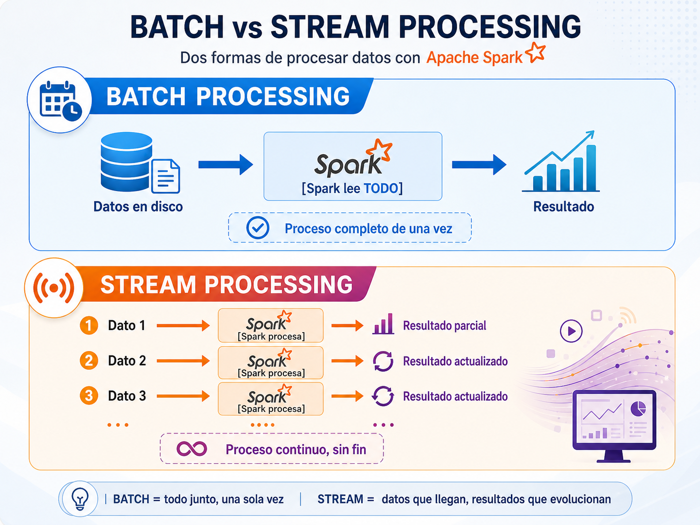
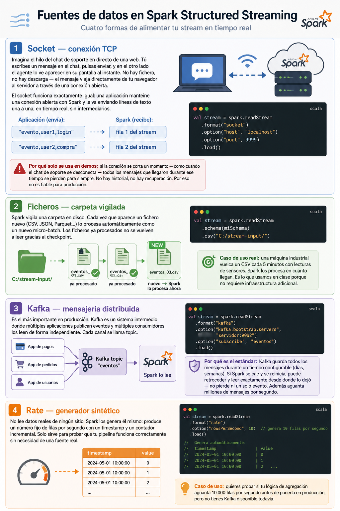
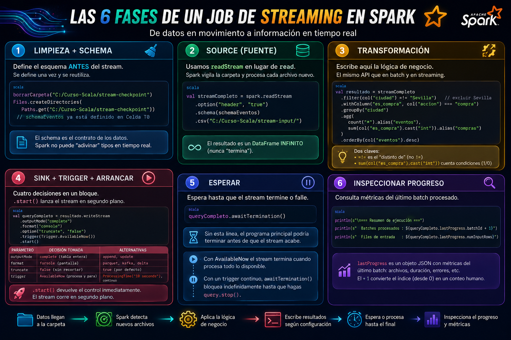

# 💻Clase 22 - Spark Structured Streaming

---

# Agenda:

<aside>
💡

#### 9:00 - 9:50    → Spark Structured Streaming

#### 9:50 - 11:20   →  Ejercicios

#### **11:20 - 11:40  →  Descanso**

#### 11:40 - 12:40  → Prueba practica Módulo 4

#### 12:40 - 14:00  → Prueba practica Módulo 4

</aside>

---

---

## 🧠 Parte 1 — Teoría

---

### 1. Batch vs. Streaming: dos formas de procesar datos

Hasta ahora todo lo que hemos hecho en el curso es **procesamiento batch**: cargas un fichero, lo transformas, obtienes un resultado y terminas. El trabajo tiene un principio y un fin claramente definidos. Pero el mundo real no siempre funciona así. Piensa en estos escenarios:

- Un sistema de pagos que debe detectar fraude **en el instante** en que ocurre la transacción.
- Una plataforma de e-commerce que actualiza el stock **cada vez** que se hace una venta.
- Un sistema de monitorización que alerta si un servidor supera el 90% de CPU **ahora mismo**.

En todos estos casos los datos no llegan en un fichero estático: **llegan continuamente**, uno a uno o en pequeños grupos, y necesitan procesarse **sin esperar a que lleguen todos**. Eso es el **stream processing**: procesar datos en movimiento, a medida que llegan.




---

### 2. Spark Structured Streaming: el modelo unificado

Spark tiene dos APIs de streaming. La antigua se llama **DStreams** (Discretized Streams) y la moderna, que es la que usaremos, se llama **Structured Streaming**, introducida en Spark 2.0. La idea central de Structured Streaming es brillante y simple a la vez:

> **Un stream es una tabla que crece infinitamente.**
> 

En lugar de pensar en "datos que llegan", piensas en una tabla a la que se añaden filas nuevas continuamente. Sobre esa tabla puedes aplicar exactamente las mismas operaciones que ya conoces de los DataFrames: `select`, `filter`, `groupBy`, `agg`...


> Esta abstracción es lo que hace que Structured Streaming sea tan potente: **el mismo código que usas para batch funciona para streaming**, con cambios mínimos.
> 

---

### 3. Arquitectura de micro-batches

<aside>

Structured Streaming no procesa cada dato individualmente de forma continua (eso sería demasiado costoso). En su lugar usa un modelo de **micro-batches**: cada cierto intervalo de tiempo (configurable), Spark recoge todos los datos que han llegado en ese periodo y los procesa como un pequeño batch.

</aside>


## El intervalo entre micro-batches se controla con `Trigger`:

```scala
// Procesar cada 5 segundos — stream continuo,
// NO usar en notebooks de Jupyter
.trigger(Trigger.ProcessingTime("5 seconds")) // NO usar en notebooks de Jupyter
// NO usar en notebooks de Jupyter

// Procesar todo lo disponible y parar — el correcto para notebooks (Spark 3.3+)
.trigger(Trigger.AvailableNow())
```

<aside>

- **`Trigger.ProcessingTime("5 seconds")` :**  Spark procesa los datos que hayan llegado cada 5 segundos, indefinidamente. El stream nunca para solo.
    
    ```scala
    t=0s  → procesa lo que haya llegado → muestra resultado
    t=5s  → procesa lo nuevo            → muestra resultado
    t=10s → procesa lo nuevo            → muestra resultado
    t=15s → ...                         → sigue "para siempre"
    ```
    
    > En un notebook esto bloquea el kernel para siempre porque `awaitTermination()` espera a que el stream termine, y este nunca termina.
    > 
- **`Trigger.AvailableNow()` :** Spark procesa **todo lo que haya disponible en ese momento** y para. Es un disparo único.
    
    ```scala
    t=0s → lee TODOS los ficheros pendientes → muestra resultado → para ✅
    ```
    
- **`Trigger` es simplemente una instrucción de temporización** que se encadena al `writeStream` antes de arrancarlo:
    
    ```scala
    streamDF.writeStream
      .outputMode("append")
      .format("console")
      .trigger(Trigger.AvailableNow())   // ← aquí va el Trigger
      .start()
    ```
    
    En un notebook esto es el correcto: ejecutas la celda, ves el resultado y el kernel queda libre.
    
    > **Analogía:** imagina que tienes una bandeja de entrada de correos.
    > 
    > - `ProcessingTime("5 seconds")` es un empleado que revisa la bandeja cada 5 segundos sin parar, aunque esté vacía.
    > - `AvailableNow()` es un empleado que vacía toda la bandeja de una vez y se va a casa.
</aside>

<aside>

💡En el entorno de clase usaremos **siempre `Trigger.AvailableNow()`** porque procesa todos los datos disponibles y **termina automáticamente**. `ProcessingTime` bloquearía el kernel de Jupyter indefinidamente.

</aside>

**Otros Triggers que existen** (para que los conozcas aunque no los usemos en clase):

| Trigger | Comportamiento |
| --- | --- |
| `ProcessingTime("N seconds")` | Procesa cada N segundos — stream continuo |
| `AvailableNow()` | Procesa todo lo pendiente y para — **el nuestro** |
| `Once()` | Igual que AvailableNow pero **deprecado** en Spark 4.x |
| `Continuous("1 second")` | Latencia muy baja, modo experimental |

> En producción se usa `ProcessingTime`. En notebooks de jupyter, siempre `AvailableNow()`.
> 

| Entorno | Trigger recomendado | Por qué |
| --- | --- | --- |
| **Jupyter / Almond** | `AvailableNow()` | El kernel queda libre, la celda termina sola |
| **spark-shell** | `AvailableNow()` o `ProcessingTime` | El shell es interactivo, `Ctrl+C` para parar |
| **Producción (jar enviado con spark-submit)** | `ProcessingTime("N seconds")` | El proceso corre en segundo plano indefinidamente |

| Entorno | `AvailableNow()` | `ProcessingTime` | Visualización en vivo |
| --- | --- | --- | --- |
| **Jupyter + Almond** | ✅ | ❌ bloquea kernel | ❌ |
| **Databricks** | ✅ | ✅ | ✅ tabla auto-refresh |
| **spark-shell** | ✅ | ✅ (con Ctrl+C para parar) | ❌ solo consola |
| **spark-submit (producción)** | ✅ | ✅ | ❌ solo logs |


---

### 🔧 Celda T0 — Inicialización de la sesión de teoría

> Ejecuta esta celda **antes de los ejemplos de las secciones siguientes**. Arranca Spark, define el schema y crea el fichero de datos que usarán todos los ejemplos.
> 

```scala
// CELDA T0 — Inicialización para los ejemplos de teoría
import $ivy.`org.apache.spark::spark-core:4.1.1`
import $ivy.`org.apache.spark::spark-sql:4.1.1`

import org.apache.spark.sql.SparkSession
import org.apache.spark.sql.functions._
import org.apache.spark.sql.types._
import org.apache.spark.sql.streaming.Trigger
import java.nio.file.{Files, Paths}
import java.nio.charset.StandardCharsets
import java.io.File

val spark = SparkSession.builder()
  .appName("Dia18S1_Teoria")
  .master("local[*]")
  .config("spark.sql.shuffle.partitions", "2")
  .getOrCreate()

import spark.implicits._
spark.sparkContext.setLogLevel("ERROR")

// Schema de eventos — se reutiliza en todos los ejemplos de teoría y práctica
val schemaEventos = StructType(Array(
  StructField("timestamp", StringType, nullable = true),
  StructField("usuario",   StringType, nullable = true),
  StructField("accion",    StringType, nullable = true),
  StructField("ciudad",    StringType, nullable = true)
))

// Utilidad para borrar carpeta completa — necesaria para limpiar checkpoints
def borrarCarpeta(ruta: String): Unit = {
  val f = new File(ruta)
  if (f.exists()) {
    f.listFiles().foreach { sub =>
      if (sub.isDirectory) borrarCarpeta(sub.getAbsolutePath)
      else sub.delete()
    }
    f.delete()
  }
}

// Crear carpetas y fichero de datos para los ejemplos
val carpetaInput = "C:/Curso-Scala/stream-input"
val carpetaCheck = "C:/Curso-Scala/stream-checkpoint"

Seq(carpetaInput, carpetaCheck).foreach { c =>
  borrarCarpeta(c)
  Files.createDirectories(Paths.get(c))
}

val datosTeo =
  """timestamp,usuario,accion,ciudad
    |2024-05-01 10:00:01,user001,login,Madrid
    |2024-05-01 10:00:03,user002,compra,Barcelona
    |2024-05-01 10:00:05,user001,busqueda,Madrid
    |2024-05-01 10:00:07,user003,login,Sevilla
    |2024-05-01 10:00:09,user002,pago,Barcelona""".stripMargin

Files.write(
  Paths.get(s"$carpetaInput/eventos_teoria.csv"),
  datosTeo.getBytes(StandardCharsets.UTF_8)
)

println(s"✅ Spark ${spark.version} listo — Scala ${scala.util.Properties.versionString}")
println("✅ schemaEventos, borrarCarpeta y datos de teoría listos")
```

**Salida esperada:**

```
✅ Spark 4.1.1 listo — Scala version 2.13.18
✅ schemaEventos, borrarCarpeta y datos de teoría listos
```

---

### 4. Fuentes de datos (Sources)

Una **fuente** es de dónde vienen los datos del stream. Spark Structured Streaming soporta varias:



> En esta sesión trabajaremos con **ficheros**, que es la fuente más práctica para el entorno de clase y muy habitual en proyectos reales (sistemas que vuelcan logs o CSVs periódicamente en una carpeta). El siguiente ejemplo muestra cómo conectar un stream a una carpeta y verificar que Spark lo reconoce como streaming — no como un DataFrame estático:
> 

```scala
// CELDA T1 — Crear un stream y verificar sus propiedades básicas
// ⚠️ schema OBLIGATORIO en streaming — no existe inferSchema
val streamTeo = spark.readStream
  .option("header", "true")
  .schema(schemaEventos)
  .csv("C:/Curso-Scala/stream-input/")

println(s"¿Es streaming?  : ${streamTeo.isStreaming}")
println(s"¿Es batch?      : ${!streamTeo.isStreaming}")
println(s"\nSchema del stream:")
streamTeo.printSchema()
println("El stream está listo. No ha procesado datos aún — solo ha declarado la fuente.")
```

**Salida esperada:**

```
¿Es streaming?  : true
¿Es batch?      : false

Schema del stream:
root
 |-- timestamp: string (nullable = true)
 |-- usuario: string (nullable = true)
 |-- accion: string (nullable = true)
 |-- ciudad: string (nullable = true)

El stream está listo. No ha procesado datos aún — solo ha declarado la fuente.
```

<aside>

💡 En este momento **no se ha leído ningún dato todavía**. Spark solo ha configurado de dónde va a leer cuando arranques el stream. Es como enchufar una manguera sin abrir el grifo aún.

</aside>

> 💡 `isStreaming = true` confirma que Spark trata este DataFrame como un stream. Puedes encadenarle transformaciones exactamente igual que con un DataFrame normal, pero los datos no se procesarán hasta que llames a `.writeStream.start()`.
> 

---

### 5. Transformaciones sobre streams

Una vez que tienes el stream, puedes encadenarle transformaciones exactamente igual que con un DataFrame de batch. La diferencia es que no se ejecutan de inmediato — Spark las aplicará **a cada micro-batch** cuando arranques el stream.

### 5.1 Filtrado y enriquecimiento

```scala
// CELDA T2 — Demostrar transformaciones: filter + withColumn
borrarCarpeta("C:/Curso-Scala/stream-checkpoint")
Files.createDirectories(Paths.get("C:/Curso-Scala/stream-checkpoint"))

val streamFiltrado = spark.readStream
  .option("header", "true")
  .schema(schemaEventos)
  .csv("C:/Curso-Scala/stream-input/")
  .filter(col("accion") === "login")               // solo eventos de login
  .withColumn("procesado_en", current_timestamp()) // columna de tiempo de procesado

// Ejecutar y ver el resultado
val qT2 = streamFiltrado.writeStream
  .outputMode("append")
  .format("console")
  .option("truncate", "false")
  .trigger(Trigger.AvailableNow())
  .start()                           // ← lanza el stream en background

qT2.awaitTermination()  // ← "espera aquí hasta que el stream pare"
```

**Salida esperada:**

```
-------------------------------------------
Batch: 0
-------------------------------------------
+-------------------+-------+------+-------+--------------------+
|timestamp          |usuario|accion|ciudad |procesado_en        |
+-------------------+-------+------+-------+--------------------+
|2024-05-01 10:00:01|user001|login |Madrid |2024-05-01 11:00:...|
|2024-05-01 10:00:07|user003|login |Sevilla|2024-05-01 11:00:...|
+-------------------+-------+------+-------+--------------------+
```

> De los 5 eventos originales, el filtro deja pasar solo los 2 de tipo `login`. La columna `procesado_en` registra el instante en que Spark ejecutó el micro-batch.
> 

### 5.2 Agregación

```scala
// CELDA T3 — Demostrar agregación: groupBy + count
borrarCarpeta("C:/Curso-Scala/stream-checkpoint")
Files.createDirectories(Paths.get("C:/Curso-Scala/stream-checkpoint"))

val conteoAcciones = spark.readStream
  .option("header", "true")
  .schema(schemaEventos)
  .csv("C:/Curso-Scala/stream-input/")
  .groupBy("accion")
  .count()
  .orderBy(col("count").desc)

// Con groupBy el outputMode debe ser "complete"
val qT3 = conteoAcciones.writeStream
  .outputMode("complete")
  .format("console")
  .option("truncate", "false")
  .trigger(Trigger.AvailableNow())
  .start()

qT3.awaitTermination()
```

**Salida esperada:**

```
-------------------------------------------
Batch: 0
-------------------------------------------
+--------+-----+
|accion  |count|
+--------+-----+
|login   |    2|
|busqueda|    1|
|compra  |    1|
|pago    |    1|
+--------+-----+
```

---

### 6. Destinos de salida (Sinks)

Un **sink** es el "destino final" donde Spark Structured Streaming escribe los datos ya procesados. Cada uno está pensado para un caso de uso diferente:

| Sink | Descripción |
| --- | --- |
| `console` | Imprime en pantalla — solo para desarrollo |
| `parquet` / `csv` | Escribe ficheros en disco |
| `memory` | Guarda en una tabla temporal consultable con SQL |
| `kafka` | Publica en un topic de Kafka |
| `foreach` / `foreachBatch` | Lógica personalizada |

<aside>

### `console`

Imprime los resultados directamente en la terminal. **Solo se usa en desarrollo y pruebas** — nunca en producción porque no persiste nada y satura los logs con volumen alto.

---

### `parquet` / `csv`

Escribe los datos como archivos en disco (local o HDFS/S3/ADLS). Es el sink más común en **pipelines de datos reales** cuando quieres persistir resultados para análisis posterior o alimentar un Data Lake.

---

### `memory`

Guarda los resultados en una **tabla temporal en memoria** que puedes consultar con SQL usando `spark.sql("SELECT * FROM nombreTabla")`. Útil para exploración interactiva en notebooks, pero los datos se pierden al cerrar la sesión.

---

### `kafka`

Publica cada registro procesado como un **mensaje en un topic de Kafka**. Se usa cuando el resultado del stream necesita ser consumido por otro sistema en tiempo real — patrón típico de arquitecturas event-driven.

---

### `foreach` / `foreachBatch`

Son los sinks de **lógica personalizada**:

| `foreach` | Se ejecuta **fila por fila** — útil para escribir en una API REST o base de datos NoSQL |
| --- | --- |
| `foreachBatch` | Recibe **un micro-batch completo** como DataFrame — más eficiente, permite usar cualquier operación de Spark batch |
</aside>


El siguiente ejemplo muestra el sink `memory`, que guarda los resultados en una tabla temporal en memoria que puedes consultar con SQL desde el mismo notebook:

```scala
// CELDA T4 — Sink memory: guardar resultado en tabla consultable con SQL
borrarCarpeta("C:/Curso-Scala/stream-checkpoint")
Files.createDirectories(Paths.get("C:/Curso-Scala/stream-checkpoint"))

val streamMem = spark.readStream
  .option("header", "true")
  .schema(schemaEventos)
  .csv("C:/Curso-Scala/stream-input/")
  .groupBy("ciudad")
  .count()
  .orderBy(col("count").desc)

val qT4 = streamMem.writeStream
  .outputMode("complete")
  .format("memory")              // sink memory — guarda en tabla temporal
  .queryName("conteo_ciudades")  // nombre de la tabla SQL
  .trigger(Trigger.AvailableNow())
  .start()

qT4.awaitTermination()

// Consultar la tabla con Spark SQL
println("=== Resultado en tabla memory 'conteo_ciudades' ===")
spark.sql("SELECT * FROM conteo_ciudades").show()
```

**Salida esperada:**

```
=== Resultado en tabla memory 'conteo_ciudades' ===
+---------+-----+
|ciudad   |count|
+---------+-----+
|Barcelona|    2|
|Madrid   |    2|
|Sevilla  |    1|
+---------+-----+
```

> 💡 Con el sink `memory` puedes usar `spark.sql("SELECT ...")` para consultar los resultados como si fuera una tabla normal. Muy útil para exploración en notebooks.
> 

---

### 7. Output modes: cómo se escriben los resultados

El **output mode** controla qué filas escribe Spark en cada micro-batch. Los tres modos se comportan de forma muy diferente cuando hay varios batches:

### `append` — solo las filas nuevas de cada batch

```scala
// CELDA T5 — Demostrar output mode "append"
// Preparar dos lotes para ver la diferencia entre batches
borrarCarpeta("C:/Curso-Scala/stream-checkpoint")
borrarCarpeta("C:/Curso-Scala/stream-input")
Files.createDirectories(Paths.get("C:/Curso-Scala/stream-checkpoint"))
Files.createDirectories(Paths.get("C:/Curso-Scala/stream-input"))

// Solo lote 1 por ahora
val lote1 =
  """timestamp,usuario,accion,ciudad
    |2024-05-01 10:00:01,user001,login,Madrid
    |2024-05-01 10:00:03,user002,compra,Barcelona
    |2024-05-01 10:00:05,user001,busqueda,Madrid""".stripMargin

Files.write(
  Paths.get("C:/Curso-Scala/stream-input/lote1.csv"),
  lote1.getBytes(StandardCharsets.UTF_8)
)

val qAppend = spark.readStream
  .option("header", "true")
  .schema(schemaEventos)
  .csv("C:/Curso-Scala/stream-input/")
  .select("usuario", "accion", "ciudad")
  .writeStream
  .outputMode("append")          // solo escribe las filas NUEVAS de este batch
  .format("console")
  .option("truncate", "false")
  .trigger(Trigger.AvailableNow())
  .start()

qAppend.awaitTermination()
println("→ append escribe SOLO las 3 filas nuevas del batch. No acumula.")
```

**Salida esperada:**

```
-------------------------------------------
Batch: 0
-------------------------------------------
+-------+--------+---------+
|usuario|accion  |ciudad   |
+-------+--------+---------+
|user001|login   |Madrid   |
|user002|compra  |Barcelona|
|user001|busqueda|Madrid   |
+-------+--------+---------+

→ append escribe SOLO las 3 filas nuevas del batch. No acumula.
```

### `complete` — el resultado acumulado completo en cada batch

```scala
// CELDA T6 — Demostrar output mode "complete"
// Restaurar el fichero de teoría con 5 eventos
borrarCarpeta("C:/Curso-Scala/stream-checkpoint")
borrarCarpeta("C:/Curso-Scala/stream-input")
Files.createDirectories(Paths.get("C:/Curso-Scala/stream-checkpoint"))
Files.createDirectories(Paths.get("C:/Curso-Scala/stream-input"))

val datos5 =
  """timestamp,usuario,accion,ciudad
    |2024-05-01 10:00:01,user001,login,Madrid
    |2024-05-01 10:00:03,user002,compra,Barcelona
    |2024-05-01 10:00:05,user001,busqueda,Madrid
    |2024-05-01 10:00:07,user003,login,Sevilla
    |2024-05-01 10:00:09,user002,pago,Barcelona""".stripMargin

Files.write(
  Paths.get("C:/Curso-Scala/stream-input/eventos_teoria.csv"),
  datos5.getBytes(StandardCharsets.UTF_8)
)

val qComplete = spark.readStream
  .option("header", "true")
  .schema(schemaEventos)
  .csv("C:/Curso-Scala/stream-input/")
  .groupBy("ciudad")
  .count()
  .orderBy(col("count").desc)
  .writeStream
  .outputMode("complete")        // reescribe el conteo COMPLETO en cada batch
  .format("console")
  .option("truncate", "false")
  .trigger(Trigger.AvailableNow())
  .start()

qComplete.awaitTermination()
println("→ complete reescribe TODO el resultado acumulado. Necesario con groupBy.")
```

**Salida esperada:**

```
-------------------------------------------
Batch: 0
-------------------------------------------
+---------+-----+
|ciudad   |count|
+---------+-----+
|Barcelona|    2|
|Madrid   |    2|
|Sevilla  |    1|
+---------+-----+

→ complete reescribe TODO el resultado acumulado. Necesario con groupBy.
```


---

### 8. Estructura completa de un job de Streaming

Aquí tienes un ejemplo completo y ejecutable que reúne todos los elementos vistos hasta ahora: source → transformación → sink → arranque → monitorización:

```scala
// CELDA T7 — Estructura completa de un job de streaming
borrarCarpeta("C:/Curso-Scala/stream-checkpoint")
Files.createDirectories(Paths.get("C:/Curso-Scala/stream-checkpoint"))

// 1. Schema (obligatorio)
// schemaEventos ya está definido en Celda T0

// 2. Source
val streamCompleto = spark.readStream
  .option("header", "true")
  .schema(schemaEventos)
  .csv("C:/Curso-Scala/stream-input/")

// 3. Transformación
val resultado = streamCompleto
  .filter(col("ciudad") =!= "Sevilla")   // excluir Sevilla
  .withColumn("es_compra", col("accion") === "compra")
  .groupBy("ciudad")
  .agg(
    count("*").alias("eventos"),
    sum(col("es_compra").cast("int")).alias("compras")
  )
  .orderBy(col("eventos").desc)

// 4. Sink + trigger + arrancar
val queryCompleto = resultado.writeStream
  .outputMode("complete")
  .format("console")
  .option("truncate", "false")
  .trigger(Trigger.AvailableNow())
  .start()

// 5. Esperar a que termine
queryCompleto.awaitTermination()

// 6. Inspeccionar progreso
println(s"\n=== Resumen de ejecución ===")
println(s"  Batches procesados : ${queryCompleto.lastProgress.batchId + 1}")
println(s"  Filas de entrada   : ${queryCompleto.lastProgress.numInputRows}")
```

**Salida esperada:**

```
-------------------------------------------
Batch: 0
-------------------------------------------
+---------+-------+-------+
|ciudad   |eventos|compras|
+---------+-------+-------+
|Barcelona|      2|      1|
|Madrid   |      2|      0|
+---------+-------+-------+

=== Resumen de ejecución ===
  Batches procesados : 1
  Filas de entrada   : 4
```

> Sevilla tiene 1 evento pero queda excluida por el filtro. Se procesan 4 de las 5 filas del fichero.
> 




---

### 9. Checkpoint: recuperación ante fallos

El **checkpoint** es una carpeta donde Spark guarda el estado del stream (qué ficheros ya procesó, qué offsets leyó...). Si el job falla y se reinicia, puede continuar desde donde lo dejó sin reprocesar datos.

<aside>

Piénsalo como el **"marcapáginas" de Spark**. Cuando lees un libro y lo cierras, el marcapáginas te dice por dónde ibas. Si el job de streaming falla o se reinicia, Spark abre su "marcapáginas" y continúa desde donde lo dejó — **sin releer datos que ya procesó**.

Sin checkpoint → cada reinicio reprocesa todo desde el principio.
Con checkpoint → Spark sabe exactamente qué ficheros ya leyó.

### ¿Qué guarda físicamente el checkpoint?

Si abrieras la carpeta `stream-checkpoint` verías algo así:

`stream-checkpoint/
  ├── commits/        ← qué batches terminaron con éxito
  ├── offsets/        ← hasta qué punto del fichero/topic se leyó
  ├── metadata        ← metadatos del stream
  └── sources/        ← qué ficheros fueron procesados`

### En producción real

En un sistema real (por ejemplo, leyendo de Kafka), el checkpoint guarda los **offsets** — básicamente el número de mensaje hasta el que se ha leído en cada partición. Si el servidor cae a las 3am y se reinicia a las 3:05, el stream **no pierde ningún evento** y no duplica ninguno. Eso es lo que hace al Structured Streaming fiable para sistemas críticos.

</aside>

```scala
// CELDA T8 — Ver el efecto del checkpoint: no reprocesar ficheros ya vistos
borrarCarpeta("C:/Curso-Scala/stream-checkpoint")
Files.createDirectories(Paths.get("C:/Curso-Scala/stream-checkpoint"))

// Primera ejecución — procesa eventos_teoria.csv
val qCheck1 = spark.readStream
  .option("header", "true")
  .schema(schemaEventos)
  .csv("C:/Curso-Scala/stream-input/")
  .writeStream
  .outputMode("append")
  .format("console")
  .option("truncate", "false")
  .option("checkpointLocation", "C:/Curso-Scala/stream-checkpoint")
  .trigger(Trigger.AvailableNow())
  .start()

qCheck1.awaitTermination()
println(s"1ª ejecución — filas procesadas: ${qCheck1.lastProgress.numInputRows}")

// Segunda ejecución con el MISMO checkpoint — Spark recuerda que ya leyó ese fichero
val qCheck2 = spark.readStream
  .option("header", "true")
  .schema(schemaEventos)
  .csv("C:/Curso-Scala/stream-input/")
  .writeStream
  .outputMode("append")
  .format("console")
  .option("truncate", "false")
  .option("checkpointLocation", "C:/Curso-Scala/stream-checkpoint")
  .trigger(Trigger.AvailableNow())
  .start()

qCheck2.awaitTermination()
println(s"2ª ejecución — filas procesadas: ${qCheck2.lastProgress.numInputRows}")
println("→ 0 filas: el checkpoint evitó reprocesar el mismo fichero.")
```

**Salida esperada:**

```
-------------------------------------------
Batch: 0
-------------------------------------------
+-------------------+-------+--------+---------+
|timestamp          |usuario|accion  |ciudad   |
+-------------------+-------+--------+---------+
|2024-05-01 10:00:01|user001|login   |Madrid   |
|2024-05-01 10:00:03|user002|compra  |Barcelona|
|2024-05-01 10:00:05|user001|busqueda|Madrid   |
|2024-05-01 10:00:07|user003|login   |Sevilla  |
|2024-05-01 10:00:09|user002|pago    |Barcelona|
+-------------------+-------+--------+---------+

1ª ejecución — filas procesadas: 5

-------------------------------------------
Batch: 1
-------------------------------------------
(vacío — no hay datos nuevos)

2ª ejecución — filas procesadas: 0
→ 0 filas: el checkpoint evitó reprocesar el mismo fichero.
```

> 💡 El checkpoint registra que `eventos_teoria.csv` ya fue procesado en el Batch 0. La segunda ejecución abre el mismo stream pero no encuentra ficheros nuevos, por lo que no procesa nada. Esto es exactamente el comportamiento correcto en producción: garantiza que cada mensaje se procese **exactamente una vez**.
> 

---

## 💻 Parte 2 — Práctica

> ⚠️ La Celda T0 de inicialización ya fue ejecutada durante la teoría. Si empiezas el notebook desde aquí, ejecútala de nuevo antes de continuar.
> 

---

### 📂 Celda P0 — Preparar datos frescos para la práctica

```scala
// CELDA P0 — Limpiar estado de la teoría y preparar datos de práctica
val carpetaInput  = "C:/Curso-Scala/stream-input"
val carpetaOutput = "C:/Curso-Scala/stream-output"
val carpetaCheck  = "C:/Curso-Scala/stream-checkpoint"

Seq(carpetaInput, carpetaOutput, carpetaCheck).foreach { c =>
  borrarCarpeta(c)
  Files.createDirectories(Paths.get(c))
}

val lote1 =
  """timestamp,usuario,accion,ciudad
    |2024-05-01 10:00:01,user001,login,Madrid
    |2024-05-01 10:00:03,user002,compra,Barcelona
    |2024-05-01 10:00:05,user001,busqueda,Madrid
    |2024-05-01 10:00:07,user003,login,Sevilla
    |2024-05-01 10:00:09,user002,pago,Barcelona""".stripMargin

Files.write(
  Paths.get(s"$carpetaInput/eventos_lote1.csv"),
  lote1.getBytes(StandardCharsets.UTF_8)
)

println("✅ Entorno de práctica listo")
println(s"✅ Lote 1 escrito: eventos_lote1.csv (5 eventos)")
```

**Salida esperada:**

```
✅ Entorno de práctica listo
✅ Lote 1 escrito: eventos_lote1.csv (5 eventos)
```

---

### 🔹 P1 — Primer stream: leer ficheros y mostrar en consola

```scala
// CELDA P1 — Stream básico: leer CSV → mostrar en consola
borrarCarpeta("C:/Curso-Scala/stream-checkpoint")
Files.createDirectories(Paths.get("C:/Curso-Scala/stream-checkpoint"))

val streamDF = spark.readStream
  .option("header", "true")
  .schema(schemaEventos)
  .csv("C:/Curso-Scala/stream-input/")

println(s"¿Es streaming?: ${streamDF.isStreaming}")
println("Schema del stream:")
streamDF.printSchema()

val query1 = streamDF.writeStream
  .outputMode("append")
  .format("console")
  .option("truncate", "false")
  .trigger(Trigger.AvailableNow())
  .start()

query1.awaitTermination()
println("✅ Stream P1 completado")
```

**Salida esperada:**

```
¿Es streaming?: true
Schema del stream:
root
 |-- timestamp: string (nullable = true)
 |-- usuario: string (nullable = true)
 |-- accion: string (nullable = true)
 |-- ciudad: string (nullable = true)

-------------------------------------------
Batch: 0
-------------------------------------------
+-------------------+-------+--------+---------+
|timestamp          |usuario|accion  |ciudad   |
+-------------------+-------+--------+---------+
|2024-05-01 10:00:01|user001|login   |Madrid   |
|2024-05-01 10:00:03|user002|compra  |Barcelona|
|2024-05-01 10:00:05|user001|busqueda|Madrid   |
|2024-05-01 10:00:07|user003|login   |Sevilla  |
|2024-05-01 10:00:09|user002|pago    |Barcelona|
+-------------------+-------+--------+---------+

✅ Stream P1 completado
```

---

### 🔹 P2 — Stream con filtro: solo eventos de login

```scala
// CELDA P2 — Filtrar eventos en tiempo real
borrarCarpeta("C:/Curso-Scala/stream-checkpoint")
Files.createDirectories(Paths.get("C:/Curso-Scala/stream-checkpoint"))

val streamFiltrado = spark.readStream
  .option("header", "true")
  .schema(schemaEventos)
  .csv("C:/Curso-Scala/stream-input/")
  .filter(col("accion") === "login")
  .withColumn("procesado_en", current_timestamp())

val query2 = streamFiltrado.writeStream
  .outputMode("append")
  .format("console")
  .option("truncate", "false")
  .trigger(Trigger.AvailableNow())
  .start()

query2.awaitTermination()
println("✅ Stream con filtro completado")
```

**Salida esperada:**

```
-------------------------------------------
Batch: 0
-------------------------------------------
+-------------------+-------+------+-------+--------------------+
|timestamp          |usuario|accion|ciudad |procesado_en        |
+-------------------+-------+------+-------+--------------------+
|2024-05-01 10:00:01|user001|login |Madrid |2024-05-01 11:00:...|
|2024-05-01 10:00:07|user003|login |Sevilla|2024-05-01 11:00:...|
+-------------------+-------+------+-------+--------------------+

✅ Stream con filtro completado
```

---

### 🔹 P3 — Stream con agregación: contar eventos por acción

```scala
// CELDA P3 — Agregación sobre un stream (output mode: complete)
borrarCarpeta("C:/Curso-Scala/stream-checkpoint")
Files.createDirectories(Paths.get("C:/Curso-Scala/stream-checkpoint"))

val conteoAcciones = spark.readStream
  .option("header", "true")
  .schema(schemaEventos)
  .csv("C:/Curso-Scala/stream-input/")
  .groupBy("accion")
  .count()
  .orderBy(col("count").desc)

// ⚠️ Con groupBy el outputMode debe ser "complete"
val query3 = conteoAcciones.writeStream
  .outputMode("complete")
  .format("console")
  .option("truncate", "false")
  .trigger(Trigger.AvailableNow())
  .start()

query3.awaitTermination()
println("✅ Stream con agregación completado")
```

**Salida esperada:**

```
-------------------------------------------
Batch: 0
-------------------------------------------
+--------+-----+
|accion  |count|
+--------+-----+
|login   |    2|
|busqueda|    1|
|compra  |    1|
|pago    |    1|
+--------+-----+

✅ Stream con agregación completado
```

---

### 🔹 P4 — Añadir un segundo lote de datos

```scala
// CELDA P4 — Escribir el segundo lote en la carpeta de entrada
val lote2 =
  """timestamp,usuario,accion,ciudad
    |2024-05-01 10:00:11,user004,login,Madrid
    |2024-05-01 10:00:13,user001,compra,Madrid
    |2024-05-01 10:00:15,user003,busqueda,Sevilla
    |2024-05-01 10:00:17,user005,login,Valencia
    |2024-05-01 10:00:19,user002,busqueda,Barcelona""".stripMargin

Files.write(
  Paths.get("C:/Curso-Scala/stream-input/eventos_lote2.csv"),
  lote2.getBytes(StandardCharsets.UTF_8)
)

println("✅ Lote 2 escrito: eventos_lote2.csv (5 eventos nuevos)")
println("   La carpeta stream-input ahora tiene 2 ficheros CSV (10 eventos en total)")
```

**Salida esperada:**

```
✅ Lote 2 escrito: eventos_lote2.csv (5 eventos nuevos)
   La carpeta stream-input ahora tiene 2 ficheros CSV (10 eventos en total)
```

---

### 🔹 P5 — Relanzar el stream con los dos lotes

```scala
// CELDA P5 — Con checkpoint limpio, Spark procesa todos los ficheros disponibles
borrarCarpeta("C:/Curso-Scala/stream-checkpoint")
Files.createDirectories(Paths.get("C:/Curso-Scala/stream-checkpoint"))

val conteoTotal = spark.readStream
  .option("header", "true")
  .schema(schemaEventos)
  .csv("C:/Curso-Scala/stream-input/")
  .groupBy("accion")
  .count()
  .orderBy(col("count").desc)

val query5 = conteoTotal.writeStream
  .outputMode("complete")
  .format("console")
  .option("truncate", "false")
  .trigger(Trigger.AvailableNow())
  .start()

query5.awaitTermination()
println("✅ Stream con 10 eventos (2 lotes) completado")
```

**Salida esperada:**

```
-------------------------------------------
Batch: 0
-------------------------------------------
+--------+-----+
|accion  |count|
+--------+-----+
|login   |    4|
|busqueda|    3|
|compra  |    2|
|pago    |    1|
+--------+-----+

✅ Stream con 10 eventos (2 lotes) completado
```

> 💡 `login` subió de 2 a 4 porque ahora hay 10 eventos en total. El modo `complete` siempre muestra el conteo acumulado de todos los datos disponibles.
> 

---

### 🔹 P6 — Escribir resultados en disco (sink Parquet)

```scala
// CELDA P6 — Guardar el stream procesado en Parquet
borrarCarpeta("C:/Curso-Scala/stream-checkpoint")
Files.createDirectories(Paths.get("C:/Curso-Scala/stream-checkpoint"))

val streamEnriquecido = spark.readStream
  .option("header", "true")
  .schema(schemaEventos)
  .csv("C:/Curso-Scala/stream-input/")
  .withColumn("procesado_en", current_timestamp())
  .withColumn("es_login", col("accion") === "login")

val query6 = streamEnriquecido.writeStream
  .outputMode("append")
  .format("parquet")
  .option("checkpointLocation", "C:/Curso-Scala/stream-checkpoint")
  .trigger(Trigger.AvailableNow())
  .start("C:/Curso-Scala/stream-output/eventos_procesados")

query6.awaitTermination()
println("✅ Stream escrito en Parquet")

val dfResultado = spark.read
  .parquet("C:/Curso-Scala/stream-output/eventos_procesados")
println(s"\n=== Resultado guardado: ${dfResultado.count()} filas ===")
dfResultado.show(truncate = false)
```

**Salida esperada:**

```
✅ Stream escrito en Parquet

=== Resultado guardado: 10 filas ===
+-------------------+-------+--------+---------+-------------------+--------+
|timestamp          |usuario|accion  |ciudad   |procesado_en       |es_login|
+-------------------+-------+--------+---------+-------------------+--------+
|2024-05-01 10:00:01|user001|login   |Madrid   |2024-05-01 11:...:.|true    |
|2024-05-01 10:00:03|user002|compra  |Barcelona|2024-05-01 11:...:.|false   |
|2024-05-01 10:00:05|user001|busqueda|Madrid   |2024-05-01 11:...:.|false   |
|2024-05-01 10:00:07|user003|login   |Sevilla  |2024-05-01 11:...:.|true    |
|2024-05-01 10:00:09|user002|pago    |Barcelona|2024-05-01 11:...:.|false   |
|2024-05-01 10:00:11|user004|login   |Madrid   |2024-05-01 11:...:.|true    |
|2024-05-01 10:00:13|user001|compra  |Madrid   |2024-05-01 11:...:.|false   |
|2024-05-01 10:00:15|user003|busqueda|Sevilla  |2024-05-01 11:...:.|false   |
|2024-05-01 10:00:17|user005|login   |Valencia |2024-05-01 11:...:.|true    |
|2024-05-01 10:00:19|user002|busqueda|Barcelona|2024-05-01 11:...:.|false   |
+-------------------+-------+--------+---------+-------------------+--------+
```

---

### 🔹 P7 — Monitorizar el progreso de un stream

```scala
// CELDA P7 — Inspeccionar el estado y progreso tras completar
borrarCarpeta("C:/Curso-Scala/stream-checkpoint")
Files.createDirectories(Paths.get("C:/Curso-Scala/stream-checkpoint"))

val streamMonitor = spark.readStream
  .option("header", "true")
  .schema(schemaEventos)
  .csv("C:/Curso-Scala/stream-input/")

val queryMonitor = streamMonitor.writeStream
  .outputMode("append")
  .format("console")
  .option("truncate", "false")
  .trigger(Trigger.AvailableNow())
  .start()

queryMonitor.awaitTermination()

val progreso = queryMonitor.lastProgress
println("\n=== Estado del stream ===")
println(s"  ID único         : ${queryMonitor.id}")
println(s"  Último batch ID  : ${progreso.batchId}")
println(s"  Filas procesadas : ${progreso.numInputRows}")
println(s"  Estado           : ${if (queryMonitor.isActive) "activo" else "completado"}")
```

**Salida esperada:**

```
-------------------------------------------
Batch: 0
-------------------------------------------
...

=== Estado del stream ===
  ID único         : xxxxxxxx-xxxx-xxxx-xxxx-xxxxxxxxxxxx
  Último batch ID  : 0
  Filas procesadas : 10
  Estado           : completado
```

---

### 🧩 Reto final — Pipeline de análisis de eventos en tiempo real

```scala
// CELDA RETO — Pipeline completo: ingestar, transformar, agregar y mostrar
borrarCarpeta("C:/Curso-Scala/stream-checkpoint")
Files.createDirectories(Paths.get("C:/Curso-Scala/stream-checkpoint"))

// Paso 1: Leer el stream
val rawStream = spark.readStream
  .option("header", "true")
  .schema(schemaEventos)
  .csv("C:/Curso-Scala/stream-input/")

// Paso 2: Clasificar si el evento es una conversión (compra o pago)
val streamTransformado = rawStream
  .withColumn("procesado_en",  current_timestamp())
  .withColumn("es_conversion", col("accion").isin("compra", "pago"))

// Paso 3: Agregar — resumen por ciudad
val resumenCiudades = streamTransformado
  .groupBy("ciudad")
  .agg(
    count("*").alias("total_eventos"),
    sum(col("es_conversion").cast("int")).alias("conversiones")
  )
  .orderBy(col("total_eventos").desc)

// Paso 4: Mostrar en consola
val queryReto = resumenCiudades.writeStream
  .outputMode("complete")
  .format("console")
  .option("truncate", "false")
  .trigger(Trigger.AvailableNow())
  .start()

queryReto.awaitTermination()

println("\n✅ Pipeline completado")
println(s"   Eventos procesados: ${queryReto.lastProgress.numInputRows}")
```

**Salida esperada:**

```
-------------------------------------------
Batch: 0
-------------------------------------------
+---------+-------------+------------+
|ciudad   |total_eventos|conversiones|
+---------+-------------+------------+
|Madrid   |            4|           1|
|Barcelona|            3|           2|
|Sevilla  |            2|           0|
|Valencia |            1|           0|
+---------+-------------+------------+

✅ Pipeline completado
   Eventos procesados: 10
```

---

<aside>

Hacer pruebas de streaming processing en tu spark-shell. Usando el output mode : console y cambiando también prueba cambiando el Trigger `AvailableNow()`  por `ProcessingTime()` . Adjunta algunas capturas en tu entrega 

</aside>