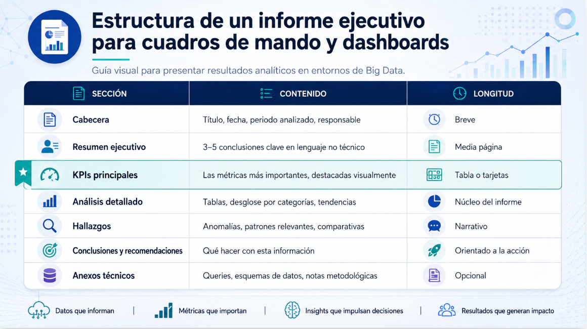

# 💻Clase 25 - Informes y cuadros de mando

---

# Agenda:

<aside>
💡

#### 9:00 - 9:50    → Sesión 1: Informes y cuadros de mando

#### 9:50 - 11:20   →  Ejercicios

#### **11:20 - 11:40  →  Descanso**

#### 11:40 - 12:40  → Flujo 1: Spark en Almond → CSV o parquet  → Power BI

#### 12:40 - 14:00  → Flujo 2: IntelliJ Idea Comunity Edition → DeltaLake → PowerBI

</aside>

# Sesión 1 : Creación de informes y cuadros de mando

---

---

### 1. ¿Qué es un informe de datos y para qué sirve?

Cuando terminamos de procesar datos con Spark tenemos resultados: tablas, cifras, tendencias. Pero esos resultados en bruto, guardados en un DataFrame, **no comunican nada por sí solos** a quien toma decisiones. Un informe es el puente entre el análisis técnico y la acción empresarial.

> **Analogía:** Imagina que eres médico y tienes los resultados de un análisis clínico: glucosa 142, colesterol 210, triglicéridos 180. Esos números son valiosos, pero lo que el paciente necesita es una hoja que diga qué significa cada valor, si está dentro del rango normal, y qué debe hacer. El informe convierte datos en decisiones.
> 

<aside>

Un **informe de análisis de datos** es un documento estructurado que presenta:

- Los hallazgos principales del análisis
- Las métricas clave calculadas
- Contexto para interpretar los resultados
- Conclusiones accionables
</aside>

Un **cuadro de mando** (*dashboard*) es un informe visual e interactivo que muestra múltiples métricas simultáneamente, actualizable de forma automática o periódica.

---

### 2. Estructura de un informe efectivo

Un buen informe de datos sigue siempre la misma estructura, independientemente de la herramienta usada para generarlo:



> 💡 **Regla de oro:** El resumen ejecutivo lo lee alguien que no sabe nada de Spark ni de SQL. Si no lo entiende, el informe ha fallado en su objetivo principal.
> 

---

### 3. KPIs: el corazón del cuadro de mando


### Ejemplos de KPIs en e-commerce

| KPI | Fórmula Spark | Objetivo típico |
| --- | --- | --- |
| Ingresos totales | `sum(precio * cantidad)` | > 50.000 €/mes |
| Ticket medio | `sum(importe) / count(pedidos)` | > 45 € |
| Tasa de conversión | `pedidos / visitas * 100` | > 3% |
| Productos más vendidos | `groupBy("producto").sum("cantidad").orderBy(desc)` | Top 10 |
| Ingresos por categoría | `groupBy("categoria").sum("importe")` | Distribución |
| Clientes únicos | `countDistinct("cliente_id")` | Tendencia creciente |
| Valor medio por cliente | `ingresos_totales / clientes_unicos` | > 80 € |

### Diseño de un KPI bien formado

Un KPI útil siempre responde a cuatro preguntas:


---

### 4. Automatización de informes con Spark

La gran ventaja de generar informes desde Spark es que el proceso es **reproducible y escalable**. El mismo código que calcula los KPIs de hoy puede ejecutarse mañana sobre datos nuevos sin modificar nada.


### Opciones de exportación desde Spark (entorno local)

| Formato | Librería/Método | Cuándo usarlo |
| --- | --- | --- |
| **CSV** | `.write.csv()` nativo Spark | Datos tabulares, fácil de abrir |
| **JSON** | `.write.json()` nativo Spark | Integración con APIs o web |
| **Parquet** | `.write.parquet()` nativo Spark | Archivado eficiente, siguientes análisis |
| **Excel (.xlsx)** | Apache POI vía Scala | Informes para directivos, no técnicos |
| **HTML** | `java.io.FileWriter` en Scala | Informes web, compartir por correo |
| **PDF** | iText / Apache PDFBox | Informes formales, documentos oficiales |

> ⚠️ **Importante en Almond/local:** Spark escribe archivos particionados (`part-00000-...csv`). Para obtener un único fichero usa `.coalesce(1)` antes de `.write`. Para Excel y HTML generamos el archivo directamente desde Scala usando los resultados de Spark recogidos con `.collect()`.
> 

---

### 5. Exportar a CSV y Excel desde Spark

### Exportación a CSV (nativo Spark)

```scala
// Guardar un DataFrame como CSV en una sola partición
dfResultados
  .coalesce(1)
  .write
  .option("header", "true")
  .mode("overwrite")
  .csv("C:/Curso-Scala/informes/kpis_ventas")

// El fichero se crea en: kpis_ventas/part-00000-....csv
```

### Exportación a Excel con Apache POI

Apache POI es la librería Java estándar para leer y escribir archivos de Microsoft Office. Desde Scala se usa directamente porque Scala corre sobre la JVM.

```scala
// Importar la librería en el notebook
import $ivy.`org.apache.poi:poi-ooxml:5.2.3`

import org.apache.poi.xssf.usermodel.XSSFWorkbook
import java.io.FileOutputStream

// Recoger los resultados de Spark como colección Scala
val filas = dfKpis.collect()
val columnas = dfKpis.columns

// Crear libro Excel
val workbook = new XSSFWorkbook()
val hoja = workbook.createSheet("KPIs Ventas")

// Cabecera
val filaCabecera = hoja.createRow(0)
columnas.zipWithIndex.foreach { case (nombre, i) =>
  filaCabecera.createCell(i).setCellValue(nombre)
}

// Datos
filas.zipWithIndex.foreach { case (fila, idx) =>
  val filaExcel = hoja.createRow(idx + 1)
  fila.toSeq.zipWithIndex.foreach { case (valor, i) =>
    filaExcel.createCell(i).setCellValue(valor.toString)
  }
}

// Guardar
val salida = new FileOutputStream("C:/Curso-Scala/informes/informe_ventas.xlsx")
workbook.write(salida)
salida.close()
workbook.close()

println("✅ Excel generado correctamente")
```

---

### 6. Generar un informe HTML desde Scala

HTML es el formato más universal para compartir informes: se abre en cualquier navegador, admite estilos visuales y no requiere instalar nada en el ordenador del destinatario.

El proceso es:

1. Calcular los KPIs con Spark (obtenemos DataFrames)
2. Recoger los resultados con `.collect()` (traemos los datos al driver)
3. Construir el HTML como un `String` en Scala
4. Escribir el fichero con `java.io.FileWriter`

```scala
import java.io.{FileWriter, BufferedWriter}

// Supongamos que ya tenemos estos valores calculados con Spark
val totalIngresos   = 48750.30
val ticketMedio     = 42.15
val clientesUnicos  = 312
val productosVendidos = 1157

// Construir el HTML
val html = s"""<!DOCTYPE html>
<html lang="es">
<head>
  <meta charset="UTF-8">
  <title>Informe de Ventas — Spark</title>
  <style>
    body { font-family: Arial, sans-serif; margin: 40px; background: #f5f5f5; }
    h1   { color: #2c3e50; }
    .kpi-grid { display: flex; gap: 20px; flex-wrap: wrap; margin: 20px 0; }
    .kpi-card { background: white; border-radius: 8px; padding: 20px;
                box-shadow: 0 2px 4px rgba(0,0,0,0.1); min-width: 160px; }
    .kpi-valor { font-size: 2em; font-weight: bold; color: #e74c3c; }
    .kpi-label { color: #7f8c8d; font-size: 0.9em; margin-top: 4px; }
    table  { border-collapse: collapse; width: 100%; background: white;
             border-radius: 8px; overflow: hidden; }
    th { background: #2c3e50; color: white; padding: 10px; text-align: left; }
    td { padding: 8px 10px; border-bottom: 1px solid #eee; }
    tr:hover { background: #f9f9f9; }
    .footer { color: #aaa; font-size: 0.8em; margin-top: 30px; }
  </style>
</head>
<body>
  <h1>📊 Informe de Ventas</h1>
  <p>Generado automáticamente con Apache Spark 4.1.1 · Scala 2.13</p>
  <p><strong>Fecha:</strong> ${java.time.LocalDate.now()}</p>

  <h2>KPIs Principales</h2>
  <div class="kpi-grid">
    <div class="kpi-card">
      <div class="kpi-valor">€${f"$totalIngresos%,.2f"}</div>
      <div class="kpi-label">Ingresos Totales</div>
    </div>
    <div class="kpi-card">
      <div class="kpi-valor">€${f"$ticketMedio%.2f"}</div>
      <div class="kpi-label">Ticket Medio</div>
    </div>
    <div class="kpi-card">
      <div class="kpi-valor">$clientesUnicos</div>
      <div class="kpi-label">Clientes Únicos</div>
    </div>
    <div class="kpi-card">
      <div class="kpi-valor">$productosVendidos</div>
      <div class="kpi-label">Unidades Vendidas</div>
    </div>
  </div>

  <p class="footer">Fuente: dataset ventas e-commerce · Procesado con Spark local</p>
</body>
</html>"""

// Escribir el fichero
val escritor = new BufferedWriter(new FileWriter("C:/Curso-Scala/informes/informe_ventas.html"))
escritor.write(html)
escritor.close()

println("✅ Informe HTML generado: C:/Curso-Scala/informes/informe_ventas.html")
```

---

### 7. Apache Superset: cuadros de mando para Big Data

<aside>

**Apache Superset** es una plataforma de Business Intelligence de código abierto creada por Airbnb y donada a la Apache Software Foundation. Es la herramienta BI más extendida en el ecosistema Big Data moderno.

</aside>

### ¿Qué hace Superset?


### Comparativa rápida: herramientas BI en entornos Big Data


---

### 8. Buenas prácticas en la comunicación de datos


---

---

---

## 💻 Práctica

---

### 🔧 Celda de inicialización — ejecutar siempre primero

**Celda 0 — Code:**

```scala
import $ivy.`org.apache.spark::spark-core:4.1.1`
import $ivy.`org.apache.spark::spark-sql:4.1.1`
import $ivy.`org.apache.poi:poi-ooxml:5.2.3`

import org.apache.spark.sql.SparkSession
import org.apache.spark.sql.functions._
import org.apache.spark.sql.types._
import java.io.{FileWriter, BufferedWriter, FileOutputStream, File}

val spark = SparkSession.builder()
  .appName("Dia22S1_Informes")
  .master("local[*]")
  .config("spark.ui.showConsoleProgress", "false")
  .getOrCreate()

import spark.implicits._
spark.sparkContext.setLogLevel("ERROR")

// Crear carpeta de salida
new File("C:/Curso-Scala/informes").mkdirs()

println(s"✅ Spark ${spark.version} listo")
println("📁 Carpeta C:/Curso-Scala/informes/ creada")
```

**Salida esperada:**

```
✅ Spark 4.1.1 listo
📁 Carpeta C:/Curso-Scala/informes/ creada
```

---

### 🔧 Dataset del e-commerce — crear los datos

**Celda datos — Code:**

```scala
// Dataset de pedidos de una tienda de tecnología online
// 20 pedidos, 5 categorías, 4 ciudades
val pedidos = Seq(
  (1,  "Laptop Pro 15",       "Informatica",    1299.99, 1, "2024-03-01", "Madrid",    "C001"),
  (2,  "Ratón Inalámbrico",   "Perifericos",      29.95, 3, "2024-03-01", "Barcelona", "C002"),
  (3,  "Monitor 27\"",        "Monitores",       349.00, 2, "2024-03-02", "Madrid",    "C003"),
  (4,  "Teclado Mecánico",    "Perifericos",      89.50, 1, "2024-03-02", "Valencia",  "C001"),
  (5,  "Disco SSD 1TB",       "Almacenamiento",  119.99, 4, "2024-03-03", "Sevilla",   "C004"),
  (6,  "Auriculares USB",     "Audio",            89.50, 2, "2024-03-03", "Madrid",    "C005"),
  (7,  "Webcam HD",           "Perifericos",      79.00, 1, "2024-03-04", "Barcelona", "C002"),
  (8,  "Hub USB-C",           "Perifericos",      44.90, 5, "2024-03-04", "Madrid",    "C006"),
  (9,  "Laptop Air 13",       "Informatica",     999.99, 1, "2024-03-05", "Valencia",  "C007"),
  (10, "Disco SSD 500GB",     "Almacenamiento",   79.99, 3, "2024-03-05", "Sevilla",   "C008"),
  (11, "Monitor 24\"",        "Monitores",       249.00, 1, "2024-03-06", "Madrid",    "C009"),
  (12, "Altavoces BT",        "Audio",            59.90, 2, "2024-03-06", "Barcelona", "C010"),
  (13, "Ratón Gaming",        "Perifericos",      49.95, 2, "2024-03-07", "Madrid",    "C003"),
  (14, "Laptop Gaming",       "Informatica",    1599.99, 1, "2024-03-07", "Valencia",  "C011"),
  (15, "Tarjeta SD 256GB",    "Almacenamiento",   35.99, 6, "2024-03-08", "Sevilla",   "C001"),
  (16, "Auriculares Pro",     "Audio",           149.00, 1, "2024-03-08", "Madrid",    "C012"),
  (17, "Monitor Curvo 32\"",  "Monitores",       499.00, 1, "2024-03-09", "Barcelona", "C013"),
  (18, "Webcam 4K",           "Perifericos",     129.00, 1, "2024-03-09", "Madrid",    "C014"),
  (19, "Laptop Ultrabook",    "Informatica",    1199.99, 1, "2024-03-10", "Sevilla",   "C015"),
  (20, "Hub 10 puertos",      "Perifericos",      64.90, 3, "2024-03-10", "Valencia",  "C005")
).toDF("pedido_id", "producto", "categoria", "precio", "cantidad", "fecha", "ciudad", "cliente_id")

// Añadir columna de importe total por línea
val dfPedidos = pedidos.withColumn("importe", round(col("precio") * col("cantidad"), 2))

println(s"✅ Dataset cargado: ${dfPedidos.count()} pedidos")
dfPedidos.show(5)
```

**Salida esperada:**

```
✅ Dataset cargado: 20 pedidos
+---------+-------------+------------+-------+--------+----------+---------+----------+--------+
|pedido_id|producto     |categoria   |precio |cantidad|fecha     |ciudad   |cliente_id|importe |
+---------+-------------+------------+-------+--------+----------+---------+----------+--------+
|1        |Laptop Pro 15|Informatica |1299.99|1       |2024-03-01|Madrid   |C001      |1299.99 |
|2        |Ratón Inalá..|Perifericos |29.95  |3       |2024-03-01|Barcelona|C002      |89.85   |
|3        |Monitor 27"  |Monitores   |349.00 |2       |2024-03-02|Madrid   |C003      |698.0   |
|4        |Teclado Mec..|Perifericos |89.50  |1       |2024-03-02|Valencia |C001      |89.5    |
|5        |Disco SSD 1TB|Almacenam.  |119.99 |4       |2024-03-03|Sevilla  |C004      |479.96  |
+---------+-------------+------------+-------+--------+----------+---------+----------+--------+
only showing top 5 rows
```

---

### P1 — Calcular los KPIs principales

**Celda P1a — Markdown:**

```markdown
## P1 — KPIs principales del periodo
Calculamos las métricas más importantes del dataset completo.
```

**Celda P1b — Code:**

```scala
// KPIs de negocio calculados con Spark
val totalIngresos   = dfPedidos.agg(round(sum("importe"), 2)).first().getDouble(0)
val totalPedidos    = dfPedidos.count()
val ticketMedio     = totalIngresos / totalPedidos
val clientesUnicos  = dfPedidos.select(countDistinct("cliente_id")).first().getLong(0)
val unidadesVendidas = dfPedidos.agg(sum("cantidad")).first().getLong(0)
val precioMedioProd = dfPedidos.agg(round(avg("precio"), 2)).first().getDouble(0)

println("=" * 50)
println("📊 KPIs — Tienda Tecnología | Marzo 2024")
println("=" * 50)
println(f"💰 Ingresos totales:    €$totalIngresos%,.2f")
println(f"🛒 Total pedidos:       $totalPedidos")
println(f"🎯 Ticket medio:        €$ticketMedio%.2f")
println(f"👥 Clientes únicos:     $clientesUnicos")
println(f"📦 Unidades vendidas:   $unidadesVendidas")
println(f"🏷️  Precio medio prod:  €$precioMedioProd%.2f")
println("=" * 50)
```

**Salida esperada:**

```
==================================================
📊 KPIs — Tienda Tecnología | Marzo 2024
==================================================
💰 Ingresos totales:    €11,453.36
🛒 Total pedidos:       20
🎯 Ticket medio:        €572.67
👥 Clientes únicos:     15
📦 Unidades vendidas:   40
🏷️  Precio medio prod:  €378.53
==================================================
```

> ⚠️ **Nota de verificación:** Los ingresos totales se obtienen de sumar todos los importes (precio × cantidad). Verificación manual de los primeros: 1299.99 + 89.85 + 698.0 + 89.5 + 479.96 + ... El total de 40 unidades se puede comprobar sumando la columna `cantidad` del dataset.
> 

---

### P2 — Ingresos por categoría

**Celda P2a — Markdown:**

```markdown
## P2 — Ingresos por categoría
Desglose de ventas por línea de producto, ordenado de mayor a menor.
```

**Celda P2b — Code:**

```scala
val dfPorCategoria = dfPedidos
  .groupBy("categoria")
  .agg(
    round(sum("importe"), 2).alias("ingresos"),
    sum("cantidad").alias("unidades"),
    count("pedido_id").alias("num_pedidos"),
    round(avg("precio"), 2).alias("precio_medio")
  )
  .orderBy(desc("ingresos"))

println("📦 Ingresos por categoría:")
dfPorCategoria.show(truncate = false)
```

**Salida esperada:**

```
📦 Ingresos por categoría:
+---------------+--------+---------+-----------+------------+
|categoria      |ingresos|unidades |num_pedidos|precio_medio|
+---------------+--------+---------+-----------+------------+
|Informatica    |5099.96 |4        |4          |1274.99     |
|Monitores      |1795.0  |4        |3          |365.67      |
|Perifericos    |1516.6  |17       |8          |73.45       |
|Almacenamiento |1031.88 |13       |3          |78.66       |
|Audio          |447.8   |5        |3          |99.47       |
+---------------+--------+---------+-----------+------------+
```

---

### P3 — Ingresos por ciudad

**Celda P3a — Markdown:**

```markdown
## P3 — Ingresos por ciudad
Análisis geográfico de las ventas.
```

**Celda P3b — Code:**

```scala
val dfPorCiudad = dfPedidos
  .groupBy("ciudad")
  .agg(
    round(sum("importe"), 2).alias("ingresos"),
    count("pedido_id").alias("pedidos"),
    round(sum("importe") / count("pedido_id"), 2).alias("ticket_medio")
  )
  .orderBy(desc("ingresos"))

println("🌍 Ingresos por ciudad:")
dfPorCiudad.show(truncate = false)
```

**Salida esperada:**

```
🌍 Ingresos por ciudad:
+---------+--------+-------+------------+
|ciudad   |ingresos|pedidos|ticket_medio|
+---------+--------+-------+------------+
|Madrid   |4945.34 |8      |618.17      |
|Valencia |3089.48 |4      |772.37      |
|Barcelona|1716.85 |4      |429.21      |
|Sevilla  |1701.69 |4      |425.42      |
+---------+--------+-------+------------+
```

---

### P4 — Top 5 productos más rentables

**Celda P4a — Markdown:**

```markdown
## P4 — Top 5 productos por importe generado
Ranking de productos que más ingresos han generado en el periodo.
```

**Celda P4b — Code:**

```scala
val dfTop5 = dfPedidos
  .groupBy("producto", "categoria")
  .agg(
    round(sum("importe"), 2).alias("ingresos_totales"),
    sum("cantidad").alias("unidades_vendidas")
  )
  .orderBy(desc("ingresos_totales"))
  .limit(5)

println("🏆 Top 5 productos por ingresos:")
dfTop5.show(truncate = false)
```

**Salida esperada:**

```
🏆 Top 5 productos por ingresos:
+------------------+------------+----------------+-----------------+
|producto          |categoria   |ingresos_totales|unidades_vendidas|
+------------------+------------+----------------+-----------------+
|Laptop Gaming     |Informatica |1599.99         |1                |
|Laptop Pro 15     |Informatica |1299.99         |1                |
|Laptop Ultrabook  |Informatica |1199.99         |1                |
|Laptop Air 13     |Informatica |999.99          |1                |
|Monitor Curvo 32" |Monitores   |499.0           |1                |
+------------------+------------+----------------+-----------------+
```

---

### P5 — Evolución diaria de ingresos

**Celda P5a — Markdown:**

```markdown
## P5 — Evolución diaria de ingresos
Tendencia de ventas día a día durante el periodo.
```

**Celda P5b — Code:**

```scala
val dfDiario = dfPedidos
  .groupBy("fecha")
  .agg(
    round(sum("importe"), 2).alias("ingresos_dia"),
    count("pedido_id").alias("pedidos_dia")
  )
  .orderBy("fecha")

println("📅 Evolución diaria:")
dfDiario.show(truncate = false)
```

**Salida esperada:**

```
📅 Evolución diaria:
+----------+------------+-----------+
|fecha     |ingresos_dia|pedidos_dia|
+----------+------------+-----------+
|2024-03-01|1389.84     |2          |
|2024-03-02|787.5       |2          |
|2024-03-03|569.46      |2          |
|2024-03-04|747.5       |2          |
|2024-03-05|1279.95     |2          |
|2024-03-06|368.9       |2          |
|2024-03-07|1649.89     |2          |
|2024-03-08|334.0       |2          |
|2024-03-09|628.0       |2          |
|2024-03-10|1297.87     |2          |
+----------+------------+-----------+
```

---

### P6 — Exportar KPIs a CSV

**Celda P6a — Markdown:**

```markdown
## P6 — Exportar resultados a CSV
Guardamos el análisis por categoría como CSV para uso posterior.
```

**Celda P6b — Code:**

```scala
// Exportar análisis de categorías a CSV (una sola partición)
dfPorCategoria
  .coalesce(1)
  .write
  .option("header", "true")
  .mode("overwrite")
  .csv("C:/Curso-Scala/informes/kpis_categoria")

// Exportar análisis por ciudad
dfPorCiudad
  .coalesce(1)
  .write
  .option("header", "true")
  .mode("overwrite")
  .csv("C:/Curso-Scala/informes/kpis_ciudad")

println("✅ CSV exportados:")
println("   → C:/Curso-Scala/informes/kpis_categoria/part-00000-...csv")
println("   → C:/Curso-Scala/informes/kpis_ciudad/part-00000-...csv")
println()
println("💡 Abre la carpeta kpis_categoria/ en el Explorador de Windows")
println("   y verás el fichero part-00000-....csv")
println("   Ese es tu CSV — lo puedes abrir con Excel directamente.")
```

**Salida esperada:**

```
✅ CSV exportados:
   → C:/Curso-Scala/informes/kpis_categoria/part-00000-...csv
   → C:/Curso-Scala/informes/kpis_ciudad/part-00000-...csv

💡 Abre la carpeta kpis_categoria/ en el Explorador de Windows
   y verás el fichero part-00000-....csv
   Ese es tu CSV — lo puedes abrir con Excel directamente.
```

---

### P7 — Generar informe HTML completo

**Celda P7a — Markdown:**

```markdown
## P7 — Informe HTML automático
Generamos un informe web completo a partir de todos los KPIs calculados.
```

**Celda P7b — Code:**

```scala
// Recoger datos de Spark para construir el HTML
// IMPORTANTE: .collect() solo es seguro con datasets pequeños (resultados agregados)

val filasCategoria = dfPorCategoria.collect()
val filasCiudad    = dfPorCiudad.collect()
val filasTop5      = dfTop5.collect()
val filasDiario    = dfDiario.collect()

// Construir tabla HTML de categorías
val tablaCategoria = filasCategoria.map { r =>
  val cat    = r.getString(0)
  val ing    = r.getDouble(1)
  val uni    = r.getLong(2)
  val ped    = r.getLong(3)
  val pm     = r.getDouble(4)
  s"<tr><td>$cat</td><td>€${f"$ing%,.2f"}</td><td>$uni</td><td>$ped</td><td>€${f"$pm%.2f"}</td></tr>"
}.mkString("\n")

// Construir tabla HTML de ciudades
val tablaCiudad = filasCiudad.map { r =>
  val ciudad  = r.getString(0)
  val ing     = r.getDouble(1)
  val ped     = r.getLong(2)
  val ticket  = r.getDouble(3)
  s"<tr><td>$ciudad</td><td>€${f"$ing%,.2f"}</td><td>$ped</td><td>€${f"$ticket%.2f"}</td></tr>"
}.mkString("\n")

// Construir tabla HTML top 5 productos
val tablaTop5 = filasTop5.map { r =>
  val prod   = r.getString(0)
  val cat    = r.getString(1)
  val ing    = r.getDouble(2)
  val uni    = r.getLong(3)
  s"<tr><td>$prod</td><td>$cat</td><td>€${f"$ing%,.2f"}</td><td>$uni</td></tr>"
}.mkString("\n")

// Construir tabla evolución diaria
val tablaEvo = filasDiario.map { r =>
  val fecha  = r.getString(0)
  val ing    = r.getDouble(1)
  val ped    = r.getLong(2)
  s"<tr><td>$fecha</td><td>€${f"$ing%,.2f"}</td><td>$ped</td></tr>"
}.mkString("\n")

// HTML completo
val html = s"""<!DOCTYPE html>
<html lang="es">
<head>
  <meta charset="UTF-8">
  <title>Informe Ventas — TechStore Marzo 2024</title>
  <style>
    * { box-sizing: border-box; margin: 0; padding: 0; }
    body { font-family: 'Segoe UI', Arial, sans-serif; background: #f0f2f5;
           color: #333; padding: 30px; }
    .container { max-width: 1100px; margin: 0 auto; }
    h1 { color: #1a1a2e; margin-bottom: 5px; }
    .subtitle { color: #666; margin-bottom: 25px; font-size: 0.9em; }
    h2 { color: #16213e; margin: 30px 0 15px; border-left: 4px solid #e94560;
         padding-left: 12px; }
    .kpi-grid { display: grid; grid-template-columns: repeat(3, 1fr);
                gap: 15px; margin-bottom: 10px; }
    .kpi-card { background: white; border-radius: 10px; padding: 20px;
                box-shadow: 0 2px 8px rgba(0,0,0,0.08); }
    .kpi-valor { font-size: 1.8em; font-weight: 700; color: #e94560; }
    .kpi-label { color: #888; font-size: 0.85em; margin-top: 5px; }
    table { width: 100%; border-collapse: collapse; background: white;
            border-radius: 10px; overflow: hidden;
            box-shadow: 0 2px 8px rgba(0,0,0,0.08); }
    th { background: #16213e; color: white; padding: 12px 15px;
         text-align: left; font-weight: 600; }
    td { padding: 10px 15px; border-bottom: 1px solid #f0f0f0; }
    tr:last-child td { border-bottom: none; }
    tr:hover td { background: #f9f9f9; }
    .badge { display: inline-block; background: #e8f4fd; color: #1a6fa8;
             padding: 2px 8px; border-radius: 4px; font-size: 0.85em; }
    .footer { text-align: center; color: #bbb; font-size: 0.8em;
              margin-top: 40px; padding-top: 20px;
              border-top: 1px solid #e0e0e0; }
  </style>
</head>
<body>
<div class="container">
  <h1>📊 Informe de Ventas — TechStore</h1>
  <p class="subtitle">Periodo: Marzo 2024 · Generado automáticamente con Apache Spark 4.1.1</p>

  <h2>KPIs Principales</h2>
  <div class="kpi-grid">
    <div class="kpi-card">
      <div class="kpi-valor">€${f"$totalIngresos%,.2f"}</div>
      <div class="kpi-label">💰 Ingresos Totales</div>
    </div>
    <div class="kpi-card">
      <div class="kpi-valor">€${f"$ticketMedio%.2f"}</div>
      <div class="kpi-label">🎯 Ticket Medio por Pedido</div>
    </div>
    <div class="kpi-card">
      <div class="kpi-valor">$totalPedidos</div>
      <div class="kpi-label">🛒 Total de Pedidos</div>
    </div>
    <div class="kpi-card">
      <div class="kpi-valor">$clientesUnicos</div>
      <div class="kpi-label">👥 Clientes Únicos</div>
    </div>
    <div class="kpi-card">
      <div class="kpi-valor">$unidadesVendidas</div>
      <div class="kpi-label">📦 Unidades Vendidas</div>
    </div>
    <div class="kpi-card">
      <div class="kpi-valor">€${f"$precioMedioProd%.2f"}</div>
      <div class="kpi-label">🏷️ Precio Medio de Producto</div>
    </div>
  </div>

  <h2>Ventas por Categoría</h2>
  <table>
    <tr><th>Categoría</th><th>Ingresos</th><th>Unidades</th>
        <th>Pedidos</th><th>Precio Medio</th></tr>
    $tablaCategoria
  </table>

  <h2>Ventas por Ciudad</h2>
  <table>
    <tr><th>Ciudad</th><th>Ingresos</th><th>Pedidos</th><th>Ticket Medio</th></tr>
    $tablaCiudad
  </table>

  <h2>Top 5 Productos por Ingresos</h2>
  <table>
    <tr><th>Producto</th><th>Categoría</th><th>Ingresos</th><th>Unidades</th></tr>
    $tablaTop5
  </table>

  <h2>Evolución Diaria de Ventas</h2>
  <table>
    <tr><th>Fecha</th><th>Ingresos del Día</th><th>Pedidos del Día</th></tr>
    $tablaEvo
  </table>

  <p class="footer">
    Fuente: dataset TechStore · Procesado con Apache Spark ${spark.version} · Scala 2.13<br>
    Generado el ${java.time.LocalDate.now()} a las ${java.time.LocalTime.now().toString.take(5)}
  </p>
</div>
</body>
</html>"""

// Escribir el fichero HTML
val escritor = new BufferedWriter(
  new FileWriter("C:/Curso-Scala/informes/informe_ventas_marzo2024.html")
)
escritor.write(html)
escritor.close()

println("✅ Informe HTML generado:")
println("   → C:/Curso-Scala/informes/informe_ventas_marzo2024.html")
println()
println("💡 Abre ese fichero con doble clic desde el Explorador de Windows")
println("   Se abrirá en tu navegador como una página web.")
```

**Salida esperada:**

```
✅ Informe HTML generado:
   → C:/Curso-Scala/informes/informe_ventas_marzo2024.html

💡 Abre ese fichero con doble clic desde el Explorador de Windows
   Se abrirá en tu navegador como una página web.
```

---

### P8 — Exportar a Excel con Apache POI

**Celda P8a — Markdown:**

```markdown
## P8 — Exportar KPIs a Excel
Generamos un fichero .xlsx con dos hojas: KPIs generales y detalle por categoría.
```

**Celda P8b — Code:**

```scala
import org.apache.poi.xssf.usermodel.{XSSFWorkbook, XSSFSheet}
import org.apache.poi.ss.usermodel.{FillPatternType, IndexedColors, HorizontalAlignment}

val workbook = new XSSFWorkbook()

// ── HOJA 1: KPIs generales ──────────────────────────────────────
val hojaKpis = workbook.createSheet("KPIs Generales")

// Estilo de cabecera
val estiloTitulo = workbook.createCellStyle()
val fuenteTitulo = workbook.createFont()
fuenteTitulo.setBold(true)
fuenteTitulo.setFontHeightInPoints(12)
estiloTitulo.setFont(fuenteTitulo)
estiloTitulo.setFillForegroundColor(IndexedColors.DARK_BLUE.getIndex)
estiloTitulo.setFillPattern(FillPatternType.SOLID_FOREGROUND)
val fuenteBlanca = workbook.createFont()
fuenteBlanca.setBold(true)
fuenteBlanca.setColor(IndexedColors.WHITE.getIndex)
estiloTitulo.setFont(fuenteBlanca)

// Título de la hoja
val filaTitulo = hojaKpis.createRow(0)
val celdaTitulo = filaTitulo.createCell(0)
celdaTitulo.setCellValue("INFORME DE VENTAS — TECHSTORE MARZO 2024")
celdaTitulo.setCellStyle(estiloTitulo)

// Fila vacía
hojaKpis.createRow(1)

// Cabecera de KPIs
val filaCab = hojaKpis.createRow(2)
filaCab.createCell(0).setCellValue("KPI")
filaCab.createCell(1).setCellValue("Valor")

// Datos KPI
val kpiData = Seq(
  ("Ingresos Totales (€)",    f"$totalIngresos%,.2f"),
  ("Total Pedidos",           totalPedidos.toString),
  ("Ticket Medio (€)",        f"$ticketMedio%.2f"),
  ("Clientes Únicos",         clientesUnicos.toString),
  ("Unidades Vendidas",       unidadesVendidas.toString),
  ("Precio Medio Producto (€)", f"$precioMedioProd%.2f")
)

kpiData.zipWithIndex.foreach { case ((kpi, valor), idx) =>
  val fila = hojaKpis.createRow(idx + 3)
  fila.createCell(0).setCellValue(kpi)
  fila.createCell(1).setCellValue(valor)
}

hojaKpis.setColumnWidth(0, 35 * 256)
hojaKpis.setColumnWidth(1, 20 * 256)

// ── HOJA 2: Detalle por categoría ──────────────────────────────
val hojaCateg = workbook.createSheet("Por Categoria")

val cabCateg = hojaCateg.createRow(0)
Seq("Categoría", "Ingresos (€)", "Unidades", "Pedidos", "Precio Medio (€)")
  .zipWithIndex
  .foreach { case (titulo, i) => cabCateg.createCell(i).setCellValue(titulo) }

dfPorCategoria.collect().zipWithIndex.foreach { case (fila, idx) =>
  val row = hojaCateg.createRow(idx + 1)
  row.createCell(0).setCellValue(fila.getString(0))
  row.createCell(1).setCellValue(fila.getDouble(1))
  row.createCell(2).setCellValue(fila.getLong(2).toDouble)
  row.createCell(3).setCellValue(fila.getLong(3).toDouble)
  row.createCell(4).setCellValue(fila.getDouble(4))
}

Seq(20, 18, 12, 12, 18).zipWithIndex.foreach { case (w, i) =>
  hojaCateg.setColumnWidth(i, w * 256)
}

// Guardar el fichero
val salida = new FileOutputStream("C:/Curso-Scala/informes/informe_ventas_marzo2024.xlsx")
workbook.write(salida)
salida.close()
workbook.close()

println("✅ Excel generado:")
println("   → C:/Curso-Scala/informes/informe_ventas_marzo2024.xlsx")
println()
println("💡 Abre el fichero con Excel o LibreOffice Calc.")
println("   Verás dos pestañas: 'KPIs Generales' y 'Por Categoria'.")
```

**Salida esperada:**

```
✅ Excel generado:
   → C:/Curso-Scala/informes/informe_ventas_marzo2024.xlsx

💡 Abre el fichero con Excel o LibreOffice Calc.
   Verás dos pestañas: 'KPIs Generales' y 'Por Categoria'.
```

---

### P9 — Verificación final

**Celda P9 — Code:**

```scala
import java.io.File

println("=" * 55)
println("VERIFICACIÓN — Día 22 Sesión 1 | TechStore")
println("=" * 55)

val checks = Seq(
  ("Dataset cargado (20 pedidos)",
    dfPedidos.count() == 20),
  ("KPI ingresos > 11.000 €",
    totalIngresos > 11000.0),
  ("5 categorías analizadas",
    dfPorCategoria.count() == 5),
  ("4 ciudades analizadas",
    dfPorCiudad.count() == 4),
  ("CSV categorías exportado",
    new File("C:/Curso-Scala/informes/kpis_categoria").exists()),
  ("Informe HTML generado",
    new File("C:/Curso-Scala/informes/informe_ventas_marzo2024.html").exists()),
  ("Excel generado",
    new File("C:/Curso-Scala/informes/informe_ventas_marzo2024.xlsx").exists())
)

checks.foreach { case (desc, ok) =>
  println(s"${if (ok) "✅ CORRECTO" else "❌ REVISAR "} — $desc")
}

println("=" * 55)
```

---