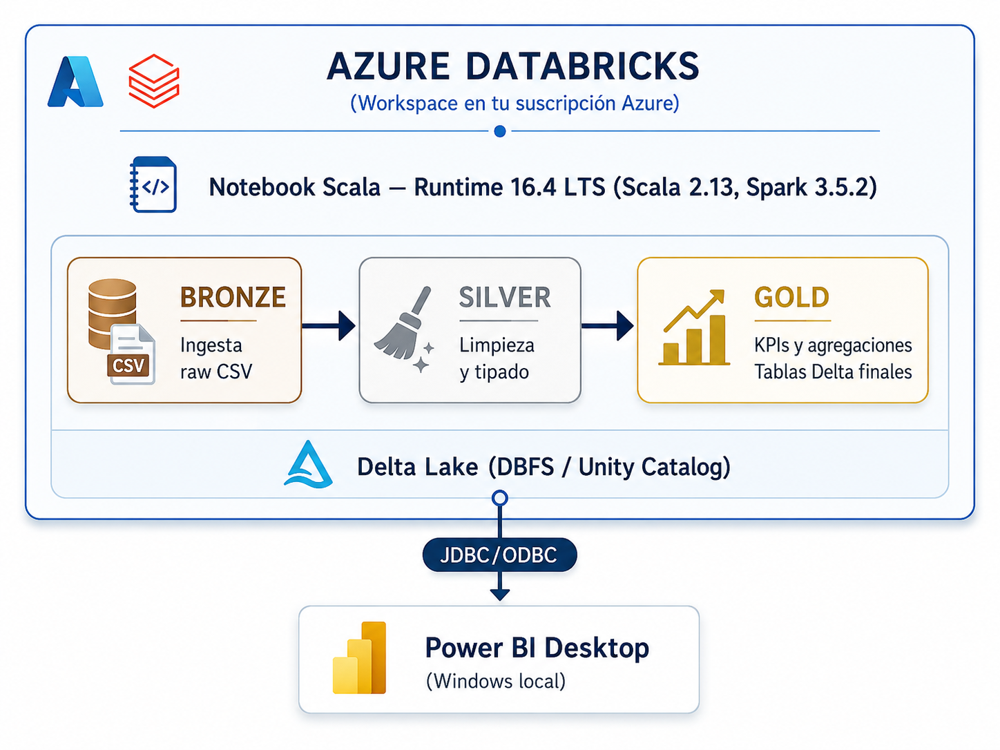

# 💻 Practica :  ETL + Delta Lake + Power BI con Azure Databricks

---

> **Entorno:** Azure Databricks · Runtime 16.4 LTS · Scala 2.13 · Spark 3.5.2
**Coste estimado con crédito estudiantil:** ~$3–5 USD por sesión de práctica
> 

---

## Por qué Azure Databricks y no la Trial de Databricks.com

| Plataforma | Scala | Clusters clásicos | Power BI | Coste |
| --- | --- | --- | --- | --- |
| Databricks Trial (AWS Express) | ❌ No disponible | ❌ Solo SQL Warehouse | ❌ | Gratis 14 días |
| Databricks Free Edition | ❌ No disponible | ❌ Solo serverless | ❌ | Gratis siempre |
| **Azure Databricks + crédito estudiantil** | **✅ Scala 2.13** | **✅ All-purpose** | **✅ Conector nativo** | **~$0 con crédito** |

> Azure Databricks despliega el workspace **dentro de tu suscripción Azure**, lo que significa que tienes control total sobre los recursos de cómputo, incluyendo clusters clásicos con Scala.
> 

---

## Arquitectura de la Práctica



<aside>

**Escenario:** Eres el Data Engineer de **TechVentas S.L.**, empresa española de e-commerce. Construirás un pipeline ETL completo con arquitectura Medallion (Bronze → Silver → Gold) sobre Delta Lake y lo conectarás a Power BI.

</aside>

---

## FASE 0: Activar Azure for Students

> Si ya tienes una suscripción Azure con crédito activo, salta al Paso 1.
> 

### 0.1 Registro en Azure for Students

1. Ve a: **https://azure.microsoft.com/es-es/free/students**
2. Haz clic en **"Comenzar gratis"**
3. Inicia sesión con tu cuenta de Microsoft (Outlook, Hotmail, o cuenta universitaria)
4. En la verificación de estudiante, introduce tu email de la institución educativa
5. Acepta los términos y condiciones
6. **No se requiere tarjeta de crédito** para Azure for Students

Recibirás **$100 USD de crédito** válido durante 12 meses.

### 0.2 Verificar que el crédito está activo

1. Ve a **https://portal.azure.com**
2. En la barra superior, haz clic en tu perfil → **"Ver mi factura"**
3. Deberías ver la suscripción **"Azure for Students"** con el crédito disponible

> Si ya tienes crédito activo, confirma en el portal que la suscripción está **habilitada** (no suspendida).
> 

---

## FASE 1: Crear el Workspace de Azure Databricks

### 1.1 Abrir el Portal de Azure

1. Ve a **https://portal.azure.com**
2. Inicia sesión con la cuenta que tiene el crédito estudiantil
3. En la barra de búsqueda superior escribe **"Azure Databricks"**
    
    
    
4. Haz clic en **"Azure Databricks"** en los resultados
    
    
    

### 1.2 Crear el Recurso

1. Haz clic en el botón **"+ Crear"** (o "Create")
    
    
    
2. Se abrirá el asistente de creación con varias pestañas:
    
    
    

### 1.3 Pestaña "Básico" — Configuración principal

Rellena los campos de la siguiente manera:

```
Suscripción:          Azure for Students o Azure Subcription 1 (según el caso)
Grupo de recursos:    (Nuevo) → escribe "rg-databricks-curso"
Nombre del área:      databricks-techventas
Región:               (Europa) West Europe  ← más cercana a Madrid
Plan de tarifa:       Premium
                      ↑ IMPORTANTE: elegir Premium, no Standard
                      (Standard se retira en Oct 2026)
```

```
Suscripción:          Azure for Students o Azure Subcription 1 (según el caso)
Grupo de recursos:    (Nuevo) → escribe "rg-databricks-curso"
```


```
Nombre del área:      databricks-techventas
Región:               (Europa) West Europe  ← más cercana a Madrid
Plan de tarifa:       Premium
                      ↑ IMPORTANTE: elegir Premium, no Standard
                      (Standard se retira en Oct 2026)
```


> **Por qué Premium:** El tier Premium incluye Delta Lake completo, Unity Catalog, control de acceso basado en roles (RBAC) y es el único tier con soporte completo a partir de octubre 2026.
> 
- En Workspace type selecciona **"Hybrid":**


<aside>

**Por qué Hybrid y no Serverless:**

- **Serverless** = mismo problema que la trial de AWS: solo compute serverless, sin clusters clásicos, **sin Scala**
- **Hybrid** = despliega compute y storage en **tu cuenta Azure**. Soporta clusters clásicos all-purpose con Scala ✅
</aside>

- Haz clic en **"Review + create"** directamente, sin tocar Networking (dejar todo por defecto).
    
    
    
    
    
- Pulsar en **"Crear"**.
    
    
    

### 1.4 Esperar el despliegue (Deployment is in progress)

- El despliegue tarda entre **3 y 8 minutos**
- Verás una pantalla con el progreso: "Se está implementando..."
    
    
    
- Cuando termine aparecerá: **"Se completó la implementación"**
    
    
    

### 1.5 Abrir el Workspace

1. Haz clic en **"Ir al recurso"**
    
    
    
2. En la página del recurso Azure Databricks, haz clic en el botón azul **"Iniciar área de trabajo”**
    
    
    
3. Se abrirá una nueva pestaña con la interfaz de Databricks. URL: `https://adb-XXXXXXXXXXXXXXXXXX.XX.azuredatabricks.net`
    
    
    

> Guarda esta URL. Es la dirección permanente de tu workspace.
> 

---

## FASE 2: Crear el Cluster con Scala 2.13

### 2.1 Navegar a Compute

1. En el menú lateral izquierdo del workspace de Databricks, haz clic en **"Compute"**
    
    
    
2. Ahora verás las pestañas: **"All-purpose compute"**, "Job compute", "SQL Warehouses"
    
    
    
3. Asegúrate de estar en la pestaña **"All-purpose compute"**
4. Haz clic en el botón azul **"Create compute"**
    
    
    

### 2.2 Configurar el Cluster

Rellena el formulario con estos valores exactos:

```
Nombre del cluster:      curso-scala-etl
Policy:                  Unrestricted
Cluster mode:            Single node
                         ↑ Más económico: usa ~$1.40/hora en lugar de ~$4/hora

Databricks Runtime:      16.4 LTS (Scala 2.13, Spark 3.5.2)
                         ↑ En el desplegable busca "16.4" y selecciona
                           la variante que dice "(Scala 2.13)" explícitamente

Node type:               Standard_DS3_v2
                         (4 vCPU, 14 GB RAM — suficiente para prácticas)

Terminate after:         30 minutes of inactivity
                         ↑ CRÍTICO: evita gastos innecesarios del crédito
```

```
Nombre del cluster:      curso-scala-etl
Policy:                  Unrestricted
```


```
Cluster mode:            Single node
                         ↑ Más económico: usa ~$1.40/hora en lugar de ~$4/hora
```


```
Databricks Runtime:      16.4 LTS (Scala 2.13, Spark 3.5.2)
                         ↑ En el desplegable busca "16.4" y selecciona
                           la variante que dice "(Scala 2.13)" explícitamente
```


> **Aviso sobre el coste:** Un cluster Single node con Standard_DS3_v2 cuesta aproximadamente $1.40–$1.80 USD/hora (VM + DBUs). Con $100 de crédito tienes más de 50 horas de práctica.
> 

Haz clic en **"Create "** y espera 3–5 minutos a que el cluster arranque (círculo verde).


---

## FASE 3: Crear los Notebooks

### 3.1 Crear la estructura de carpetas

1. En el menú lateral, haz clic en **"Workspace"**
    
    
    
2. Haz clic en el icono de tu usuario:
    
    
    
3. Con el botón derecho sobre tu carpeta → **"Create"** → **"Folder"**
    
    
    
4. Crea esta estructura:

```
/Users/tu-email/
└── curso-scala/
    └── etl-techventas/
        ├── 01_generacion_datos
        ├── 02_bronze
        ├── 03_silver
        ├── 04_gold
        └── 05_delta_avanzado
```


### 3.2 Cómo crear un notebook

Para cada sección siguiente:

1. Navega a la subcarpeta correspondiente
2. Haz clic derecho → **"Create"** → **"Notebook"**
    
    
    
3. Nombre: el indicado en cada sección. 
    
    
    
4. Default language: **Scala**
    
    
    
5. Cluster: selecciona `curso-scala-etl`


Repetir para: 

02_bronze → etl_bronze (nombre del notebook)

03_silver → etl_silver

04_gold → etl_gold

05_delta_avanzado → delta_avanzado


En todos los notebooks cambia el lenguaje por defecto de Python a Scala:

---

## FASE 4: Generación de Datos Sintéticos

**Notebook:** `generar_datos` (en carpeta `01_generacion_datos`)

---

**Celda 1 — Verificar entorno**

```scala
// Verificar que tenemos Scala 2.13 y Spark 3.5.2
println(s"Spark version:  ${spark.version}")
println(s"Scala version:  ${scala.util.Properties.versionString}")
println(s"Delta Lake:     disponible de forma nativa en Runtime 16.4 LTS")
```

Salida esperada:

```
Spark version:  3.5.2
Scala version:  version 2.13.x
```

---

**Celda 2 — Definir rutas base**

```scala
val catalog = "databricks_techventas"
val schema  = "default"
val volumen = "techventas"

spark.sql(s"CREATE SCHEMA IF NOT EXISTS $catalog.$schema")
spark.sql(s"CREATE VOLUME IF NOT EXISTS $catalog.$schema.$volumen")

val rutaBase = s"/Volumes/$catalog/$schema/$volumen"

dbutils.fs.mkdirs(s"$rutaBase/raw/ventas")
dbutils.fs.mkdirs(s"$rutaBase/raw/clientes")
dbutils.fs.mkdirs(s"$rutaBase/raw/productos")
dbutils.fs.mkdirs(s"$rutaBase/bronze")
dbutils.fs.mkdirs(s"$rutaBase/silver")
dbutils.fs.mkdirs(s"$rutaBase/gold")

println(s"rutaBase = $rutaBase")
display(dbutils.fs.ls(rutaBase))
```

---

**Celda 3 — Generar CLIENTES**

```scala
import scala.util.Random
import spark.implicits._

val rnd = new Random(42) // semilla fija → resultados reproducibles

val nombresLista = List(
  "Ana García","Carlos López","María Martínez","José Rodríguez",
  "Laura Sánchez","Miguel González","Carmen Pérez","Antonio Fernández",
  "Isabel Jiménez","Francisco Álvarez","Elena Díaz","Manuel Moreno",
  "Pilar Ruiz","David Herrera","Rosa Romero","Javier Navarro",
  "Lucia Torres","Pablo Domínguez","Marta Vázquez","Sergio Ramos"
)
val ciudadesLista  = List("Madrid","Barcelona","Valencia","Sevilla","Bilbao",
                          "Zaragoza","Málaga","Murcia","Alicante","Valladolid")
val segmentosLista = List("Premium","Estándar","Básico")

val clientes = (1 to 100).map { id =>
  val mes = (1 + rnd.nextInt(12)).toString.padLeft(2,'0')
  val dia = (1 + rnd.nextInt(28)).toString.padLeft(2,'0')
  (
    id,
    nombresLista(rnd.nextInt(nombresLista.length)),
    ciudadesLista(rnd.nextInt(ciudadesLista.length)),
    segmentosLista(rnd.nextInt(segmentosLista.length)),
    20 + rnd.nextInt(50),
    s"2023-$mes-$dia",
    rnd.nextDouble() > 0.1
  )
}

val dfClientes = clientes.toDF(
  "cliente_id","nombre","ciudad","segmento","edad","fecha_registro","activo"
)
dfClientes.coalesce(1).write.mode("overwrite")
  .option("header","true").csv(s"$rutaBase/raw/clientes")

println(s"✅ ${clientes.length} clientes generados")
display(dfClientes)
```

---

**Celda 4 — Definir case class Producto**

```scala
// En Azure Databricks no hay restricción Almond, pero seguimos la
// buena práctica de separar case class y su uso en celdas distintas
case class Producto(
  producto_id: Int,
  nombre:      String,
  categoria:   String,
  precio_base: Double,
  stock:       Int,
  proveedor:   String
)
```

---

**Celda 5 — Generar PRODUCTOS**

```scala
val catalogo = Map(
  "Electrónica" -> List(
    ("Smartphone Samsung Galaxy A54", 349.99),
    ("Auriculares Sony WH-1000XM5",  279.99),
    ("Tablet iPad Air",              699.99),
    ("Smartwatch Garmin Venu 2",     299.99),
    ("Portátil Lenovo IdeaPad",      549.99)
  ),
  "Hogar" -> List(
    ("Robot aspirador iRobot Roomba",  299.99),
    ("Cafetera DeLonghi Magnifica",    449.99),
    ("Freidora de Aire Philips",        89.99),
    ("Purificador de Aire Dyson",      499.99),
    ("Robot de Cocina Thermomix TM6", 1299.99)
  ),
  "Deportes" -> List(
    ("Bicicleta Estática Domyos",   299.99),
    ("Mancuernas Ajustables 20kg",   79.99),
    ("Esterilla de Yoga Premium",    39.99),
    ("Zapatillas Running Nike",     119.99),
    ("Casco Ciclismo Scott Supra",   89.99)
  ),
  "Moda" -> List(
    ("Chaqueta The North Face",     179.99),
    ("Mochila Samsonite Guardit",    89.99),
    ("Gafas Ray-Ban Aviator",       149.99),
    ("Reloj Casio G-Shock",         109.99),
    ("Bolso Loewe Puzzle Mini",    1450.00)
  )
)

var idProd = 1
val productos = for {
  (cat, items) <- catalogo.toSeq.sortBy(_._1)
  (nombre, precio) <- items
} yield {
  val p = Producto(idProd, nombre, cat, precio,
    10 + rnd.nextInt(490), s"Proveedor_${rnd.nextInt(10)+1}")
  idProd += 1
  p
}

val dfProductos = productos.toDF()
dfProductos.coalesce(1).write.mode("overwrite")
  .option("header","true").csv(s"$rutaBase/raw/productos")

println(s"✅ ${productos.length} productos generados")
display(dfProductos)
```

---

**Celda 6 — Definir case class VentaRaw**

```scala
// Campos String para poder incluir datos sucios intencionados
case class VentaRaw(
  venta_id:        String,
  fecha:           String,
  cliente_id:      String,
  producto_id:     String,
  cantidad:        String,
  precio_unitario: String,
  descuento:       String,
  canal:           String,
  estado:          String
)
```

---

**Celda 7 — Generar VENTAS con datos sucios**

```scala
// Los datos de ventas simulan errores reales de producción:
// ~5%  fechas en formato dd/MM/yyyy en lugar de yyyy-MM-dd
// ~3%  cliente_id "NULL"
// ~2%  cantidades negativas (-1)
// ~2%  precios negativos (-99.99)
// ~2%  IDs de venta duplicados

val canales = List("Web","App Móvil","Tienda Física","Teléfono")
val estados = List("Completado","Completado","Completado","Devuelto","Pendiente")

val ventas = (1 to 2000).map { i =>
  val mes = 1 + rnd.nextInt(12)
  val dia = 1 + rnd.nextInt(28)
  val fecha =
    if (rnd.nextDouble() < 0.05) f"$dia%02d/$mes%02d/2024"  // ← error de formato
    else                          f"2024-$mes%02d-$dia%02d"

  val clienteId  = if (rnd.nextDouble() < 0.03) "NULL"    else s"${1 + rnd.nextInt(100)}"
  val cantidad   = if (rnd.nextDouble() < 0.02) "-1"      else s"${1 + rnd.nextInt(5)}"
  val precio     = if (rnd.nextDouble() < 0.02) "-99.99"  else f"${10.0 + rnd.nextDouble() * 1290.0}%.2f"
  val ventaId    = if (rnd.nextDouble() < 0.02) s"V${i-1}" else s"V$i"  // ← duplicado

  VentaRaw(ventaId, fecha, clienteId, s"${1 + rnd.nextInt(20)}",
           cantidad, precio, f"${rnd.nextInt(31)}%.2f",
           canales(rnd.nextInt(canales.length)),
           estados(rnd.nextInt(estados.length)))
}

val dfVentas = ventas.toDF()
dfVentas.coalesce(1).write.mode("overwrite")
  .option("header","true").csv(s"$rutaBase/raw/ventas")

println(s"✅ ${ventas.length} ventas generadas (con ~10% datos sucios)")
println(s"\n📊 Distribución de estados:")
dfVentas.groupBy("estado").count().orderBy("estado").show()
```

---

## FASE 5: Capa BRONZE — Ingesta Raw

**Notebook:** `etl_bronze` (en `02_bronze`)

---

**Celda 1**

```scala
val rutaBase = "/Volumes/databricks_techventas/default/techventas"
import org.apache.spark.sql.functions._
println(s"=== BRONZE: ${java.time.LocalDateTime.now()} ===")
println(s"rutaBase = $rutaBase")
```

---

**Celda 2 — Ingestar VENTAS**

```scala
// En Bronze conservamos TODO tal cual viene de la fuente
// Solo añadimos metadatos de auditoría
val dfVentasBronze = spark.read
  .option("header","true")
  .option("inferSchema","false")   // Todo String — no inferimos tipos en Bronze
  .csv(s"$rutaBase/raw/ventas")
  .withColumn("_ingesta_ts",     current_timestamp())
  .withColumn("_ingesta_fecha",  current_date())
  .withColumn("_fuente",         lit("erp_ventas_v2"))
  .withColumn("_pipeline",       lit("batch_diario"))

// Guardar en formato Delta Lake
dfVentasBronze.write
  .format("delta")
  .mode("overwrite")
  .save(s"$rutaBase/bronze/ventas")

println(s"✅ Bronze/ventas: ${dfVentasBronze.count()} registros")
dfVentasBronze.printSchema()
```

---

**Celda 3 — Ingestar CLIENTES y PRODUCTOS**

```scala
// Clientes
spark.read.option("header","true").option("inferSchema","false")
  .csv(s"$rutaBase/raw/clientes")
  .withColumn("_ingesta_ts", current_timestamp())
  .withColumn("_fuente", lit("crm_sistema"))
  .write.format("delta").mode("overwrite").save(s"$rutaBase/bronze/clientes")
println(s"✅ Bronze/clientes guardado")

// Productos
spark.read.option("header","true").option("inferSchema","false")
  .csv(s"$rutaBase/raw/productos")
  .withColumn("_ingesta_ts", current_timestamp())
  .withColumn("_fuente", lit("erp_sistema"))
  .write.format("delta").mode("overwrite").save(s"$rutaBase/bronze/productos")
println(s"✅ Bronze/productos guardado")
```

---

**Celda 4 — Registrar en el Metastore**

```scala
val catalog = "databricks_techventas"
val bronzeSchema = "bronze"

spark.sql(s"CREATE SCHEMA IF NOT EXISTS $catalog.$bronzeSchema")

// Leer los Delta ya guardados y escribirlos como tablas Unity Catalog managed
spark.read.format("delta").load(s"$rutaBase/bronze/ventas")
  .write.format("delta").mode("overwrite")
  .saveAsTable(s"$catalog.$bronzeSchema.ventas")

spark.read.format("delta").load(s"$rutaBase/bronze/clientes")
  .write.format("delta").mode("overwrite")
  .saveAsTable(s"$catalog.$bronzeSchema.clientes")

spark.read.format("delta").load(s"$rutaBase/bronze/productos")
  .write.format("delta").mode("overwrite")
  .saveAsTable(s"$catalog.$bronzeSchema.productos")

println("Tablas Bronze registradas en Unity Catalog:")
spark.sql(s"SHOW TABLES IN $catalog.$bronzeSchema").show()

spark.sql(s"""
  SELECT estado, COUNT(*) as total
  FROM $catalog.$bronzeSchema.ventas
  GROUP BY estado ORDER BY total DESC
""").show()
```

---

## FASE 6: Capa SILVER — Limpieza y Transformación

**Notebook:** `etl_silver` (en `03_silver`)

---

**Celda 1**

```scala
val catalog  = "databricks_techventas"
val rutaBase = s"/Volumes/$catalog/default/techventas"
import org.apache.spark.sql.functions._
import org.apache.spark.sql.types._
println("=== SILVER: Limpieza y estandarización ===")
```

---

**Celda 2 — Leer Bronze**

```scala
val bronzeSchema = "bronze"
val dfVentasBronze    = spark.table(s"$catalog.$bronzeSchema.ventas")
val dfClientesBronze  = spark.table(s"$catalog.$bronzeSchema.clientes")
val dfProductosBronze = spark.table(s"$catalog.$bronzeSchema.productos")

println(s"Bronze Ventas:    ${dfVentasBronze.count()}")
println(s"Bronze Clientes:  ${dfClientesBronze.count()}")
println(s"Bronze Productos: ${dfProductosBronze.count()}")
```

---

**Celda 3 — Silver CLIENTES**

```scala
val dfClientesSilver = dfClientesBronze
  .withColumn("cliente_id",     col("cliente_id").cast(IntegerType))
  .withColumn("edad",           col("edad").cast(IntegerType))
  .withColumn("activo",         col("activo").cast(BooleanType))
  .withColumn("fecha_registro", to_date(col("fecha_registro"), "yyyy-MM-dd"))
  .withColumn("ciudad",         trim(col("ciudad")))
  .withColumn("segmento",       trim(col("segmento")))
  .drop("_ingesta_ts","_fuente")
  .filter(col("cliente_id").isNotNull && col("edad").between(18,100))

println(s"Silver Clientes: ${dfClientesSilver.count()}")
display(dfClientesSilver.limit(5))
```

---

**Celda 4 — Silver PRODUCTOS**

```scala
val dfProductosSilver = dfProductosBronze
  .withColumn("producto_id",  col("producto_id").cast(IntegerType))
  .withColumn("precio_base",  col("precio_base").cast(DoubleType))
  .withColumn("stock",        col("stock").cast(IntegerType))
  .withColumn("nombre",       trim(col("nombre")))
  .withColumn("categoria",    trim(col("categoria")))
  .drop("_ingesta_ts","_fuente")
  .filter(col("producto_id").isNotNull && col("precio_base") > 0)

println(s"Silver Productos: ${dfProductosSilver.count()}")
display(dfProductosSilver)
```

---

**Celda 5 — Silver VENTAS: filtrar inválidos**

```scala
val dfFiltradas = dfVentasBronze
  .filter(col("cliente_id")                    =!= "NULL")
  .filter(col("cantidad").cast(IntegerType)      > 0)
  .filter(col("precio_unitario").cast(DoubleType) > 0)
  .dropDuplicates("venta_id")

println(s"Tras filtrar: ${dfFiltradas.count()} (de ${dfVentasBronze.count()})")
```

---

**Celda 6 — Silver VENTAS: normalizar fechas**

```scala
val dfFechas = dfFiltradas
  .withColumn("fecha_ok",
    when(col("fecha").contains("/"),
      to_date(col("fecha"), "dd/MM/yyyy")
    ).otherwise(
      to_date(col("fecha"), "yyyy-MM-dd")
    )
  )
  .filter(col("fecha_ok").isNotNull)

println(s"Con fecha válida: ${dfFechas.count()}")
```

---

**Celda 7 — Silver VENTAS: calcular importes**

```scala
val dfVentasSilver = dfFechas
  .withColumn("cliente_id",      col("cliente_id").cast(IntegerType))
  .withColumn("producto_id",     col("producto_id").cast(IntegerType))
  .withColumn("cantidad",        col("cantidad").cast(IntegerType))
  .withColumn("precio_unitario", col("precio_unitario").cast(DoubleType))
  .withColumn("descuento_pct",   col("descuento").cast(DoubleType))
  .withColumn("importe_bruto",
    round(col("cantidad") * col("precio_unitario"), 2))
  .withColumn("importe_descuento",
    round(col("importe_bruto") * col("descuento_pct") / 100.0, 2))
  .withColumn("importe_neto",
    round(col("importe_bruto") - col("importe_descuento"), 2))
  .withColumn("anyo",       year(col("fecha_ok")))
  .withColumn("mes",        month(col("fecha_ok")))
  .withColumn("trimestre",  quarter(col("fecha_ok")))
  .withColumn("dia_semana", dayofweek(col("fecha_ok")))
  .select(
    col("venta_id"),
    col("fecha_ok").alias("fecha"),
    col("anyo"), col("mes"), col("trimestre"), col("dia_semana"),
    col("cliente_id"), col("producto_id"),
    col("cantidad"), col("precio_unitario"), col("descuento_pct"),
    col("importe_bruto"), col("importe_descuento"), col("importe_neto"),
    col("canal"), col("estado"),
    col("_ingesta_fecha")
  )

println(s"Silver Ventas: ${dfVentasSilver.count()} registros")
display(dfVentasSilver.limit(10))
```

---

**Celda 8 — Guardar Silver en Unity Catalog**

```scala
val silverSchema = "silver"
spark.sql(s"CREATE SCHEMA IF NOT EXISTS $catalog.$silverSchema")

// saveAsTable() — la forma correcta en Unity Catalog Hybrid
dfVentasSilver.write.format("delta").mode("overwrite")
  .saveAsTable(s"$catalog.$silverSchema.ventas")

dfClientesSilver.write.format("delta").mode("overwrite")
  .saveAsTable(s"$catalog.$silverSchema.clientes")

dfProductosSilver.write.format("delta").mode("overwrite")
  .saveAsTable(s"$catalog.$silverSchema.productos")

println("Tablas Silver en Unity Catalog:")
spark.sql(s"SHOW TABLES IN $catalog.$silverSchema").show()
```

---

**Celda 9 — Informe de calidad de datos**

```scala
val bronzeTotal = dfVentasBronze.count()
val silverTotal = dfVentasSilver.count()
val eliminados  = bronzeTotal - silverTotal

println("=" * 55)
println("INFORME DE CALIDAD — VENTAS")
println("=" * 55)
println(f"  Bronze (entrada):  $bronzeTotal%6d  (100.0%%)")
println(f"  Silver (salida):   $silverTotal%6d  (${silverTotal*100.0/bronzeTotal}%.1f%%)")
println(f"  Eliminados:        $eliminados%6d  (${eliminados*100.0/bronzeTotal}%.1f%%)")
println("=" * 55)

spark.sql(s"""
  SELECT mes, COUNT(*) as ventas, ROUND(SUM(importe_neto),2) as facturacion
  FROM $catalog.silver.ventas
  GROUP BY mes ORDER BY mes
""").show()
```

---

## FASE 7: Capa GOLD — KPIs de Negocio

**Notebook:** `etl_gold` (en `04_gold`)

---

**Celda 1**

```scala
val catalog  = "databricks_techventas"
val rutaBase = s"/Volumes/$catalog/default/techventas"
import org.apache.spark.sql.functions._
import org.apache.spark.sql.expressions.Window
spark.sql(s"CREATE SCHEMA IF NOT EXISTS $catalog.gold")
println("=== GOLD: KPIs de negocio ===")
```

---

**Celda 2 — JOIN enriquecido**

```scala
val dfV = spark.table(s"$catalog.silver.ventas")
val dfC = spark.table(s"$catalog.silver.clientes")
val dfP = spark.table(s"$catalog.silver.productos")

val dfCompleto = dfV
  .join(dfC, "cliente_id")
  .join(dfP, "producto_id")
  .select(
    dfV("venta_id"), dfV("fecha"),
    dfV("anyo"), dfV("mes"), dfV("trimestre"),
    dfC("nombre").alias("cliente"),
    dfC("ciudad"), dfC("segmento"),
    dfP("nombre").alias("producto"),
    dfP("categoria"),
    dfV("cantidad"), dfV("importe_bruto"),
    dfV("importe_neto"), dfV("canal"), dfV("estado")
  )
  .cache()

println(s"Dataset enriquecido: ${dfCompleto.count()} registros")
display(dfCompleto.limit(5))
```

---

**Celda 3 — Gold 1: Ventas por Mes y Categoría**

```scala
val goldMensual = dfCompleto
  .filter(col("estado") === "Completado")
  .groupBy("anyo","mes","trimestre","categoria")
  .agg(
    count("venta_id").alias("num_ventas"),
    sum("cantidad").alias("unidades"),
    round(sum("importe_neto"),2).alias("facturacion_neta"),
    round(avg("importe_neto"),2).alias("ticket_medio"),
    round(sum("importe_bruto") - sum("importe_neto"),2).alias("descuentos")
  )
  .orderBy("anyo","mes","categoria")

goldMensual.write.format("delta").mode("overwrite")
  .saveAsTable(s"$catalog.gold.ventas_mensual_categoria")

println("Gold 1: Ventas mensual por categoría")
display(goldMensual)
```

---

**Celda 4 — Gold 2: KPIs por Segmento**

```scala
val goldSegmento = dfCompleto
  .filter(col("estado") === "Completado")
  .groupBy("segmento","ciudad")
  .agg(
    countDistinct("venta_id").alias("transacciones"),
    countDistinct("cliente").alias("clientes_activos"),
    round(sum("importe_neto"),2).alias("revenue_total"),
    round(avg("importe_neto"),2).alias("pedido_medio"),
    round(sum("importe_neto") / countDistinct("cliente"),2).alias("clv_medio")
  )
  .orderBy(col("revenue_total").desc)

goldSegmento.write.format("delta").mode("overwrite")
  .saveAsTable(s"$catalog.gold.kpi_segmento")

println("Gold 2: KPIs por segmento")
display(goldSegmento)
```

---

**Celda 5 — Gold 3: Ranking de Productos**

```scala
val goldRanking = dfCompleto
  .filter(col("estado") === "Completado")
  .groupBy("producto","categoria")
  .agg(
    sum("cantidad").alias("unidades_vendidas"),
    count("venta_id").alias("pedidos"),
    round(sum("importe_neto"),2).alias("revenue"),
    round(avg("importe_neto"),2).alias("precio_medio")
  )
  .withColumn("ranking",
    rank().over(Window.partitionBy("categoria").orderBy(col("revenue").desc)))
  .orderBy("categoria","ranking")

goldRanking.write.format("delta").mode("overwrite")
  .saveAsTable(s"$catalog.gold.ranking_productos")

println("Gold 3: Ranking de productos")
display(goldRanking)
```

---

**Celda 6 — Gold 4: Ventas por Canal**

```scala
val goldCanal = dfCompleto
  .filter(col("estado") === "Completado")
  .groupBy("canal","mes")
  .agg(
    count("venta_id").alias("ventas"),
    round(sum("importe_neto"),2).alias("facturacion"),
    round(avg("importe_neto"),2).alias("ticket_medio")
  )
  .orderBy("canal","mes")

goldCanal.write.format("delta").mode("overwrite")
  .saveAsTable(s"$catalog.gold.ventas_canal")

println("Gold 4: Ventas por canal")
display(goldCanal)
```

---

**Celda 7 — Resumen ejecutivo**

```scala
val totalFact = spark.sql(
  s"SELECT ROUND(SUM(facturacion_neta),2) FROM $catalog.gold.ventas_mensual_categoria"
).collect()(0).getDouble(0)

val topCat = spark.sql(s"""
  SELECT categoria FROM (
    SELECT categoria, SUM(facturacion_neta) t
    FROM $catalog.gold.ventas_mensual_categoria
    GROUP BY categoria ORDER BY t DESC LIMIT 1)
""").collect()(0).getString(0)

val topCanal = spark.sql(s"""
  SELECT canal FROM (
    SELECT canal, SUM(facturacion) t
    FROM $catalog.gold.ventas_canal
    GROUP BY canal ORDER BY t DESC LIMIT 1)
""").collect()(0).getString(0)

println("=" * 55)
println("RESUMEN EJECUTIVO — TechVentas S.L. 2024")
println("=" * 55)
println(f"  Facturación total:    EUR $totalFact%,.2f")
println(s"  Categoría top:        $topCat")
println(s"  Canal principal:      $topCanal")
println("=" * 55)

spark.sql(s"SHOW TABLES IN $catalog.gold").show()
```

---

## FASE 8: Funcionalidades Avanzadas de Delta Lake

**Notebook:** `delta_avanzado` (en `05_delta_avanzado`)

---

**Celda 1 — Time Travel**

```scala
val catalog = "databricks_techventas"
import org.apache.spark.sql.functions._

spark.sql(s"DESCRIBE HISTORY $catalog.silver.ventas")
  .select("version","timestamp","operation")
  .show(10, truncate = false)
```

---

**Celda 2 — Leer versión anterior**

```scala
// Time Travel: leer versión 0 (la inicial)
val dfV0     = spark.read.format("delta").option("versionAsOf",0)
                 .table(s"$catalog.silver.ventas")
val dfActual = spark.table(s"$catalog.silver.ventas")

println(s"Versión 0:      ${dfV0.count()} registros")
println(s"Versión actual: ${dfActual.count()} registros")
```

---

**Celda 3 — MERGE**

```scala
import io.delta.tables._

val actualizaciones = Seq(
  ("V5",  "Completado"),
  ("V12", "Completado"),
  ("V23", "Devuelto")
).toDF("venta_id","nuevo_estado")

val deltaTabla = DeltaTable.forName(spark, s"$catalog.silver.ventas")

deltaTabla.alias("origen")
  .merge(actualizaciones.alias("upd"), "origen.venta_id = upd.venta_id")
  .whenMatched()
  .updateExpr(Map("estado" -> "upd.nuevo_estado"))
  .execute()

println("MERGE ejecutado")
spark.table(s"$catalog.silver.ventas")
  .filter(col("venta_id").isin("V5","V12","V23"))
  .select("venta_id","estado").show()
```

---

**Celda 4 — OPTIMIZE: compactar ficheros pequeños**

```scala
spark.sql(s"OPTIMIZE $catalog.silver.ventas")
println("OPTIMIZE ejecutado")
spark.sql(s"DESCRIBE DETAIL $catalog.silver.ventas")
  .select("format","numFiles","sizeInBytes")
  .show(truncate = false)
```

---

**Celda 5 — Inventario completo del Delta Lake**

```scala
println("=" * 65)
println("INVENTARIO COMPLETO DEL DELTA LAKE — TechVentas S.L.")
println("=" * 65)

val tablas = Seq(
  ("Bronze", "ventas",               s"$catalog.bronze.ventas"),
  ("Bronze", "clientes",             s"$catalog.bronze.clientes"),
  ("Bronze", "productos",            s"$catalog.bronze.productos"),
  ("Silver", "ventas",               s"$catalog.silver.ventas"),
  ("Silver", "clientes",             s"$catalog.silver.clientes"),
  ("Silver", "productos",            s"$catalog.silver.productos"),
  ("Gold",   "ventas_mensual_cat",   s"$catalog.gold.ventas_mensual_categoria"),
  ("Gold",   "kpi_segmento",         s"$catalog.gold.kpi_segmento"),
  ("Gold",   "ranking_productos",    s"$catalog.gold.ranking_productos"),
  ("Gold",   "ventas_canal",         s"$catalog.gold.ventas_canal")
)

tablas.foreach { case (capa, nombre, tabla) =>
  val n = spark.table(tabla).count()
  println(f"  [$capa%-6s]  $nombre%-24s  →  $n%6d registros")
}
println("=" * 65)
```

---

## FASE 9: Conexión Power BI Desktop

### 9.1 Obtener las credenciales JDBC del cluster

1. En Azure Databricks, ve al menú lateral → **"Compute"**
    
    
    
2. Haz clic en tu cluster `curso-scala-etl`
    
    
    
3. Ve a la pestaña **"Advanced options"**
    
    
    
4. Haz clic en la sub-pestaña **"JDBC/ODBC"**
    
    
    
5. Copia estos dos valores:

```
Server Hostname:   adb-XXXXXXXXXXXXXXXXXX.XX.azuredatabricks.net
HTTP Path:         /sql/1.0/clusters/XXXX-XXXXXX-XXXXXXXX
```

> La URL del campo "Server Hostname" es la misma que la URL de tu workspace sin el `https://`.
> 

### 9.2 Crear un Token de Acceso Personal (PAT)

1. Haz clic en tu icono de usuario (esquina superior derecha) → **"Settings"**
    
    
    
2. Navega a **"Developer"** en el menú izquierdo
    
    
    
3. Junto a "Access tokens" haz clic en **"Manage"**
    
    
    
4. Haz clic en **"Generate new token"**
    
    
    
5. Rellena:
    - **Comment:** `powerbi-conexion`
    - **Lifetime (days):** `30`
        
        
        
    - Pulsa en BI Tools y selecciona sql
        
        
        
6. Haz clic en **"Generate"**
7. **Copia el token inmediatamente** — solo se muestra una vez

> Guarda el token en un archivo de texto seguro. Si lo pierdes, deberás generar uno nuevo y reconfigurar Power BI.
> 

### 9.3 Instalar Power BI Desktop

Si no lo tienes instalado:

1. Ve a **https://powerbi.microsoft.com/es-es/desktop**
2. Descarga la versión gratuita (Power BI Desktop)
3. Instala y abre la aplicación

### 9.4 Conectar Power BI a Azure Databricks

1. En Power BI Desktop, menú superior → **"Inicio"** → **"Obtener datos de otros orígenes"**
    
    
    
2. En el buscador escribe **"Databricks"**
    
    
    
3. Selecciona **"Azure Databricks"** y haz clic en **"Conectar"**
    
    
    
    
    
    > Si no aparece el conector, instala el driver ODBC desde: **https://www.databricks.com/spark/odbc-drivers-download**
    Luego reinicia Power BI Desktop.
    > 
4. Rellena los campos del conector:
    
    ```
    Server Hostname:   (pega el valor del paso 9.1)
    HTTP Path:         (pega el valor del paso 9.1)
    ```
    
    
    
5. Haz clic en **"Aceptar"**
6. En la pantalla de autenticación:
    - Selecciona el método: **"Token de Acceso Personal"**
        
        
        
    - En el campo Token, pega el PAT del paso 9.2
        
        
        
7. Haz clic en **"Conectar"**

### 9.5 Importar las tablas Gold

En el navegador de Power BI expandir: `databricks_techventas` → `gold`:


1. Marca las 4 tablas:
    
    
    
2. Haz clic en **"Cargar"**
    
    
    
3. Espera a que Power BI importe los datos (~30 segundos)
    
    
    

### 9.6 Crear el Dashboard

Una vez cargadas las tablas, crea los siguientes visuales en una nueva página:

### Crear la primera tarjeta — Facturación Total

1. En el panel **"Visualizaciones"** (centro derecha), haz clic en el icono de **tarjeta:**
    
    
    
2. Aparecerá un visual vacío en el lienzo
3. En el panel **"Datos"** (derecha), expande `ventas_mensual_categoria`
    
    
    
4. Arrastra el campo `facturacion_neta` al área **"Valores"** del panel izquierdo
    
    
    
5. Power BI aplicará SUM automáticamente.
    
    
    
    
    

### Crear la segunda tarjeta — Num. Transacciones

1. Haz clic en una zona vacía del lienzo para deseleccionar
2. Vuelve a hacer clic en el icono de tarjeta
3. Expande `kpi_segmento` en el panel Datos
4. Arrastra `transacciones` a **"Valores"**
    
    
    

### Crear la tercera tarjeta — Ticket Medio

1. Nueva tarjeta
2. De `ventas_mensual_categ...` arrastra `ticket_medio` a **"Valores"**
3. Haz clic en la flecha junto al campo → cambia de **Suma** a **Promedio**
    
    
    

**Gráficos principales**

### Gráfico 1 — Ventas por mes (Líneas)

1. Haz clic en zona vacía del lienzo para deseleccionar
2. En Visualizaciones selecciona el icono de **gráfico de líneas.**
    
    
    
3. En el panel **Datos**, expande `ventas_mensual_categoria`
4. Arrastra:
    - `mes` → campo **"Eje X"**
    - `facturacion_neta` → campo **"Eje Y"**
    - `categoria` → campo **"Leyenda"**
        
        
        

Verás 4 líneas de colores, una por categoría (Electrónica, Hogar, Deportes, Moda).

---

### Gráfico 2 — Revenue por segmento (Barras apiladas)

1. Nueva visualización → icono **barras apiladas.**
    
    
    
2. Expande `kpi_segmento`
3. Arrastra:
    - `segmento` → **"Eje Y"**
    - `revenue_total` → **"Eje X"**
    - `ciudad` → **"Leyenda"**
        
        
        

### Gráfico 3 — Top productos (Treemap)

1. Haz clic en zona vacía del lienzo
2. En Visualizaciones busca el icono **Treemap.**
    
    
    
3. Expande `ranking_productos` en el panel Datos
4. Arrastra:
    - `categoria` → **"Categoría"**
    - `producto` → **"Detalles"**
    - `revenue` → **"Valores"**
        
        
        

---

### Gráfico 4 — Cuota por canal (Área)

1. Nueva visualización → icono **gráfico de área:**
    
    
    
2. Expande `ventas_canal`
3. Arrastra:
    - `mes` → **"Eje X"**
    - `facturacion` → **"Eje Y"**
    - `canal` → **"Leyenda"**
        
        
        

**Filtros interactivos (Segmentadores)**

- Segmentador de `trimestre`
- Segmentador de `categoria`

### Segmentador 1 — Trimestre

1. Haz clic en zona vacía del lienzo
2. En Visualizaciones busca el icono **Segmentacion de datos:**
    
    
    
3. Expande `ventas_mensual_categoria` en el panel Datos
4. Arrastra `trimestre` → **"Campo"**

Verás un filtro con los valores 1, 2, 3, 4. Al hacer clic en uno, todos los gráficos se filtran automáticamente.


---

### Segmentador 2 — Categoría

1. Nueva visualización → mismo icono **Segmentación de datos.**
2. Expande `ventas_mensual_categoria`
3. Arrastra `categoria` → **"Campo"**

Verás las 4 categorías (Deportes, Electrónica, Hogar, Moda) como botones de filtro.


---

#### Con esto el dashboard estará completo. Cuando lo tengas todo montado:

1. **Archivo → Guardar** → nombre `Dashboard_TechVentas`
    
    
    
    
    
2. Haz un **screenshot** del lienzo completo con todos los visuales
3. Ese screenshot es la evidencia de entrega 
    
    
    

---

## Control de Costes: Apagar el Cluster

> **IMPORTANTE:** El cluster factura mientras está activo aunque no estés ejecutando código.
> 

Para apagar el cluster manualmente:

1. Menú lateral → **"Compute"**
    
    
    
2. Busca `curso-scala-etl`
    
    
    
3. Haz clic en el icono **■ (Stop/Terminate)**
    
    
    
    
    

Con la configuración de "Terminate after 30 minutes" el cluster se apagará solo si no detecta actividad. Aun así, termínalo manualmente al acabar cada sesión.

**Estimación de costes por sesión de 5 horas:**

| Componente | Coste/hora | 5 horas |
| --- | --- | --- |
| VM Standard_DS3_v2 | ~$0.29/h | ~$1.45 |
| DBUs All-Purpose Premium | ~$0.55/DBU × 2 DBU/h | ~$5.50 |
| **Total** | **~$1.40/h** | **~$7.00** |

Con $100 de crédito tienes aproximadamente **14 sesiones de 5 horas** de práctica.

### Exportar notebooks desde Databricks

1. Abre tu workspace: haz clic en **`databricks-techventas`** en la lista de recursos → **"Launch Workspace"**
2. En el menú lateral ve a **"Workspace"**
3. Navega hasta tu carpeta: `Users → tu-email → curso-scala → etl-techventas`
4. Haz clic derecho sobre la carpeta **`etl-techventas`**
5. Selecciona **"Export"** → **"DBC Archive"**
6. Se descargará un archivo `etl-techventas.dbc` con todos los notebooks

---

> Un archivo `.dbc` contiene todos los notebooks de la carpeta y puede importarse en cualquier workspace Databricks futuro con **Workspace → Import → subir el .dbc**.
> 

Para eliminar todos los recursos de Azure de esta práctica, el método más rápido es **eliminar el grupo de recursos** — eso borra todo de una vez (el workspace Databricks, el storage asociado y la red virtual).

### Pasos para eliminar todo

1. Haz clic en **`rg-databricks-curso`** en la lista de recursos:
    
    
    
2. En la página del grupo de recursos, haz clic en **"Delete resource group"** (arriba, barra de botones)
    
    
    
3. Te pedirá que escribas el nombre del grupo para confirmar: escribe `rg-databricks-curso`
    
    
    
4. Haz clic en **"Delete"**
5. El proceso tarda entre 3 y 10 minutos

---

### Qué se elimina

- El workspace `databricks-techventas`
- Todo el storage asociado (los datos Delta Lake, los Volumes)
- La red virtual creada automáticamente
- El grupo de recursos `rg-databricks-curso`