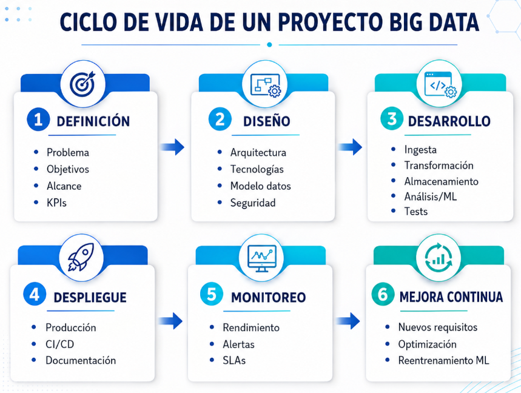

# 💻Clase 26 - ETL con Databricks

---

# Agenda:

<aside>
💡

#### 9:00 - 9:50    → Sesión 1. Practica: ETL con Databricks

#### 9:50 - 11:20   → Sesión 1. Practica: ETL con Databricks

#### **11:20 - 11:40  →  Descanso**

#### 11:40 - 12:40  → Sesión 2: Planificación y Diseño de Proyectos de Big Data

#### 12:40 - 14:00  → Ejercicios

</aside>

[💻 Sesión 1: Practica :  ETL + Delta Lake + Power BI con Azure Databricks](https://www.notion.so/Sesi-n-1-Practica-ETL-Delta-Lake-Power-BI-con-Azure-Databricks-35d1a81bbef4807d9967cb22e95239e3?pvs=21)

# Sesión 2: Planificación y Diseño de Proyectos de Big Data

---

## 1. 🔄 Fases de un Proyecto de Big Data

Un proyecto de Big Data bien ejecutado sigue un ciclo de vida estructurado. No existe un estándar único universal, pero la mayoría de metodologías comparten estas fases:



### 1.1 Fase 1 — Definición

Es la fase más importante. Un error aquí se multiplica exponencialmente en las siguientes fases.


| Actividad | Descripción | Ejemplo |
| --- | --- | --- |
| Definir el problema | ¿Qué pregunta de negocio queremos responder? | "¿Por qué bajaron las ventas en Madrid en Q3?" |
| Establecer objetivos | SMART: Específicos, Medibles, Alcanzables, Relevantes, Temporales | "Reducir la latencia del pipeline de 4h a 15min en 6 semanas" |
| Delimitar el alcance | Qué entra y qué no entra en el proyecto | "Solo datos de los últimos 2 años, solo mercado nacional" |
| Identificar KPIs | Métricas que dirán si el proyecto tuvo éxito | Tasa de precisión ≥ 90%, tiempo de procesamiento < 30s |

### 1.2 Fase 2 — Diseño

Aquí se toman las decisiones arquitectónicas. Cambiarlas después es muy costoso.


> El **checkpointing** consiste en **guardar periódicamente el estado de un proceso para poder retomarlo desde ese punto si ocurre un fallo**.
> 

### 1.3 Fase 3 — Desarrollo

Es donde más tiempo se gasta, pero solo es productivo si las fases 1 y 2 están bien hechas.

Componentes típicos de un pipeline Scala + Spark:


### 1.4 Fases 4–6 — Despliegue, Monitoreo y Mejora

Esta parte la veremos mas a detalle en la siguiente clase

---

## 2. 📋 Definición de Requisitos

### 2.1 Requisitos Funcionales

Describen **qué debe hacer** el sistema. Son observables desde fuera.


### 2.2 Requisitos No Funcionales

Describen **cómo debe comportarse** el sistema. Son criterios de calidad.


> ⚠️ **Error frecuente:** Confundir los requisitos funcionales con los no funcionales. Un RF dice "qué hace"; un RNF dice "cómo de bien lo hace". Ambos son igual de importantes para la viabilidad del proyecto.
> 

---

## 3. 🏗️ Arquitecturas: Lambda y Kappa

### 3.1 Arquitectura Lambda

Propuesta por Nathan Marz (~2011). Separa el procesamiento en dos capas paralelas para satisfacer simultáneamente las necesidades de latencia baja y de exactitud histórica.

> Es una arquitectura de procesamiento de datos que combina una capa batch para procesar datos históricos con alta exactitud y una capa speed para procesar datos recientes en tiempo real con baja latencia. Ambas vistas se integran en una capa de servicio que permite responder consultas de forma rápida y completa.
> 


**Cuándo usar Lambda:**

- Necesitas resultados en tiempo real Y análisis histórico completo
- Puedes asumir el coste de mantener dos pipelines paralelos
- Ejemplos: sistemas de recomendación, detección de fraude bancario

**Inconvenientes:**

- Complejidad operativa alta (dos lógicas de procesamiento casi duplicadas)
- Difícil mantener consistencia entre ambas capas

---

### 3.2 Arquitectura Kappa

Propuesta por Jay Kreps (co-creador de Kafka, ~2014). Simplifica Lambda eliminando la capa batch: **todo es streaming**, incluso el reprocesamiento histórico.

> La **Arquitectura Kappa** es una arquitectura de procesamiento de datos que utiliza un único pipeline basado en streaming para procesar tanto los datos recientes como los datos históricos, evitando separar el sistema en una capa batch y una capa speed.
> 


### 3.3 Comparativa


> 💡 **En la práctica:** Muchas empresas adoptan una variante simplificada. Con **Delta Lake** por ejemplo.
> 

---

## 4. 🔧 Selección de Herramientas

No existe la herramienta perfecta para todo. La clave es elegir según el problema.

### Criterios de selección


### Tabla de referencia rápida


---

## 5. 🏃 Gestión Ágil en Entornos Big Data

Los proyectos Big Data tienen características que hacen que las metodologías ágiles sean especialmente apropiadas: los datos reales nunca son como los esperados, los requisitos evolucionan, y el valor de negocio es difícil de estimar por adelantado.


### Estructura de un Backlog básico para un proyecto Big Data

Un **backlog** es la lista ordenada de todo el trabajo pendiente del proyecto, desglosado en tareas (llamadas *historias de usuario* o *tasks*).


---

## 6. 💻 Bloque Práctico

### Contexto del proyecto ficticio

<aside>
💡

La empresa española **LogiTrack S.L.** gestiona una red de almacenes y rutas de reparto en la Península Ibérica. El director de operaciones tiene tres preguntas urgentes:

1. ¿Qué rutas generan más retrasos?
2. ¿Qué almacenes tienen mayor coste operativo por envío?
3. ¿Podemos predecir si un envío llegará tarde?
</aside>

Tu equipo ha sido contratado para construir un sistema Big Data que responda a estas preguntas de forma automatizada y escalable.

---

### Ejercicio 1 — Definición del proyecto

Responde por escrito a las siguientes preguntas sobre el proyecto LogiTrack:

**E1.1 — Definición del problema:**

Redacta en 3–5 frases el problema de negocio que se quiere resolver. ¿Qué dolor tiene LogiTrack hoy? ¿Qué valor aporta la solución?

**E1.2 — Requisitos funcionales:**

Identifica al menos **5 requisitos funcionales** para el sistema. Usa el formato:

> "El sistema debe [verbo] [qué] [condición/frecuencia]"
> 

Ejemplo: "El sistema debe leer los ficheros de expediciones generados diariamente en el servidor FTP de LogiTrack."

**E1.3 — Requisitos no funcionales:**

Identifica al menos **4 requisitos no funcionales** con su métrica concreta. Usa la tabla:

| Categoría | Requisito | Métrica |
| --- | --- | --- |
| Rendimiento | ... | ... |
| Disponibilidad | ... | ... |
| Seguridad | ... | ... |
| Mantenibilidad | ... | ... |

---

### Ejercicio 2 — Diseño de arquitectura

**E2.1 — Elección de arquitectura:**

Para el proyecto LogiTrack, ¿elegirías Lambda o Kappa? Argumenta tu elección considerando:

- Frecuencia de actualización de los datos (los ficheros llegan una vez al día)
- Necesidad de análisis histórico (sí, se quieren ver tendencias de 2 años)
- Tamaño del equipo (3 ingenieros de datos)

**E2.2 — Diagrama de arquitectura:**

Dibuja (a mano o en texto con caracteres ASCII) el flujo de datos del sistema LogiTrack, desde la fuente hasta el consumidor final. Debe incluir al menos:

- Fuente de datos
- Capa de ingesta
- Capa de transformación (Scala + Spark)
- Almacenamiento de resultados
- Capa de exposición (quién consume los datos)

Ejemplo mínimo de estructura esperada:

```
[Fuente] → [Ingesta] → [Transformación Spark] → [Almacenamiento] → [Consumidor]
```

**E2.3 — Selección de herramientas:**

Completa esta tabla para el proyecto LogiTrack:

| Capa | Herramienta elegida | Justificación |
| --- | --- | --- |
| Ingesta | ? | ? |
| Procesamiento | ? | ? |
| Almacenamiento intermedio | ? | ? |
| Almacenamiento final | ? | ? |
| Orquestación | ? | ? |
| Visualización | ? | ? |

---

### Ejercicio 3 — Backlog del proyecto

**E3.1 — Épicas y tareas:**

Crea un backlog mínimo viable para el proyecto LogiTrack organizado en épicas. Debe incluir:

- Al menos **3 épicas**
- Al menos **3 tareas por épica**
- Una estimación de dificultad por tarea: Baja / Media / Alta

Usa el formato:

```
ÉPICA [N]: [Nombre]
  └─ Task [N.1]: [Descripción] — Dificultad: [Baja/Media/Alta]
  └─ Task [N.2]: ...
```

**E3.2 — Priorización:**

De todas las tareas del backlog, ¿cuáles incluirías en el **primer sprint** (2 semanas)? Argumenta por qué esas y no otras.

**E3.3 — Riesgos del proyecto:**

Identifica al menos **3 riesgos** que podrían hacer fracasar el proyecto LogiTrack. Para cada riesgo, propón una medida de mitigación.

| Riesgo | Probabilidad (A/M/B) | Impacto (A/M/B) | Mitigación |
| --- | --- | --- | --- |
| Los datos de origen son de mala calidad | A | A | Fase de validación temprana con DQ checks |
| ... | ... | ... | ... |

---