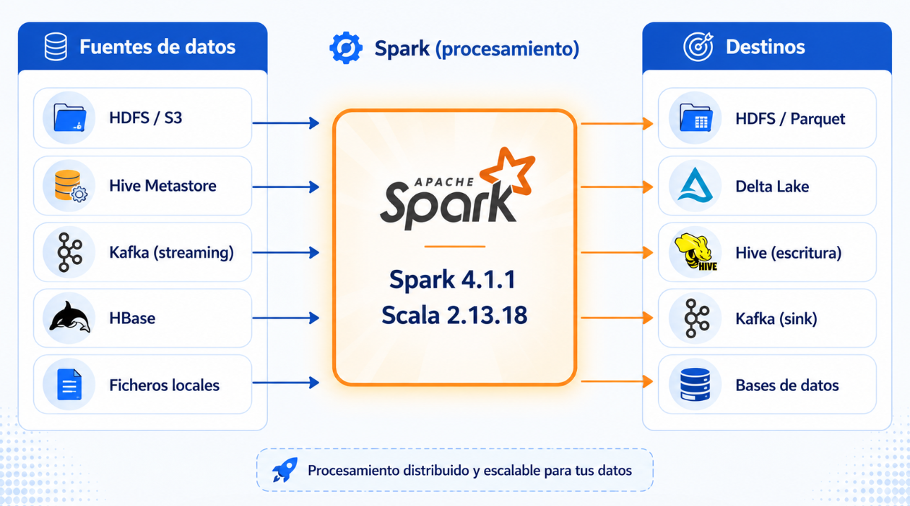

# Sesión 2. Integración de Spark con el Ecosistema Big Data

---

---

## 🧠 BLOQUE TEÓRICO

### 1. El problema que resuelve la integración

<aside>
💡

Spark es un motor de procesamiento, no un sistema de almacenamiento. Funciona como la **cocina de un restaurante**: puede preparar cualquier plato, pero necesita que alguien le suministre los ingredientes (datos) y que alguien recoja los platos listos (resultados). Ese "alguien" es el ecosistema de herramientas que rodea a Spark.

</aside>

En un proyecto Big Data real raramente encontrarás Spark trabajando solo. Siempre estará conectado a uno o varios sistemas externos:



**Hive Metastore** es una base de datos (normalmente MySQL o PostgreSQL) que guarda el "catálogo" del data lake: nombres de tablas, columnas, tipos de datos y la ruta en HDFS donde están los ficheros reales. No almacena datos, solo la descripción de dónde están y cómo leerlos. Es como el índice de una biblioteca: el índice no tiene los libros, pero te dice en qué estantería está cada uno.

**HBase** es una base de datos NoSQL que vive sobre HDFS y permite leer o escribir una fila concreta en milisegundos, aunque la tabla tenga miles de millones de filas. Mientras Spark + Hive está pensado para analizar millones de filas a la vez, HBase está pensado para buscar o actualizar un registro individual muy rápido. La analogía: Hive es como hacer una auditoría de todo el almacén; HBase es como buscar un producto concreto por su código de barras.

**Hive (escritura)**  se refiere a guardar el resultado de un DataFrame de Spark como una tabla permanente en el Hive Metastore, usando `saveAsTable()` o `CREATE TABLE ... AS SELECT`. Después de escribirla, esa tabla es visible para cualquier herramienta conectada al mismo metastore (otro job de Spark, un cuadro de mando, un equipo de analistas con HiveQL). Es la diferencia entre guardar un fichero Parquet en un directorio sin nombre lógico y registrarlo con nombre, esquema y descripción para que otros lo encuentren.

---

### 2. Spark + HDFS: lectura y escritura distribuida

### ¿Qué es HDFS?

<aside>
💡

**HDFS** (Hadoop Distributed File System) es el sistema de ficheros distribuido de Apache Hadoop. Piénsalo como un disco duro gigante repartido entre decenas o cientos de máquinas. Sus características clave:

- **Distribuido:** los ficheros se dividen en bloques (por defecto 128 MB) y se reparten entre los nodos del clúster.
- **Replicado:** cada bloque se copia en 3 nodos (factor de replicación por defecto). Si un nodo cae, los datos no se pierden.
- **Diseñado para lecturas secuenciales largas:** óptimo para Big Data, no para acceso aleatorio.
</aside>

### La relación natural Spark ↔ HDFS


<aside>
💡

En un ordenador normal, cuando quieres procesar un fichero, lo traes a donde está el programa: el fichero viaja desde el disco (o la red) hasta la CPU que va a procesarlo. Eso funciona bien con ficheros pequeños.

En un clúster con HDFS, los datos están repartidos entre decenas de máquinas y pueden pesar terabytes. Si trajeras los datos al programa, estarías moviendo terabytes por la red interna del clúster en cada job. La red es el cuello de botella más severo en un clúster distribuido.

La solución de Spark + HDFS es la contraria: **el programa viaja a donde están los datos**. Cada nodo del clúster tiene almacenados algunos bloques de datos y también tiene un Executor de Spark corriendo. Cuando Spark planifica el job, intenta asignar cada tarea al Executor que está en el mismo nodo donde está el bloque que esa tarea necesita leer. El código (que son kilobytes) viaja al dato (que son gigabytes), no al revés.

El resultado es que en la mayoría de los casos cada Executor lee sus bloques directamente del disco local, sin tocar la red.

</aside>


> Lo que viaja por la red no son los 1 millón de pedidos, sino 9 filas de resumen. Eso es manejable.
> 
> 
> Cuando haces `.show()` en tu notebook, el Driver recoge esos resultados parciales, los combina y te los muestra. El Driver es el coordinador central que vive en tu máquina (o en el nodo maestro del clúster) y es el único que ve el resultado final completo.
> 
> La regla general es: **los datos crudos no se mueven, solo los resultados intermedios**. Y Spark está diseñado para que esos resultados intermedios sean lo más pequeños posible antes de moverlos, que es exactamente lo que hace el optimizador Catalyst cuando analiza tu consulta.
> 


---

### 3. Spark + Hive: consultas sobre el Hive Metastore


### Habilitar soporte Hive en Spark

```scala
// Al crear la SparkSession, añadir .enableHiveSupport()
// (requiere hive-site.xml o metastore Thrift corriendo)
val spark = SparkSession.builder()
  .appName("Spark + Hive")
  .master("local[*]")
  .enableHiveSupport()
  .getOrCreate()
```

### Leer y escribir tablas Hive

```scala
// Listar bases de datos disponibles en el metastore
spark.sql("SHOW DATABASES").show()

// Usar una base de datos
spark.sql("USE ventas_db")

// Leer una tabla Hive directamente (Spark se conecta al metastore)
val clientes = spark.table("clientes")
clientes.show(5)

// Equivalente con SQL
val resultado = spark.sql("""
  SELECT ciudad, COUNT(*) as total_clientes
  FROM clientes
  GROUP BY ciudad
  ORDER BY total_clientes DESC
""")
resultado.show()

// Escribir un DataFrame como tabla Hive permanente
resultado.write
  .mode("overwrite")
  .saveAsTable("resumen_clientes_por_ciudad")

// Crear tabla Hive desde Spark SQL directamente
spark.sql("""
  CREATE TABLE IF NOT EXISTS productos_procesados
  USING parquet
  AS SELECT id, nombre, precio * 1.21 as precio_con_iva
  FROM productos
""")
```

> 💡 **Concepto clave:** Spark + Hive no significa que Spark use el motor de Hive para ejecutar las consultas. Spark usa el **Hive Metastore solo para conocer el esquema y la ubicación de los datos**. La ejecución siempre la realiza Spark. Es como consultar el índice de un libro para saber en qué página está el capítulo, pero leer tú mismo el capítulo.
> 

---

### 4. Spark + Kafka: ingestión de datos en streaming


### Leer de Kafka con Spark Structured Streaming

```scala
// Dependencia necesaria en build.sbt (para referencia):
// "org.apache.spark" %% "spark-sql-kafka-0-10" % "4.1.1"

// Crear un stream que lee de Kafka
val kafkaStream = spark.readStream
  .format("kafka")
  .option("kafka.bootstrap.servers", "kafka-broker:9092")  // servidor Kafka
  .option("subscribe", "pagos-online")                      // topic a consumir
  .option("startingOffsets", "latest")                      // solo mensajes nuevos
  .load()

// El DataFrame tiene columnas fijas de Kafka:
// key (binary), value (binary), topic, partition, offset, timestamp

// Decodificar el valor (los mensajes en Kafka son bytes)
import org.apache.spark.sql.functions._

val pagos = kafkaStream
  .select(
    col("key").cast("string").as("id_pago"),
    col("value").cast("string").as("json_pago"),
    col("timestamp")
  )

// Parsear el JSON del campo value
val pagosParsed = pagos.select(
  col("id_pago"),
  col("timestamp"),
  get_json_object(col("json_pago"), "$.importe").cast("double").as("importe"),
  get_json_object(col("json_pago"), "$.ciudad").as("ciudad")
)

// Escribir el stream procesado (por ejemplo, a consola para debugging)
val query = pagosParsed.writeStream
  .format("console")
  .outputMode("append")
  .start()

query.awaitTermination()
```

> ⚠️ **En entorno de clase:** No tenemos un servidor Kafka corriendo localmente. Los ejercicios prácticos simularán el comportamiento de Kafka con ficheros JSON o con socket. En entornos productivos y en Databricks, la conexión a Kafka es exactamente como el código de arriba.
> 

---

### 5. Spark + HBase y Spark + Delta Lake


La integración técnica usa la librería `SHC` (Spark-HBase Connector) o `hbase-spark`:

```scala
// Ejemplo conceptual — requiere conector externo
// En producción:
val hbaseConf = Map(
  "hbase.zookeeper.quorum" -> "zookeeper-host:2181",
  "hbase.table" -> "perfiles_usuarios",
  "hbase.columns.mapping" -> "id STRING :key, nombre STRING cf:nombre"
)

val perfiles = spark.read
  .format("org.apache.hadoop.hbase.spark")
  .options(hbaseConf)
  .load()
```

### Spark + Delta Lake ⭐


Delta Lake guarda un **transaction log** (carpeta `_delta_log/`) junto a los ficheros Parquet. Ese log registra cada operación, como el historial de commits de Git.

```scala
// Dependencia en Almond:
// import $ivy.`io.delta:delta-spark_2.13:3.3.0`

import io.delta.tables._

// Crear/escribir una tabla Delta
df.write
  .format("delta")
  .mode("overwrite")
  .save("C:/Curso-Scala/datos/tabla_delta/")

// Leer una tabla Delta
val deltaDF = spark.read
  .format("delta")
  .load("C:/Curso-Scala/datos/tabla_delta/")

// Time travel: leer una versión anterior
val version0 = spark.read
  .format("delta")
  .option("versionAsOf", "0")
  .load("C:/Curso-Scala/datos/tabla_delta/")

// UPDATE nativo (imposible con Parquet puro)
val deltaTable = DeltaTable.forPath(spark, "C:/Curso-Scala/datos/tabla_delta/")

deltaTable.update(
  condition = col("ciudad") === "Madrid",
  set = Map("precio" -> (col("precio") * lit(1.05)))
)

// Ver el historial de cambios
deltaTable.history().show(truncate = false)
```

> 💡 **Delta Lake e**s la tecnología es la mas utilizada. Un pipeline Big Data moderno lee de Kafka → procesa con Spark → escribe en Delta Lake → consulta con Spark SQL. Databricks fue el creador de Delta Lake y lo integra de forma nativa.
> 


---

### 6. Resumen visual


---

## 💻 BLOQUE PRÁCTICO (Opcional)

### Configuración del notebook

> ⚠️ **Recordatorio patrón Almond:** si usas `case class` con `.toDS()`, defínela en una celda separada antes de usarla. En esta sesión trabajaremos principalmente con DataFrames, pero el patrón sigue aplicando si aparecen Datasets tipados.
> 

---

**Celda Code — Inicialización:**

```scala
import $ivy.`org.apache.spark::spark-sql:4.1.1`
import $ivy.`io.delta:delta-spark_2.13:3.3.0`

import org.apache.spark.sql.SparkSession
import org.apache.spark.sql.functions._

val spark = SparkSession.builder()
  .appName("Dia25-Ecosistema")
  .master("local[*]")
  .config("spark.sql.extensions", "io.delta.sql.DeltaSparkSessionExtension")
  .config("spark.sql.catalog.spark_catalog", "org.apache.spark.sql.delta.catalog.DeltaCatalog")
  .config("spark.ui.enabled", "false")
  .getOrCreate()

spark.sparkContext.setLogLevel("ERROR")

import spark.implicits._

println(s"Spark ${spark.version} listo — Scala ${scala.util.Properties.versionString}")
```

**Salida esperada:**

```
Spark 4.1.1 listo — Scala version 2.13.18 (...)
```

---

### P1 — Leer un CSV simulando datos de HDFS

En producción leerías `hdfs://namenode:9000/datos/pedidos.csv`. En clase usamos una ruta local con exactamente el mismo código Spark (solo cambia el prefijo de la URI).

```
## P1 — Lectura de datos (simulando HDFS con ruta local)
```

**Celda Code:**

```scala
// Crear dataset de pedidos en memoria y guardarlo como CSV
val pedidosData = Seq(
  (1, "2024-01-10", "Madrid",    "electronica", 299.99, 2),
  (2, "2024-01-10", "Barcelona", "ropa",         45.00, 3),
  (3, "2024-01-11", "Madrid",    "electronica", 899.00, 1),
  (4, "2024-01-11", "Sevilla",   "hogar",        120.50, 4),
  (5, "2024-01-12", "Barcelona", "electronica", 199.99, 2),
  (6, "2024-01-12", "Madrid",    "ropa",          55.00, 5),
  (7, "2024-01-13", "Valencia",  "hogar",         88.75, 2),
  (8, "2024-01-13", "Madrid",    "electronica", 450.00, 1),
  (9, "2024-01-14", "Sevilla",   "ropa",          32.00, 3),
  (10,"2024-01-14", "Barcelona", "hogar",         210.00, 2)
).toDF("id", "fecha", "ciudad", "categoria", "precio_unitario", "cantidad")

// Guardar como CSV (simula lo que encontrarías en HDFS o S3)
val rutaCSV = "C:/Curso-Scala/datos/pedidos_raw/"
pedidosData.coalesce(1)
  .write
  .mode("overwrite")
  .option("header", "true")
  .csv(rutaCSV)

println(s"Datos guardados en: $rutaCSV")
```

**Celda Code:**

```scala
// Leer el CSV (misma API que hdfs://namenode:9000/datos/pedidos_raw/)
val pedidos = spark.read
  .option("header", "true")
  .option("inferSchema", "true")
  .csv(rutaCSV)

pedidos.printSchema()
pedidos.show()
println(s"Total pedidos: ${pedidos.count()}")
```

**Salida esperada:**

```
root
 |-- id: integer (nullable = true)
 |-- fecha: string (nullable = true)
 |-- ciudad: string (nullable = true)
 |-- categoria: string (nullable = true)
 |-- precio_unitario: double (nullable = true)
 |-- cantidad: integer (nullable = true)

+---+----------+---------+------------+---------------+--------+
| id|     fecha|   ciudad|   categoria|precio_unitario|cantidad|
+---+----------+---------+------------+---------------+--------+
|  1|2024-01-10|   Madrid| electronica|         299.99|       2|
...
+---+----------+---------+------------+---------------+--------+
Total pedidos: 10
```

---

### P2 — Transformaciones y escritura en Parquet (formato HDFS nativo)

```
## P2 — Calcular importe total y escribir en Parquet
```

**Celda Code:**

```scala
// Añadir columna importe_total = precio_unitario * cantidad
val pedidosConImporte = pedidos
  .withColumn("importe_total", round($"precio_unitario" * $"cantidad", 2))
  .withColumn("fecha", to_date($"fecha", "yyyy-MM-dd"))

pedidosConImporte.show()

// Escribir en Parquet particionado por ciudad (como harías en HDFS)
val rutaParquet = "C:/Curso-Scala/datos/pedidos_parquet/"
pedidosConImporte.write
  .mode("overwrite")
  .partitionBy("ciudad")
  .parquet(rutaParquet)

println(s"Escrito en Parquet particionado por ciudad: $rutaParquet")
```

**Salida esperada:**

```
+---+----------+---------+------------+---------------+--------+-------------+
| id|     fecha|   ciudad|   categoria|precio_unitario|cantidad|importe_total|
+---+----------+---------+------------+---------------+--------+-------------+
|  1|2024-01-10|   Madrid| electronica|         299.99|       2|       599.98|
|  2|2024-01-10|Barcelona|        ropa|           45.0|       3|        135.0|
...
```

**Celda Code:**

```scala
// Verificar la estructura de particiones creada
import java.nio.file.{Paths, Files}
import scala.jdk.CollectionConverters._

val dirs = Files.list(Paths.get("C:/Curso-Scala/datos/pedidos_parquet/"))
  .iterator().asScala
  .filter(Files.isDirectory(_))
  .map(_.getFileName.toString)
  .toList
  .sorted

println("Particiones creadas:")
dirs.foreach(d => println(s"  └── $d"))
```

**Salida esperada:**

```
Particiones creadas:
  └── ciudad=Barcelona
  └── ciudad=Madrid
  └── ciudad=Sevilla
  └── ciudad=Valencia
```

---

### P3 — Simular consulta tipo Hive con vistas temporales

Como no tenemos un servidor Hive Metastore, simularemos su función con **vistas temporales**. La mecánica SQL es idéntica a lo que usarías con `spark.sql("SELECT ... FROM tabla_hive")`.

```
## P3 — Spark SQL sobre vistas temporales (equivalente a Hive)
```

**Celda Code:**

```scala
// Registrar el DataFrame como vista temporal (equivale a una tabla Hive)
pedidosConImporte.createOrReplaceTempView("pedidos")

// Ahora podemos hacer exactamente las mismas consultas que con Hive
val ventasPorCategoria = spark.sql("""
  SELECT
    categoria,
    COUNT(*)                        AS num_pedidos,
    ROUND(SUM(importe_total), 2)    AS total_ventas,
    ROUND(AVG(importe_total), 2)    AS ticket_medio
  FROM pedidos
  GROUP BY categoria
  ORDER BY total_ventas DESC
""")

println("=== Ventas por categoría ===")
ventasPorCategoria.show()
```

**Salida esperada:**

```
=== Ventas por categoría ===
+------------+-----------+------------+------------+
|   categoria|num_pedidos|total_ventas|ticket_medio|
+------------+-----------+------------+------------+
| electronica|          4|     2889.96|      722.49|
|        ropa|          3|      311.0 |      103.67|
|       hogar|          3|      838.5 |      279.5 |
+------------+-----------+------------+------------+
```

**Celda Code:**

```scala
// Consulta más compleja: top ciudad por categoría
val topCiudadCategoria = spark.sql("""
  SELECT ciudad, categoria, ROUND(SUM(importe_total), 2) AS total
  FROM pedidos
  GROUP BY ciudad, categoria
  ORDER BY ciudad, total DESC
""")

println("=== Ventas por ciudad y categoría ===")
topCiudadCategoria.show()
```

---

### P4 — Simular ingestión de streaming desde ficheros JSON (estilo Kafka)

Kafka envía mensajes en formato JSON. Simularemos este flujo creando ficheros JSON que Spark leerá como stream.

```
## P4 — Micro-batch streaming desde ficheros JSON (simula Kafka)
```

**Celda Code:**

```scala
import org.apache.spark.sql.types._

// Definir el esquema de los mensajes (en Kafka, vendrían como bytes → JSON)
val schemaMensajes = StructType(Array(
  StructField("id_evento",  StringType,  nullable = false),
  StructField("timestamp",  LongType,    nullable = false),
  StructField("tipo",       StringType,  nullable = false),
  StructField("ciudad",     StringType,  nullable = false),
  StructField("importe",    DoubleType,  nullable = true)
))

// Crear mensajes de ejemplo (simulan lo que Kafka enviaría)
val mensajes = Seq(
  """{"id_evento":"evt_001","timestamp":1704844800,"tipo":"pago","ciudad":"Madrid","importe":150.0}""",
  """{"id_evento":"evt_002","timestamp":1704844860,"tipo":"pago","ciudad":"Barcelona","importe":89.5}""",
  """{"id_evento":"evt_003","timestamp":1704844920,"tipo":"devolucion","ciudad":"Madrid","importe":45.0}""",
  """{"id_evento":"evt_004","timestamp":1704844980,"tipo":"pago","ciudad":"Sevilla","importe":210.0}""",
  """{"id_evento":"evt_005","timestamp":1704845040,"tipo":"pago","ciudad":"Madrid","importe":320.0}"""
)

// Parsear los JSON (en Kafka haríamos .cast("string") sobre la columna "value")
val dfEventos = spark.read.json(mensajes.toDS())

println("=== Eventos recibidos (simulación Kafka) ===")
dfEventos.show(truncate = false)
dfEventos.printSchema()
```

**Salida esperada:**

```
=== Eventos recibidos (simulación Kafka) ===
+---------+----------+------+---------+----------+
|   ciudad|id_evento |importe|timestamp|    tipo  |
+---------+----------+------+---------+----------+
|   Madrid|  evt_001 | 150.0|1704844800|    pago  |
|Barcelona|  evt_002 |  89.5|1704844860|    pago  |
|   Madrid|  evt_003 |  45.0|1704844920|devolucion|
...
```

**Celda Code:**

```scala
// Procesar: filtrar solo pagos y agregar por ciudad
val resumenPagos = dfEventos
  .filter($"tipo" === "pago")
  .groupBy("ciudad")
  .agg(
    count("*").as("num_pagos"),
    round(sum("importe"), 2).as("total_recaudado")
  )
  .orderBy($"total_recaudado".desc)

println("=== Resumen de pagos (resultado del pipeline de streaming) ===")
resumenPagos.show()
```

**Salida esperada:**

```
=== Resumen de pagos (resultado del pipeline de streaming) ===
+---------+---------+---------------+
|   ciudad|num_pagos|total_recaudado|
+---------+---------+---------------+
|   Madrid|        2|          470.0|
|  Sevilla|        1|          210.0|
|Barcelona|        1|           89.5|
+---------+---------+---------------+
```

---

### P5 — Introducción a Delta Lake: escritura y lectura

```
## P5 — Delta Lake: escritura con ACID transactions
```

**Celda Code:**

```scala
val rutaDelta = "C:/Curso-Scala/datos/pedidos_delta/"

// Escribir en formato Delta (en lugar de Parquet puro)
pedidosConImporte.write
  .format("delta")
  .mode("overwrite")
  .save(rutaDelta)

println(s"Tabla Delta creada en: $rutaDelta")

// Leer la tabla Delta
val deltaDF = spark.read
  .format("delta")
  .load(rutaDelta)

deltaDF.show()
println(s"Filas en tabla Delta: ${deltaDF.count()}")
```

---

### P6 — Delta Lake: actualización de registros (imposible en Parquet puro)

```
## P6 — Delta Lake: UPDATE (operación ACID)
```

**Celda Code:**

```scala
import io.delta.tables._

val deltaTable = DeltaTable.forPath(spark, rutaDelta)

// Aplicar un descuento del 10% a todos los pedidos de electronica en Madrid
deltaTable.update(
  condition = $"categoria" === "electronica" && $"ciudad" === "Madrid",
  set = Map(
    "precio_unitario" -> ($"precio_unitario" * lit(0.9)),
    "importe_total"   -> (round($"precio_unitario" * lit(0.9) * $"cantidad", 2))
  )
)

println("=== Tabla después del UPDATE (descuento electronica Madrid) ===")
deltaTable.toDF
  .filter($"categoria" === "electronica")
  .orderBy("ciudad")
  .show()
```

---

### P7 — Delta Lake: Time Travel

```
## P7 — Delta Lake: Time Travel (leer versión anterior)
```

**Celda Code:**

```scala
// Ver el historial de operaciones (como 'git log')
println("=== Historial de la tabla Delta ===")
deltaTable.history().select("version", "timestamp", "operation").show(truncate = false)
```

**Celda Code:**

```scala
// Leer la versión original (antes del UPDATE)
val versionOriginal = spark.read
  .format("delta")
  .option("versionAsOf", "0")
  .load(rutaDelta)

println("=== Versión 0 (antes del descuento) — pedidos electronica Madrid ===")
versionOriginal
  .filter($"categoria" === "electronica" && $"ciudad" === "Madrid")
  .select("id", "ciudad", "categoria", "precio_unitario", "importe_total")
  .show()

println("=== Versión actual (con descuento aplicado) ===")
deltaTable.toDF
  .filter($"categoria" === "electronica" && $"ciudad" === "Madrid")
  .select("id", "ciudad", "categoria", "precio_unitario", "importe_total")
  .show()
```

**Salida esperada (versión 0):**

```
+---+------+------------+---------------+-------------+
| id|ciudad|   categoria|precio_unitario|importe_total|
+---+------+------------+---------------+-------------+
|  1|Madrid| electronica|         299.99|       599.98|
|  3|Madrid| electronica|         899.00|       899.00|
|  8|Madrid| electronica|         450.00|       450.00|
+---+------+------------+---------------+-------------+
```

---

### P8 — Pipeline completo: CSV → transformación → Delta Lake → consulta SQL

```
## P8 — Pipeline end-to-end: ingesta → procesado → Delta → análisis
```

**Celda Code:**

```scala
// Paso 1: Leer CSV (simula HDFS/S3)
val rawData = spark.read
  .option("header", "true")
  .option("inferSchema", "true")
  .csv(rutaCSV)

// Paso 2: Transformar (lógica de negocio)
val transformado = rawData
  .withColumn("importe_total", round($"precio_unitario" * $"cantidad", 2))
  .withColumn("fecha",         to_date($"fecha", "yyyy-MM-dd"))
  .withColumn("es_premium",    ($"importe_total" > 400).cast("boolean"))
  .filter($"importe_total" > 0)

// Paso 3: Escribir en Delta Lake
val rutaPipeline = "C:/Curso-Scala/datos/pipeline_resultado/"
transformado.write
  .format("delta")
  .mode("overwrite")
  .partitionBy("ciudad")
  .save(rutaPipeline)

println("Pipeline completado. Registrando como vista temporal...")

// Paso 4: Registrar como vista y consultar con SQL (simula Hive)
spark.read.format("delta").load(rutaPipeline)
  .createOrReplaceTempView("resultados_pipeline")

val analisis = spark.sql("""
  SELECT
    ciudad,
    categoria,
    COUNT(*)                              AS num_pedidos,
    ROUND(SUM(importe_total), 2)          AS total_ventas,
    SUM(CASE WHEN es_premium THEN 1 ELSE 0 END) AS pedidos_premium
  FROM resultados_pipeline
  GROUP BY ciudad, categoria
  ORDER BY total_ventas DESC
""")

println("=== Análisis final del pipeline ===")
analisis.show()
```

---
