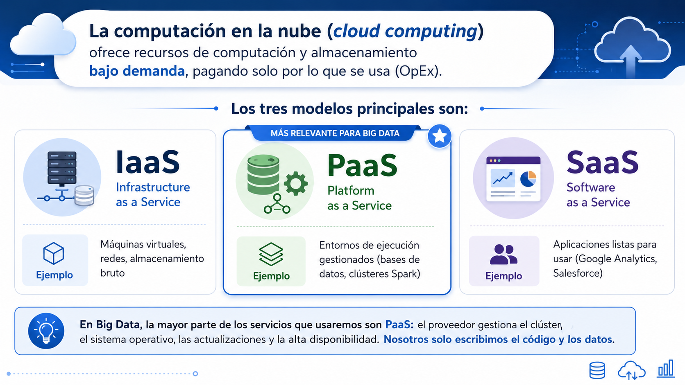

# 💻Clase 28 - Big Data en la nube

---

# Agenda:

<aside>
💡

#### 9:00 - 9:50    → Sesión 1: Big Data en la nube

#### 9:50 - 11:20   → Practica

#### **11:20 - 11:40  →  Descanso**

#### 11:40 - 12:40  → Sesión 2: Practica Final

#### 12:40 - 14:00  → Practica

</aside>

---

## 🧠 BLOQUE TEÓRICO

### 1. ¿Por qué Big Data en la Nube?

<aside>
💡

### 1.1 El problema del hardware propio (*on-premise*)

Antes de la nube, una empresa que quisiera procesar grandes volúmenes de datos tenía que:

1. **Comprar servidores físicos** — con un coste inicial elevado (CapEx)
2. **Instalar y configurar el software** — Hadoop, Spark, HDFS...
3. **Contratar personal especializado** para mantenerlo
4. **Dimensionar para el pico de carga** — si un día al año el tráfico se triplica, el hardware tiene que aguantarlo aunque el resto del año esté al 20% de uso
5. **Pagar el espacio, la electricidad y la refrigeración** del centro de datos

Esto era viable para grandes empresas como bancos o telecomunicaciones, pero inaccesible para la mayoría.

</aside>

### 1.2 La nube cambia el modelo



### 1.3 Ventajas clave para Big Data

- **Elasticidad:** un clúster de 100 nodos para una carga puntual se puede crear en minutos y destruir al terminar
- **Escalado automático:** los servicios gestionados ajustan los recursos según la demanda
- **Ecosistema integrado:** almacenamiento, procesamiento, machine learning y visualización de un mismo proveedor, conectados nativamente
- **Modelo de pago por uso:** ideal para cargas variables o proyectos en fase inicial
- **Disponibilidad global:** regiones en todo el mundo con baja latencia para los usuarios finales
- **Seguridad certificada:** los proveedores cumplen ISO 27001, SOC 2, GDPR, ENS (Esquema Nacional de Seguridad en España)

### 1.4 Desventajas y riesgos

- **Vendor lock-in:** migrar de un proveedor a otro puede ser costoso si se usan servicios propietarios
- **Coste impredecible:** un pipeline mal optimizado puede generar facturas inesperadas
- **Latencia de red:** mover datos entre regiones o entre on-premise y cloud tiene coste y latencia
- **Soberanía del dato:** en sectores regulados (sanidad, banca), los datos no pueden salir de la UE; hay que elegir bien la región

> 💡 **Concepto importante para el proyecto final:** cuando diseñes una arquitectura Big Data en cloud, la primera decisión es siempre dónde viven los datos. El procesamiento debería ir al dato, no al revés.
> 

---

### 2. Amazon Web Services (AWS) para Big Data

AWS es el proveedor de nube más antiguo y con mayor cuota de mercado. Lanzado en 2006, tiene la oferta de servicios Big Data más amplia y madura.

### 2.1 Almacenamiento


---

### 2.2 Procesamiento distribuido


**AWS Glue**


---

### 2.3 Consulta y análisis


---

### 2.4 Machine Learning y catálogo


---

### 3. Microsoft Azure para Big Data

<aside>

Azure es el segundo proveedor por cuota de mercado y el favorito en entornos empresariales con infraestructura Microsoft (Active Directory, Office 365, SAP).

</aside>

### 3.1 Almacenamiento

**Azure Data Lake Storage Gen2 (ADLS Gen2)**


---

### 3.2 Procesamiento distribuido


---

### 3.3 Ingesta y ETL


---

### 3.4 Consulta y análisis


---

### 3.5 Machine Learning


---

### 4. Google Cloud Platform (GCP) para Big Data

GCP es el proveedor más innovador tecnológicamente en el ámbito de datos. Muchas de las tecnologías Big Data modernas nacieron en Google (MapReduce, Bigtable, Dremel/BigQuery, Pub/Sub).

### 4.1 Almacenamiento

**Google Cloud Storage (GCS)**


---

### 4.2 Procesamiento distribuido


---

### 4.3 Consulta y análisis


---

### 4.4 Streaming


---

### 4.5 Machine Learning e IA


---

### 5. Comparativa entre Proveedores

### 5.1 Cuota de mercado (2025 Q1)


### 5.2 Equivalencias de servicios

> 💡 **Nota:** Databricks no es un proveedor cloud independiente — se despliega *sobre* AWS, Azure o GCP. Tiene su propia columna porque ofrece servicios propios que sustituyen o complementan a los nativos de cada nube, y es la plataforma Spark de referencia en el mercado empresarial.
> 

| Categoría | AWS | Azure | GCP | Databricks (sobre cualquier nube) | Open Source (Apache) |
| --- | --- | --- | --- | --- | --- |
| Almacenamiento de objetos | S3 | ADLS Gen2 / Blob Storage | Cloud Storage (GCS) | Usa el almacenamiento del proveedor subyacente | **Apache Hadoop HDFS** |
| Clúster Spark gestionado | EMR | HDInsight | Dataproc | **All-Purpose / Job Clusters** | **Apache Spark** (autogestionado) |
| Spark Premium (lakehouse) | Databricks (partner) | Azure Databricks | Databricks (partner) | **Databricks Lakehouse Platform** | **Apache Spark** + **Delta Lake** |
| Formato de tabla lakehouse | — | — | — | **Delta Lake** (por defecto) | **Apache Iceberg** / **Apache Hudi** |
| ETL serverless | Glue | Data Factory | Dataflow | **Delta Live Tables (DLT)** | **Apache Beam** / **Apache NiFi** |
| Data Warehouse | Redshift | Synapse Analytics | BigQuery | **Databricks SQL Warehouse** | **Apache Hive** / **Apache Impala** |
| Consulta SQL sobre lago | Athena | Synapse Serverless SQL | BigQuery | **Databricks SQL** | **Apache Drill** / **Trino** (ex-PrestoSQL) |
| Streaming | Kinesis | Event Hubs | Pub/Sub | Integra con Kafka / Event Hubs / Kinesis | **Apache Kafka** |
| Procesamiento de streams | Kinesis Data Analytics | Azure Stream Analytics | Dataflow | **Spark Structured Streaming** (nativo) | **Apache Flink** / **Spark Structured Streaming** |
| ML Platform | SageMaker | Azure ML / Fabric | Vertex AI | **MLflow** + **Mosaic AI** | **Apache Spark MLlib** / **MLflow** |
| Orquestación | MWAA (Airflow) | Azure Data Factory | Cloud Composer (Airflow) | **Databricks Workflows** | **Apache Airflow** |
| Catálogo de datos | Glue Data Catalog | Microsoft Purview | Dataplex | **Unity Catalog** | **Apache Atlas** |
| NoSQL | DynamoDB | Cosmos DB | Bigtable / Firestore | — (no es su dominio) | **Apache Cassandra** / **Apache HBase** |

---


---

## 💻 BLOQUE PRÁCTICO (Opcional)

### Objetivo

<aside>

Esta sesión práctica no tiene notebook de código. El objetivo es que cada alumno **investigue, compare y documente** los servicios cloud de Big Data, construyendo su propia referencia de consulta para el mercado laboral.

</aside>

---

### Instrucciones generales

Trabaja individualmente o en parejas. Usa los navegadores y las documentaciones oficiales de cada proveedor. Al finalizar, cada alumno tendrá un documento de referencia personal.

**Documenta tus hallazgos en un fichero Markdown** llamado:

```
investigacion_cloud_bigdata_[tu_nombre].md
```

Guárdalo en `C:\Curso-Scala\investigacion\`

---

### Parte A — Investigación de servicios AWS

Accede a: **https://aws.amazon.com/es/big-data/datalakes-and-analytics/**

Investiga y responde las siguientes preguntas documentando cada respuesta:

**1. Amazon S3**

- ¿Cuánto cuesta almacenar 1 TB en S3 Standard en la región de Madrid (`eu-south-2`) por mes?
- ¿Qué diferencia hay entre S3 Standard y S3 Glacier Instant Retrieval en términos de coste y tiempo de recuperación?
- ¿Qué es el *S3 Intelligent-Tiering* y cuándo tiene sentido usarlo?

**2. Amazon EMR**

- ¿Cuánto cuesta una instancia `m5.xlarge` en EMR en la región de Irlanda (`eu-west-1`)?
- ¿Qué versión de Spark soporta la versión más reciente de EMR?
- ¿Qué es *EMR Serverless* y en qué se diferencia de un clúster EMR tradicional?

**3. AWS Glue**

- ¿Qué es una *DPU* (Data Processing Unit) y cuánto cuesta por hora?
- ¿Cuál es la diferencia entre un *Glue Job* de tipo Spark y uno de tipo Python Shell?
- ¿Qué hace el servicio *AWS Glue DataBrew*?

**4. Amazon Athena**

- ¿Cuánto cuesta ejecutar una consulta que escanea 10 GB de datos en Parquet?
- ¿Por qué Parquet reduce el coste de Athena respecto a CSV?
- ¿Qué es *Athena Federated Query*?

**5. Amazon Kinesis vs Apache Kafka (Amazon MSK)**

- ¿Qué es *Amazon MSK* (Managed Streaming for Apache Kafka)?
- ¿Cuándo elegiría Kinesis Data Streams en lugar de MSK?

**6. Servicio a elegir libremente**

- Elige un servicio AWS Big Data que no se haya mencionado en clase
- Documenta: nombre, descripción, caso de uso principal, precio aproximado

---

### Parte B — Investigación de servicios Azure

Accede a: **https://azure.microsoft.com/es-es/solutions/big-data/**

**1. Azure Data Lake Storage Gen2**

- ¿Cuánto cuesta almacenar 1 TB en ADLS Gen2 (LRS) en la región West Europe por mes?
- ¿Qué diferencia hay entre el nivel Hot y Cool de almacenamiento?
- ¿Qué ventaja tiene ADLS Gen2 frente a Azure Blob Storage para Big Data?

**2. Azure Databricks**

- ¿Qué son las *DBUs* (Databricks Units)?
- ¿Cuál es la diferencia entre un *All-Purpose Cluster* y un *Job Cluster* en Databricks?
- ¿Qué es *Delta Live Tables* (DLT)?
- ¿Qué versiones del Runtime de Databricks soportan Scala 2.13 con Spark 3.5?

**3. Azure Synapse Analytics**

- ¿Qué diferencia hay entre un *Dedicated SQL Pool* y un *Serverless SQL Pool* en Synapse?
- ¿Cuándo usarías Synapse Spark en lugar de Azure Databricks?
- ¿Qué es *Apache Spark pool* en Synapse?

**4. Azure Data Factory**

- ¿Qué es un *Integration Runtime* en ADF?
- ¿Cuáles son los tres tipos de Integration Runtime disponibles?
- ¿Cuánto cuesta ejecutar 1.000 actividades de pipeline por mes?

**5. Azure Event Hubs**

- ¿Cuántos eventos por segundo puede ingestar Event Hubs en el nivel Standard?
- ¿Qué es la *captura automática* (Capture) de Event Hubs y para qué sirve?
- ¿Cómo se conecta Spark Structured Streaming a Event Hubs?

**6. Microsoft Fabric**

- ¿Qué es *OneLake* en Microsoft Fabric?
- ¿Qué componentes integra Microsoft Fabric?
- ¿Es Fabric un servicio separado de Azure o está integrado?

---

### Parte C — Investigación de servicios GCP

Accede a: **https://cloud.google.com/solutions/big-data**

**1. Google BigQuery**

- ¿Cuánto cuesta consultar 1 TB de datos en BigQuery?
- ¿Qué es el plan *BigQuery Flat-Rate* y cuándo conviene?
- ¿Qué es *BigQuery Omni* y qué nubes soporta?
- ¿Qué es *BigLake* y cómo se relaciona con BigQuery?

**2. Google Cloud Dataproc**

- ¿Qué versión de Spark soporta la imagen más reciente de Dataproc?
- ¿Qué es *Dataproc Serverless for Spark* y qué ventaja tiene frente a un clúster Dataproc?
- ¿Cuánto cuesta un trabajo de Dataproc Serverless (precio por vCPU·hora)?

**3. Google Cloud Dataflow**

- ¿Qué es *Apache Beam* y cuál es su relación con Dataflow?
- ¿Qué lenguajes soporta el SDK de Apache Beam?
- ¿Cuándo elegiría Dataflow en lugar de Dataproc?

**4. Google Pub/Sub**

- ¿Cuánto cuestan los primeros 10 GB de mensajes al mes en Pub/Sub?
- ¿Qué garantía de entrega ofrece Pub/Sub: *at-most-once*, *at-least-once* o *exactly-once*?
- ¿Qué es *Pub/Sub Lite* y en qué se diferencia del Pub/Sub estándar?

**5. Vertex AI**

- ¿Qué es *Vertex AI Workbench* y en qué se diferencia de Google Colab?
- ¿Qué es *Vertex AI Pipelines* y cómo se relaciona con Apache Beam/Airflow?

---

### Parte D — Comparativa y reflexión personal

Construye una tabla comparativa personal con los servicios que has investigado. Formato sugerido:

```markdown
## Mi comparativa cloud Big Data

| Servicio | Proveedor | Categoría | Precio aproximado | ¿Cuándo lo usaría? |
|----------|-----------|-----------|-------------------|-------------------|
| S3       | AWS       | Almacenamiento | 0,023 $/GB/mes | Lago de datos en AWS |
| ...      | ...       | ...       | ...               | ...               |
```

Responde también estas preguntas de reflexión:

1. Si tuvieras que elegir **un solo proveedor** para el proyecto final del curso, ¿cuál elegirías y por qué?
2. ¿Qué servicio te ha sorprendido más durante la investigación? ¿Por qué?
3. ¿Existe algún servicio que no tengas claro cuándo usarlo frente a su equivalente en otro proveedor? Anótalo para debatirlo en clase.

---

## 📌 Recursos oficiales de referencia

| Proveedor | Recurso | URL |
| --- | --- | --- |
| AWS | Calculadora de precios | https://calculator.aws/pricing/2/home |
| AWS | Servicios de análisis | https://aws.amazon.com/es/big-data/datalakes-and-analytics/ |
| Azure | Calculadora de precios | https://azure.microsoft.com/es-es/pricing/calculator/ |
| Azure | Soluciones Big Data | https://azure.microsoft.com/es-es/solutions/big-data/ |
| Azure | Databricks pricing | https://azure.microsoft.com/es-es/pricing/details/databricks/ |
| GCP | Calculadora de precios | https://cloud.google.com/products/calculator |
| GCP | Soluciones Big Data | https://cloud.google.com/solutions/big-data |
| GCP | BigQuery pricing | https://cloud.google.com/bigquery/pricing |
| Databricks | Documentación | https://docs.databricks.com |

---